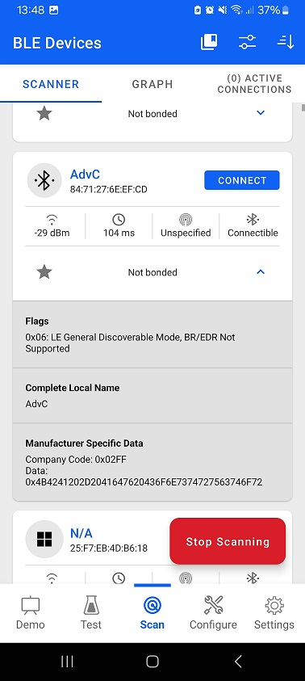

# Advertisement or Scan Response Constructor #

## Description ##

In Silicon Labs Bluetooth SDK v8.x you can use the API calls [sl_bt_legacy_advertiser_set_data()](https://docs.silabs.com/bluetooth/latest/bluetooth-stack-api/sl-bt-legacy-advertiser#sl-bt-legacy-advertiser-set-data) / [sl_bt_extended_advertiser_set_data()](https://docs.silabs.com/bluetooth/latest/bluetooth-stack-api/sl-bt-extended-advertiser#sl-bt-extended-advertiser-set-data) to set the advertisement and scan response data. Advertisement payload is defined in a structured manner whereas the data passed to above API calls is raw data uint8array. This example focuses on adding a middle layer between user application and the Bluetooth stack API to set the advertisement payload, which makes the payload more straightforward, visible, and easier to understand.

To learn more about the payload of Bluetooth advertisement, see [Bluetooth Advertising Data Basics](https://docs.silabs.com/bluetooth/latest/bluetooth-fundamentals-advertising-scanning/advertising-data-basics).

In this example two functions are introduced:

- **`sl_status_t construct_adv(const adv_t *adv, uint8_t ext_adv);`**  
This is the main function, which turns a formatted advertisement structure (adv_t type) into a byte array accepted by the Bluetooth stack. For the description of the adv_t structure and of other function arguments, see app.h. Feel free to copy this function into your own project - along with the definitions in app.h - and use it for creating your own advertisement.

- **`void demo_setup_adv(uint8_t handle);`**  
This function demonstrates how to use construct_adv() by setting up an example advertisement structure. Study this function to learn how to properly create an advertisement.

The example advertisement structure set up in demo_adv_setup() looks like this:

**Advertisement data**

- Flags: 0x06
- Complete local name: "AdvC" that will be showed as device name when you scan on the mobile phone
- One of the 128-bit UUIDs - Silicon Labs OTA Service UUID

**Scan response data**

- Manufacturer-specific data

  - Company ID: 0x02FF (Silicon Labs)
  - Data: "KBA-Adv Constructor"

## Simplicity SDK version ##

SiSDK  v2025.6

## Hardware Required ##

- One WSTK board
- One Bluetooth capable radio board, e.g: BRD4162A

## Setup ##

1. Create a **Bluetooth - SoC Empty** project

2. Open the .slcp file of the project, select the **Software Components** tab and do the following changes:

   - Install **IO Stream: USART** component with the default instance name: **vcom**  
    

   - Find the **Board Control** component and click to the **Configure** button like below
      
    Then enable *Virtual COM UART* under its configuration
      

   - Install the **Log** component (found under Application > Utility group)

3. Replace the *app.c* and *app.h* file in the project with the provided *app.c*, *app.h*

4. Compile and flash binary to the target board

## Usage ##

1. Flash binary to the radio board

2. Open Simplicity Connect application on your smartphone

3. Start the Bluetooth Browser from the application to scan nearby devices. If everything goes well you will get below result. The data shown in the EFR Connect app must be the same as described in the [Description](#description) section.

   

      
   

   For debugging purposes open a Terminal, and connect to your device via the JLink virtual COM port.
