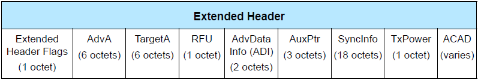
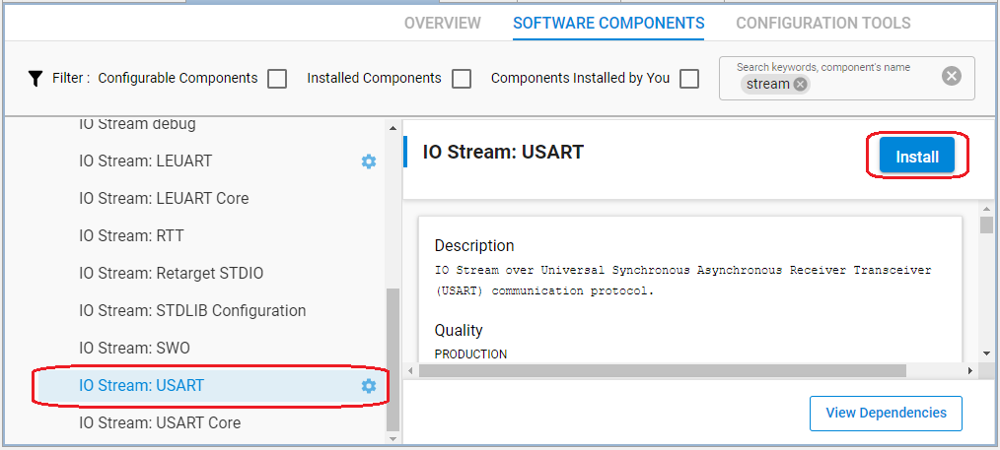
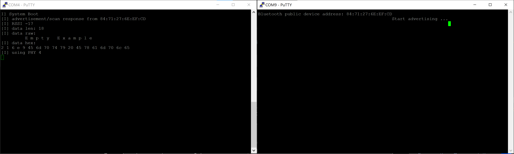

# Advertising and Scanning with LE Coded PHY

## Description

One of the new features added in Bluetooth 5 is the LE coded PHY, which enables longer range connections.

The LE Coded PHY uses 1Mbit symbol rate but the payload is coded at 125kbps or 500kbps. It also adds Forward Error Correction and Pattern Mapper.

This example shows how advertising on the coded PHY works, as well how to establish a connection using the coded PHY in the board [BGM220 Bluetooth Module Explorer Kit](https://www.silabs.com/development-tools/wireless/bluetooth/bgm220-explorer-kit)

>Note: 2M and LE Coded PHY are only supported on specific devices.

Traditional Bluetooth low-energy advertisements use channels 37, 38, and 39 only for advertising. The advertisement is identical on each channel and contains the advertiser’s address and advertising data payload. Starting in Bluetooth 5, it is possible to offload the advertising data payload onto one of the data channels. In this new type of advertisement, the same three advertising channels are used but instead of including the data payload, they include a pointer to the data channel and the offset time until the data payload is expected. This type of advertising is known as extended advertising. The following diagram is provided to illustrate extended advertising.


The common extended advertising format looks like the following:


The ADV mode field is shown below. Note that it is not permitted to be scannable and connectable at the same time.


The extended header is laid out as follows. Not all fields will be present in every advertisement.



The aux pointer field provides information about the auxiliary advertisement, as shown below.


The channel index indicates which channel the auxiliary advertisement will come on. The CA field indicates the clock accuracy, the offset units indicate whether the offset (time until the auxiliary advertisement) is in units of 30 us or 300 us, the aux offset indicates the number of offset units until the auxiliary advertisement can be expected, and the aux PHY indicates which PHY be used in the auxiliary advertisement.

The sync info field is used for Periodic Advertisement synchronization, not discussed here. The TX Power field indicates the transmitted power in dBm.

Another feature of these extended advertisements is that it is possible to specify the PHY used for the primary and secondary advertisements separately. To set the PHY used for advertisements, the following API function is used:

```C
sl_bt_extended_advertiser_set_phy(advertising_set_handle,
                                  sl_bt_gap_phy_coded,
                                  sl_bt_gap_phy_coded);
```

The parameters indicate the advertisement set to be used, the PHY for primary advertisements, and the PHY used for secondary advertisements.

Advertisements on the coded PHY do not support active scanning. This means that is always necessary to use the new connectivity mode `sl_bt_extended_advertiser_non_connectable`.

To start advertising, the following API function is used:

```C
sc = sl_bt_extended_advertiser_start(advertising_set_handle,
                                     connect,
                                     flags);
```

Remaining advertising parameters can be set as they would with the traditional 1 Mbps PHY.

## Simplicity SDK version ##

- SiSDK v2025.6

## Hardware Required ##

- 2 x BGM220 Bluetooth Module Explorer Kit: BRD4314

  OR

- 2 x Thunderboard BG22

  OR

- 2 x WSTK with a radio board supporting coded phy, e.g. BRD4182A

## Setting up

To test the example, you need to setup two radio boards as advertiser and scanner.

### Advertiser

1. Create an **Bluetooth - SoC Empty** example for the radio boards in Simplicity Studio.

2. Copy the attached [src/advertiser/app.c](src/advertiser/app.c) replacing the existing `app.c`.

3. Config **Software components**, add **Log** driver.  

    - Install **IO Stream: USART** component with the default instance name: **vcom**  
    
    

    - Install **Retarget STDIO** component:
    

    - Install the **Extended Advertising** component, if it is not yet installed

    - Install the **Log** component (found under Application > Utility group)
      

4. Import the GATT configuration:
    - Open the **Bluetooth GATT Configurator** under the **CONFIGURATION TOOLS** tab.
    - Find the Import button and import the attached **gatt_configuration.btconf** file.
    
    - Save the GATT configuration (Ctrl+S).

5. **Save and close** then the tool will auto-generate to code.

6. Build and flash the project to the **Advertiser** device.

### Scanner

1. Create an **Bluetooth - SoC Empty** example for the radio boards in Simplicity Studio.

2. Copy the attached [src/scanner/app.c](src/scanner/app.c) replacing the existing `app.c`.

3. Config **Software components**, add **Log** driver.  

    Same as the Advertiser device

4. **Save and close** then the tool will auto-generate to code.

5. Build and flash the project to the **Scanner** device.

## Usage

Launch the console for **Advertiser board** and **Scanner board** or open a terminal program, and connect to the virtual COM ports. After you reset both boards, the advertiser will start advertising on Coded PHY, while the scanner will start scanning on Coded PHY. Because most of the Bluetooth devices around you are advertising on 1 Mbps PHY, most probably your two test devices will find each other. Observe the logs on the terminals:



You can use the **[Network Analyzer](https://docs.silabs.com/simplicity-studio-5-users-guide/latest/ss-5-users-guide-tools-network-analyzer/)** tool to see the packets transferred in the air.


