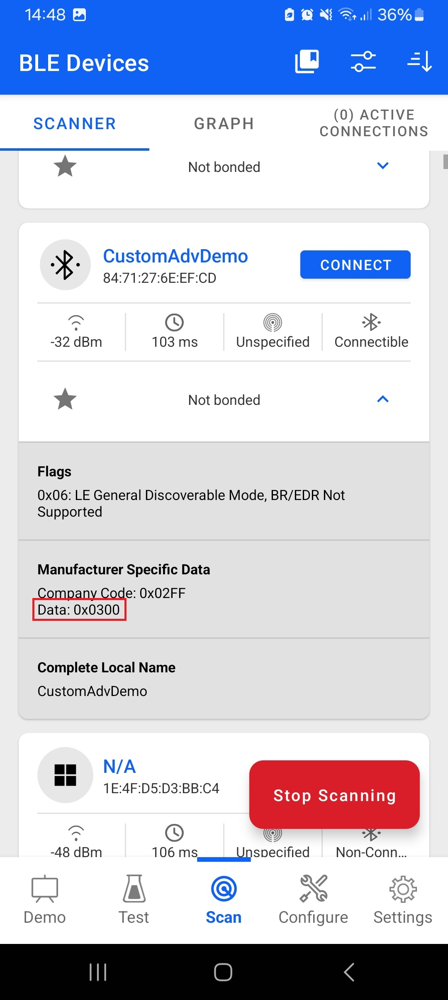

# Advertising Manufacturer Specific Data

## Description

The general structure of advertising packets is described in [Bluetooth Advertising Data Basics](https://docs.silabs.com/bluetooth/latest/general/adv-and-scanning/bluetooth-adv-data-basics). This example focuses on a **Manufacturer-Specific Data** (type 0xFF) as a specific advertising type.

Manufacturer-specific data can be used to add any custom data into advertising packets in any format suitable for your application. For example, you could create a beacon that includes the reading of a temperature sensor in the advertising data.

The assumption is that your application has the following requirements:

1. The device must include its name in advertising packets

2. The advertising data must also contain a counter value that changes dynamically

Advertise the device name so that it is easy to identify the device using any BLE-capable smart phone app, such as the EFR Connect app for Android / iOS.

To demonstrate dynamic changing of the advertising payload, the counter is incremented/decremented when pushbuttons PB1/PB0 on the development kit are pressed. One byte is used for the counter value, meaning that the range is 0..255. As an additional feature, one byte is included to indicate which button was pressed last.

An example of an advertising packet that contains the device name and the 8-bit counter
value is shown below.


This advertising packet consists of three elements (as explained in the advertising data basics documentation):

1. The first element is the flags.

2. The second element contains the counter value and an indication of which button was
pressed last.

3. The third and the last element is the device name.

The second element uses type 0xFF indicating manufacturer-specific data, meaning that data can be formulated in (almost) any way. The other two elements are using predefined AD types.

Note that the custom AD element is formatted using the same convention as any other elements. It begins with a length indicator so that any client receiving this data can still parse the advertising packet element by element and skip over those elements that it does not know how to decode.

The first 2 octets contain the **Company Identifier Code**. Company Identifiers are listed at (https://www.bluetooth.com/specifications/assigned-numbers/company-identifiers). The remaining bytes in the custom element can be used for any purpose. The total size of the packet cannot exceed the maximum size that is 31 bytes.

In the example used here, the company ID is followed by two additional bytes, one to represent the number of button presses (zero in the above example) and another byte to indicate which button was pressed last (0xFF in the above example, meaning neither button has been pressed so far).

The following three API calls are needed to use custom advertising (and scan response) data:

```C
sl_bt_advertiser_create_set()
```

```c
sl_bt_legacy_advertiser_set_data()
```

```c
sl_bt_legacy_advertiser_start()
```

The first call sets the advertising data content before starting advertisements. Calling the latter starts the advertising. When using custom data, note that the parameter "discoverable mode" must be set to **advertiser_user_data** (value 4).

The example sets up advertising using the custom format defined earlier in this document.

## Gecko SDK version

GSDK v3.1.1

## Hardware Required

- One WSTK boards
- One Bluetooth capable radio boards, e.g: BRD4162A

## Setup

1. Download the latest Bluetooth SDK via [Simplicity Studio](https://www.silabs.com/products/development-tools/software/simplicity-studio) if not already done.
2. Create a **Bluetooth - SoC Empty** project based on the board you are using as the starting point.
3. Open the .slcp file of the project, select the **Software Components** tab and do the following changes:

   - Install **Simple Button** component with two instances name **btn0** and **btn1** as below  
    
    **Note**: In case you want to install more than one button than you can use "**Add New Instance**" button  
    

   - Install **IO Stream: USART** component with the default instance name: **vcom**  
    

   - Find the **Board Control** component and click to the **Configure** button like below
      
    Then enable *Virtual COM UART* under its configuration
    

   - Install the **Legacy Advertising** component, if it is not yet installed

   - Install the **Log** component (found under Application > Utility group)

4. Drag and drop all of files (**app.c**, **custom_adv.c**, **custom_adv.h**) that located in `src` folder to the project created just now, then compile and program to your board.

## Usage

A smart phone app is required, such as the EFR Connect app, to see nearby advertising devices.

1. Open the EFR Connect app.

2. Open the Bluetooth Browser.

3. Find the device advertising as CustomAdvDemo.

4. Click on the instance of CustomAdvDemo. Now, you should see the counter and the last button value on the *Manufacturer Specific Data* row. Please have a look at the red highlighted area below in the result pictures.

5. Push PB1 some times on your WSTK.

6. Refresh the list of devices in the Bluetooth Browser.

7. Check the value of the counter again.

|||
|:-:|:-:|
|**PB0 button result**|**PB1 button result**|
