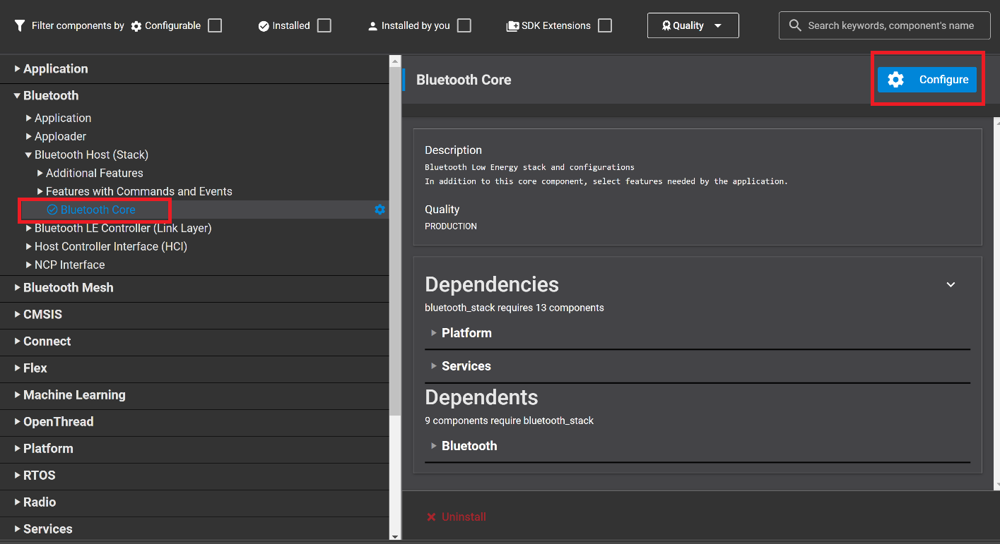
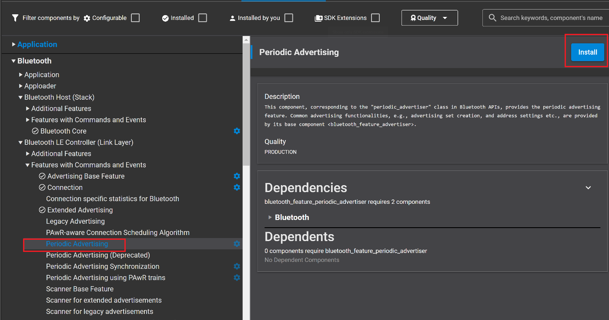
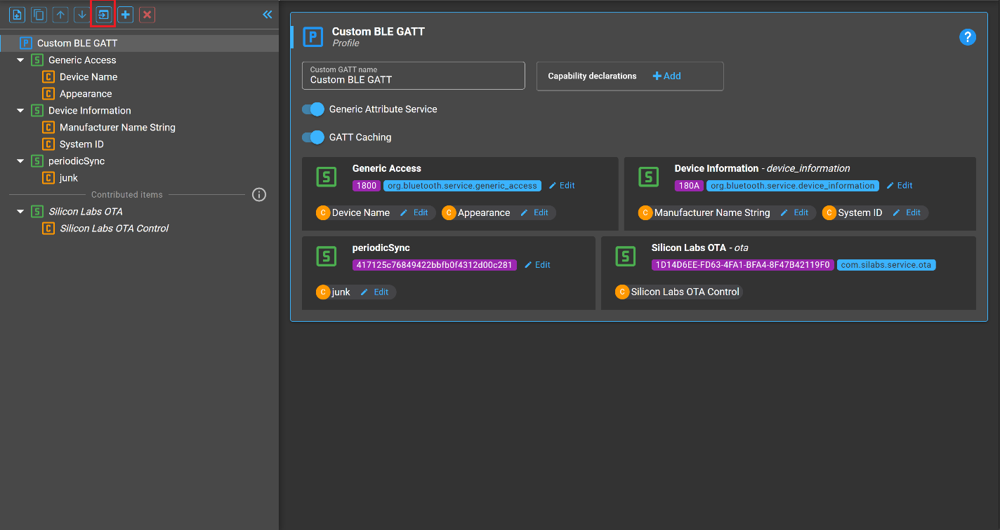
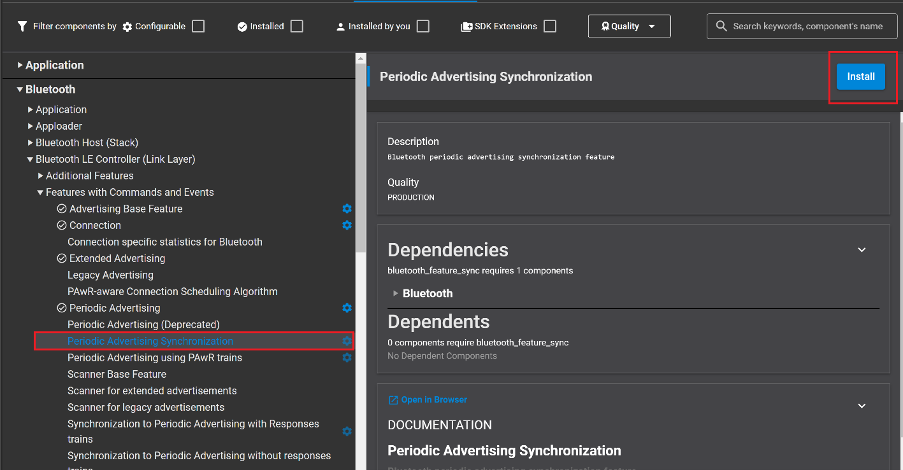

# Chained Advertisement

## Description

Chained advertising allows advertising packets to be linked or chained together to allow for larger advertisements, up to 1650 bytes, to be sent. A new packet type, AUX_CHAIN_IND, is used to transmit the individual portions of these advertisements. Chained advertising works together with [Extended advertising](https://docs.silabs.com/bluetooth/latest/code-examples/stack-features/adv-and-scanning/extended-adv-example) and [Periodic advertising](https://docs.silabs.com/bluetooth/latest/general/adv-and-scanning/periodic-adv-bt5). The following example allows a synchronizer, i.e., the receiver of a periodic advertisement, to synchronize to a chained periodic advertisement and begin receiving these advertisements.

### Advertiser

The maximum size of a BGAPI command is 255B, which does not support using one command to set 1650B of advertisement data. Therefore, version 3.1 of Silicon Labs Bluetooth SDK introduces the API:

```C
sl_status_t sl_bt_system_data_buffer_write(size_t data_len,
                                           const uint8_t* data);
```

to write up to 255 bytes of data to the system data buffer, in which the stack assembles the full advertisement data. This API can be called multiple times when more than 255 bytes (maximum 1650 bytes) must be written to the buffer.

The sample code provided with this article implements a simple function:

```C
static int16_t write_system_data_buffer(size_t size, uint8_t * data);
```

to simplify writing up to 1650 bytes to the system data buffer. After the desired advertising data has been written to the buffer, the advertiser will start extended advertisement to advertise the sync info needed for the periodic advertising (include a **Synchronous service** UUID, which the synchronizer will look for, and another sync info, on which the synchronizer can sync on). Next, the periodic advertisement is started. Finally, the data assembled in the system data buffer is transferred to the periodic advertisement by calling the API:

```C
sl_bt_periodic_advertiser_set_long_data(advertising_set_handle);
```

### Scanner

The scanner, or synchronizer, begins by starting scanning for advertisements containing the Synchronous service with the UUID 417125c7-6849-422b-bfb0-f4312d00c281. The scanner sets the discovery timing and type and starts discovery. Advertisements or scan responses are handled by `sl_bt_evt_scanner_scan_report_id` event handler. This event handler first filters out any packets which are not extended advertising packets. Next, the advertisement is searched for the Synchronous service UUID mentioned above by calling function:

```C
find_service_in_advertisement()
```

When an advertisement containing this UUID is found, the scanner syncs to this device by calling function:

```C
sl_status_t sl_bt_sync_open(bd_addr address,
                            uint8_t address_type,
                            uint8_t adv_sid,
                            uint16_t *sync);
```

The sample code for the scanner/synchronizer includes event handlers for sync_opened and sync_closed events. The sync_closed event is triggered when a sync timeout expires and is used to start scanning again. The `sl_bt_evt_sync_opened_id` event is purely informative and prints a message indicating that a sync has been opened. The `sl_bt_evt_sync_data_id` is triggered whenever sync data is received. This event handler handles three situations:

- Data received complete
- Data received with more to follow and
- Data truncated

The first situation occurs either when the advertisement fits in a single packet or when the last packet in a chain is received, in either case, the data is saved. The second situation occurs when data is received and more are expected. When this happens, the event handler saves the data and begins reassembly the advertisement. If subsequent data is expected but none is received, the status is set to data truncated.  In this case, the sample application considers the data to be corrupt and discards it all by clearing it’s buffer.

### Notes

Some notes when setting up this example:

- Set the value **Max number of periodic advertising synchronizations** according to the number of advertisers in **Bluetooth Core configuration** on the scanner side.

- The Advertiser must use the **Periodic Advertising** component and the Scanner must use the **Periodic Advertising Synchronization** component.

- 1650 bytes of advertising data are buffered in `system_data_buffer` so the buffer size needs to be increased to provide sufficient space for data, which can be edited by the value **Buffer memory size for Bluetooth stack** in **Bluetooth core configure**.

## Gecko SDK version ##

- GSDK v3.1.1

## Hardware Required ##

- 2 x WSTK board: BR4001A
- 2 x Bluetooth radio board, e.g: BRD4162A

## Setting up

To try this example, you need two radio boards, one for the advertiser side and one for the scanner side.

### Advertiser

1. Create a new **Bluetooth - SoC Empty** project.

2. Copy the attached [src/advertiser/app.c](src/advertiser/app.c) file replacing the existing `app.c`.

3. Config **Software components**, add **Periodic Advertising**, and **Log** driver.  
    - In **Bluetooth Core configuration**increase **Buffer memory size for Bluetooth stack** by `1650`, from default `3150` bytes to `4800` bytes.  
    
    

    - Install **Periodic Advertising** component  
    

    - Install **IO Stream: USART** component with the default instance name: **vcom**  
    
    

    - Enable **Virtual COM UART** in the **Board Control** component  
      
      

   - Install the **Extended Advertising** and **Periodic Advertising** components, if they are not yet installed

    - Install the **Log** component (found under Application > Utility group)
      

4. Import the GATT configuration:
    - Open the **Bluetooth GATT Configurator** under the **CONFIGURATION TOOLS** tab.
    - Find the Import button and import the attached [gatt_configuration.btconf](config/gatt_configuration.btconf) file.
    
    - Save the GATT configuration (Ctrl+S).

5. **Save and close** then the tool will auto-generate to code.

6. Build and flash the project to the **Advertiser** device.

### Scanner

1. Create an **SoC-Empty** example for the radio boards in Simplicity Studio.

2. Copy the attached [src/scanner/app.c](src/scanner/app.c) replacing the existing `app.c`.

3. Config **Software components**.  

    * In **Bluetooth Core configuration**, set the value **Max number of periodic advertising synchronizations** according to the number of advertisers and set **Buffer memory size for Bluetooth stack** to `4800`, 
    * Add **Log** driver the same way as in the case of the Advertiser device.  

    * While the Advertiser must use the **Periodic Advertising** component, the Scanner must use the **Periodic Advertising Synchronization** component.  
      

4. **Save and close** then the tool will auto-generate to code.

5. Build and flash the project to the **Scanner** device.

## Usage

Open a terminal program for both boards, such as the Simplicity Studio serial console, to view the output from the devices. The result should look similar to the following:


Shortly after starting up, the scanner discovers an advertiser that has come into range and synchronizes with it. Each `sl_bt_evt_sync_data_id` comes with a maximum of 250 bytes. The entire advertising packet contains 1650 bytes. The final event contains 150 bytes and displays a message indicating that the sync is complete.

The figure below will show the case when one of the advertising packet PDUs is not received, so the data is discarded.


