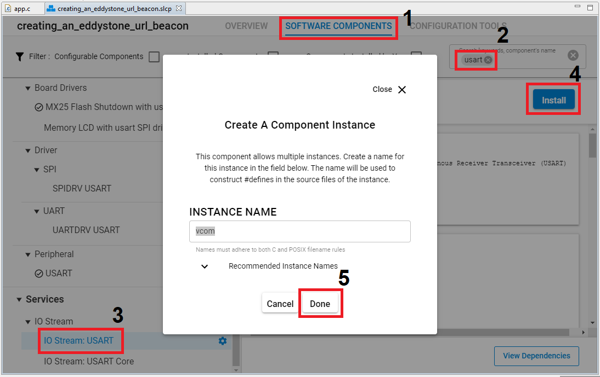
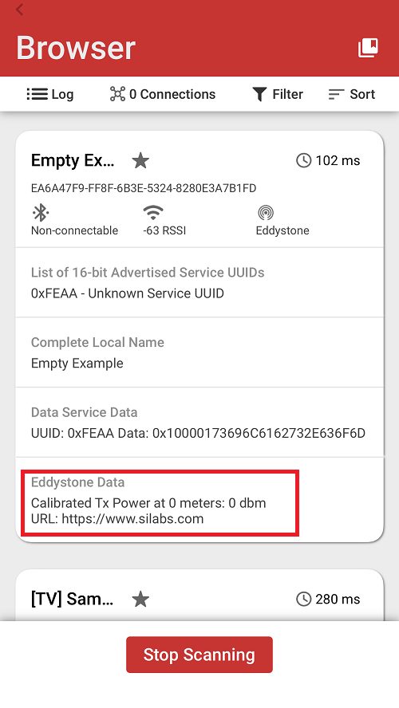
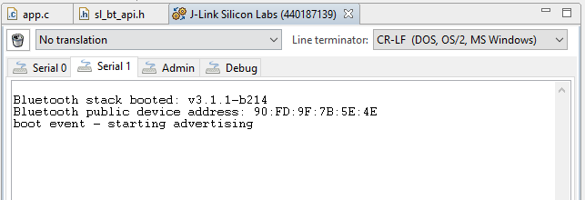

# Creating an Eddystone-URL Beacon #
 
## Description ##
 
This example demonstrates how to create an Eddystone beacon with Silicon Labs' Bluetooth SDK.

### Eddystone Beacons ###

The [Eddystone format](https://developers.google.com/beacons/eddystone) defines four different packet types. This example shows how to implement the Eddystone-URL packet. The Eddystone-URL packet advertises a URL in a compressed format. For more information on Eddystone beacons, see [Google's Eddystone repository](https://github.com/google/eddystone/tree/master/eddystone-url).

### URL Beacon Implementation ###

The first step in creating the beacon is to define custom user data to be advertised:

``` C
static const uint8_t eddystone_data[] = {
  0x03,          // Length of service list
  0x03,          // Service list
  0xAA, 0xFE,    // Eddystone ID
  0x10,          // Length of service data
  0x16,          // Service data
  0xAA,  0xFE,   // Eddystone ID
  0x10,          // Frame type Eddystone-URL
  0x00,          // Tx power
  0x00,          // 0x00=http://www., 0x01=https://www.
  's','i','l','a','b','s','.','c','o','m'
};
```

Call the API to set this data to be advertised.

``` C
sl_bt_legacy_advertiser_set_data(advertising_set_handle, 0, sizeof(eddystone_data), eddystone_data);
```

The first two parameters are the advertising set handle and a value indicating that data is to be used in advertising packets.

Then, set the transmit power. The Eddystone-URL packet format includes the transmit power in the 10th byte. This data can be used by receivers of the beacon to determine distance so it is important that this data and the actual transmit power match.

``` C
sl_bt_system_set_tx_power(0, 0, &ret_min_power, &ret_max_power); // Set global minimum and maximum TX power to 0 dBm
```

The following call sets the minimum and maximum advertising interval to 100 ms ( 625 us * 160). All three advertising channels are used by default (37, 38, 39).

``` C
sl_bt_advertiser_set_timing(advertising_set_handle, 160, 160, 0, 0);
```

The device is now ready to start advertising the Eddystone-URL beacon data. This is accomplished by making the following call:

``` C
sl_bt_legacy_advertiser_start(advertising_set_handle, advertiser_non_connectable);
```
This tells the stack to use the custom user data and to make the beacon non-connectable.
 
## Gecko SDK version ##
 
GSDK v3.1.1
 
## Hardware Required ##
 
- A WSTK board.
- A Bluetooth capable radio board, e.g: BRD4161A.
 
## Setup
 
To be able to test this example do as follows:

1. Create a **Bluetooth - SoC Empty** project.

2. Copy the attached app.c file into your project (overwriting existing app.c).

3. Install the software components to use the **VCOM** port (UART) for logging:

- Open the .slcp file in the project.

- Select the SOFTWARE COMPONENTS tab.

- Install **IO Stream: USART** component with the default instance name: **vcom**.



- Find the **Board Control** component  and enable *Virtual COM UART* under its configuration.

- Install the **Legacy Advertising** component, if it is not yet installed

- Install the **Log** component (found under Application > Utility group).

4. Build and flash the project to your device.

5. Do not forget to flash a bootloader to your board, if you have not done so already.
 
## How It Works ##
 
Follow the below steps to test the example:

1. Open the EFR Connect app on your smartphone.

2. Find your device in the Bluetooth Browser, advertising as Empty Example, and observe the advertising data.



You can launch the Console that is integrated on Simplicity Studio or can use a third-party terminal tool like TeraTerm to receive the logs from the virtual COM port.


