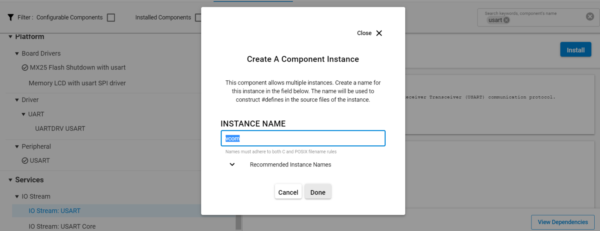

# Directed Advertising Example

## Description

This is a special-purpose type of advertising, designed to invite a specific peer device to connect as quickly as possible. It contains the address of both the advertising device and the device being invited to connect. On receipt of this advertising packet, the receiving device (known now as the “initiator”) will immediately and automatically send a connect request. In direct advertising mode, advertising packets are sent very frequently, every 3.75 milliseconds, but for no more than 1.28 seconds. This is so that advertising channels do not get congested. There are two modes of directed advertising:
- High duty cycle directed connectable legacy advertising
  - sl_bt_legacy_advertiser_high_duty_directed_connectable - The advertising happens with the above described duty cycle
- Low duty cycle directed connectable legacy advertising
  - sl_bt_legacy_advertiser_low_duty_directed_connectable - The advertising happens with the configured duty cycle - You may configure the advertising parameters with `sl_bt_advertiser_set_timing`

## Gecko SDK version

GSDK v4.2.0 or newer

## Hardware Required

- Two WSTK boards
- Two Bluetooth-capable radio boards, e.g: BRD4162A

## Setup

### Advertiser

To create an **Advertiser**:

1. Download the latest Bluetooth SDK via [Simplicity Studio](https://www.silabs.com/products/development-tools/software/simplicity-studio) if not already done.
2. Create a **Bluetooth - SoC Empty** project base on the board you are using as the starting point.
3. Open the .slcp file of the project, select the **Software Components** tab, and make the following changes:

   - Install **IO Stream: USART** component with the default instance name: **vcom**.
    

   - Find the **Board Control** component and click to the **Configure** button as shown.
      
    Then enable *Virtual COM UART* under its configuration.
    
 
   - Install the **Legacy Advertising** component, if it is not yet installed.
   

   - Install the **Log** component (found under Application > Utility group).
   

4. Drag and drop the *app.c* and *app.h* files located in `src\advertiser` folder to your project to replace the existing ones.
5. Modify the `scanner` variable in the *app.c* file and configure the Bluetooth address of the *Scanner* board (in reverse byte order).
6. Modify the advertising parameters to your needs (high/low duty cycle) in function `sl_bt_legacy_advertiser_start_directed`.
7. Compile and run the program. Use a Bluetooth scanner to check the advertisement.

### Scanner

The Silicon Labs Bluetooth stack also supports scanning for directed advertising.

To create a **Scanner**:

1. Download the latest Bluetooth SDK via [Simplicity Studio](https://www.silabs.com/products/development-tools/software/simplicity-studio) if not already done.
2. Create a **Bluetooth - SoC Empty** project based on the board you are using as the starting point.
3. Open the .slcp file of the project, select the **Software Components** tab, and make the following changes:

   - Install **IO Stream: USART** component with the default instance name: **vcom**.
    

   - Find the **Board Control** component and click to the **Configure** button as shown.
      
    Then enable *Virtual COM UART* under its configuration.
    

   - Install the **Log** component (found under Application > Utility group).
   

4. Drag and drop the *app.c* file located in `src\scanner` folder to your project to replace the existing one.
5. Modify the `advertiser` variable in the *app.c* file and configure the Bluetooth address of the *Advertiser* board (in reverse byte order).
6. Compile and run the program.

## Usage

1. Flash one radio board with the advertiser code, and another one with the scanner code.

2. Open two instances of your favorite terminal program, and connect to both boards via the virtual COM port (find the JLink CDC UART ports). Use the following UART settings: **baud rate 115200, 8N1, no flow control**.

3. Press the reset buttons, first on the scanner, then on the advertiser board.

4. On the Advertiser's terminal you will see the device address and on the Scanner's termial you will see the list of advertising data:

|Advertiser|Scanner|
|:----------:|:-------:|
|||
