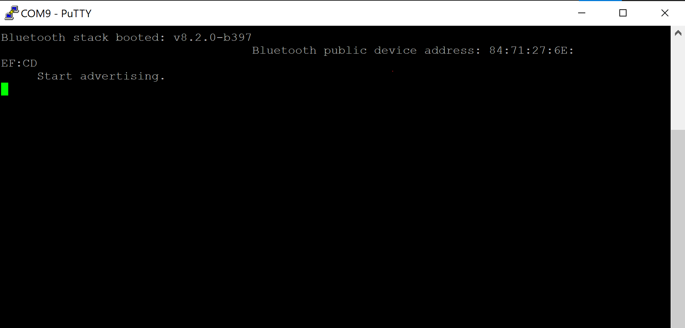
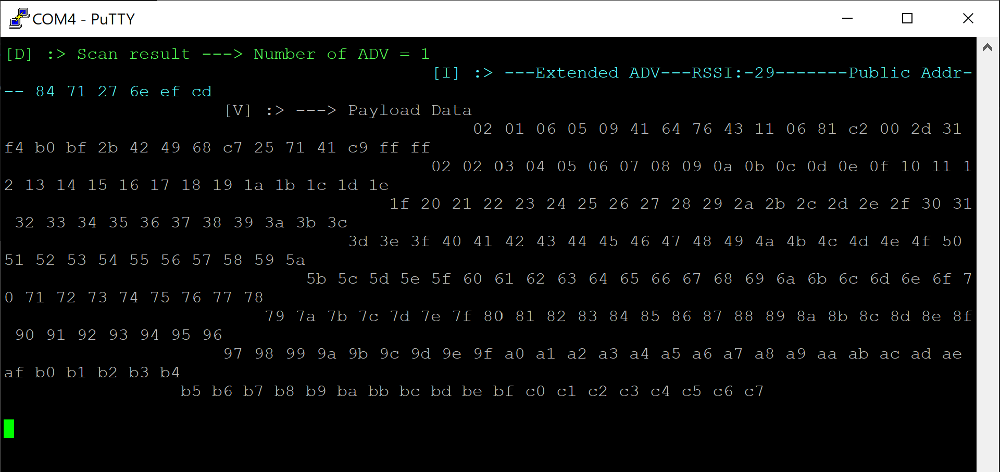

# Extended Advertising Example

## Description

The feature – LE Advertising Extensions – is introduced by Bluetooth Specification Version 5.0. It defines two types of advertising channels, primary advertising channel and secondary advertising channel. Channels from 0 to 36 known as LE piconet channels in Bluetooth Specification 4.2 or earlier versions can also be used to send advertisements, and they are called secondary advertising channels. Table below shows the differences between Bluetooth 5.0 and earlier versions supporting this feature.

|                                             | Bluetooth 4.2 or earlier        | Bluetooth 5.0                                       |
| ------------------------------------------- | ------------------------------- | --------------------------------------------------- |
| Channels – 37, 38 and 39                    | Advertisement broadcast channel | Primary advertising channel                         |
| Channels – 0 to 36                          | LE piconet channel              | LE piconet channel or secondary advertising channel |
| Max payload for single adv packet (AdvData) | 0-31 bytes                      | 0-254 bytes                                         |  

The PDU payload of primary advertising channels can vary in length from 6 to 37 bytes. 6-byte address is mandatory to present in the packet, so the advertising data is limited to no more than 31 bytes, which is the same as previous versions.

Bluetooth 5.0 introduces a way to use secondary advertising channels to offload data that would otherwise be transmitted on the primary advertising channel. The advertising packets on primary channels contain the information in which secondary advertising channel and the offset to the start time the auxiliary data will be transmitted. Figure below shows the timing of extended advertising.

**ADV_EXT_IND** – advertising packets on primary advertising channels. These packets only include the information on which channel and when the AUX_ADV_IND will happen.

**AUX_ADV_IND** – advertising packet on secondary advertising channels. This packet could contain up to 254 bytes payload.

The procedure of a scanner to scan an extended advertising looks like the following:

1. Scan on 3 primary channels for advertising packets.
2. If ADV_EXT_IND is scanned, record the secondary channel information (which channel and when etc.)
3. Scan the specific secondary channel at the given time.

This code example demonstrates both an advertiser, sending extended advertisements, and a scanner which is able to receive extended advertisements.

## Simplicity SDK version

SiSDK v2025.6

## Hardware Required

- Two WSTK boards
- Two Bluetooth capable radio boards, e.g: BRD4162A

## Setup

### Advertiser

To create an **Advertiser**:

1. Download the latest Bluetooth SDK via [Simplicity Studio](https://www.silabs.com/products/development-tools/software/simplicity-studio) if not already done.
2. Create a **Bluetooth - SoC Empty** project base on the board you are using as the starting point.
3. Open the .slcp file of the project, select the **Software Components** tab and do the following changes:

   - Install **IO Stream: USART** component with the default instance name: **vcom**  
    

   - Find the **Board Control** component and click to the **Configure** button like below
      
    Then enable *Virtual COM UART* under its configuration
    

   - Install the **Extended Advertising** component, if it is not yet installed

   - Install the **Log** component (found under Application > Utility group)
4. Drag and drop the *app.c* and *app.h* files that located in `src\advertiser` folder to your project to replace the existing ones.
5. Compile and run the program. Use a Bluetooth scanner to check the advertisement.

### Scanner

Silicon Labs Bluetooth stack also support scanning for extended advertising. To develop also on the scanner side, you can follow below steps to use the scanner. Note, the scanner project has the facts

1. Use malloc (calloc) and free  
2. Use LRU mechanism.

You can easily remove or modify them if it doesn't fit your requirements.

To create a **Scanner**:

1. Download the latest Bluetooth SDK via [Simplicity Studio](https://www.silabs.com/products/development-tools/software/simplicity-studio) if not already done.
2. Create a **Bluetooth - SoC Empty** project based on the board you are using as the starting point.
3. Open the .slcp file of the project, select the **Software Components** tab and do the following changes:

   - Install **IO Stream: USART** component with the default instance name: **vcom**  
    

   - Find the **Board Control** component and click to the **Configure** button like below
      
    Then enable *Virtual COM UART* under its configuration
    

   - Install the **Log** component (found under Application > Utility group)

4. Drag and drop all of files that located in `src\scanner` folder to the project created just now, then compile and program to your board.
5. Modify the project settings in app.c if needed.

## Usage

1. Flash one radio board with the advertiser code, and another one with the scanner code.

2. Open two instances of your favorite terminal program, and connect to both kits via the virtual COM port (find the JLink CDC UART ports). Use the following UART settings: **baud rate 115200, 8N1, no flow control**.

3. Press reset button on both kits.

4. On the Advertiser's terminal you will see the device address and on the Scanner's terminal you will see the list of advertising and payload data as below result

|Advertiser|Scanner|
|:----------:|:-------:|
|||

**NOTE**:  You can flash a board with **ncp-empty** project and use the **Bluetooth NCP Commander** tool to scan for the extended advertisement, as shown in the figure below.
You might be able to scan extended advertisements with your smart phone as well. However, not every phones on the market supports Bluetooth 5 and extended advertisements yet.

