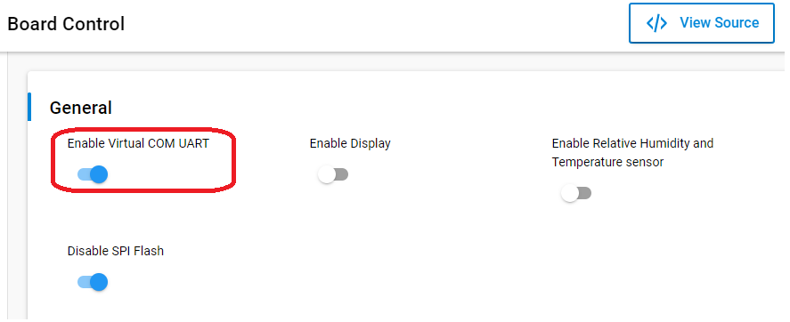
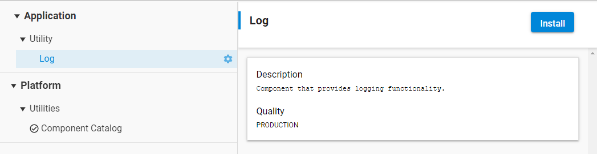
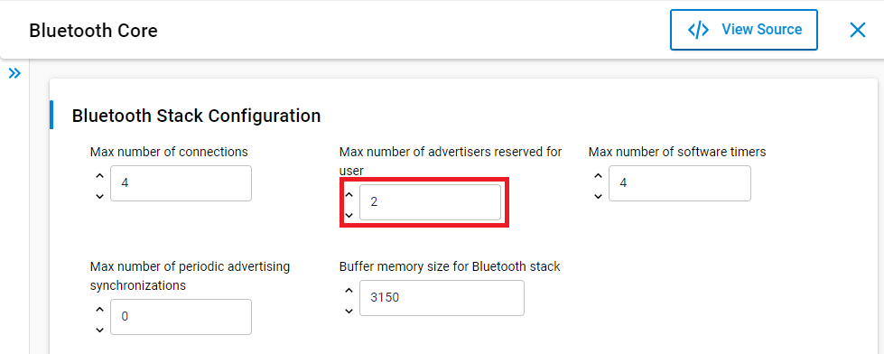
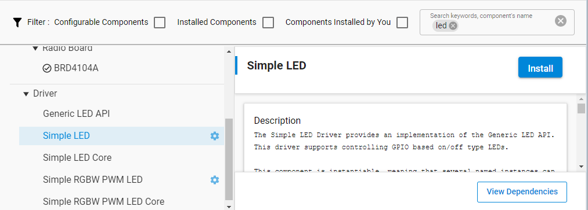
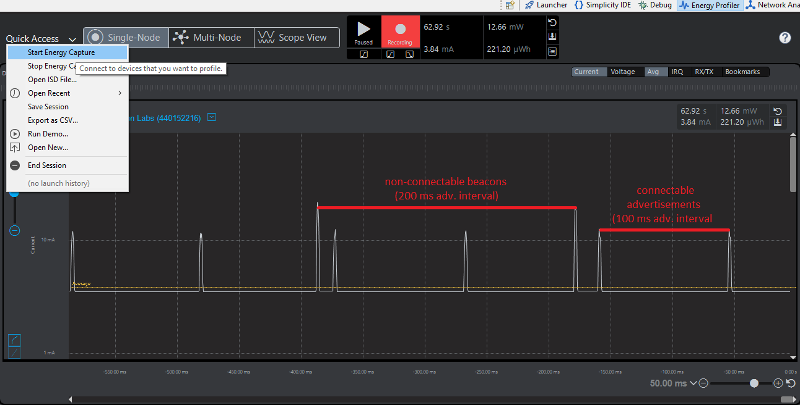
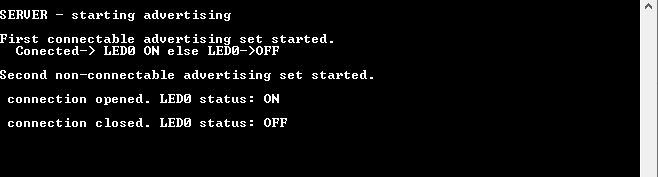

# Multiple Advertising Sets

## Description

Bluetooth 5 introduces a number of useful new features, such as multiple advertising sets. This feature supports having  more than one advertising sets concurrently without having to stop and restart advertising.

All parameters including the advertising interval, advertising data, discoverability, connectability and number of advertisements to send before stopping can be configured independently for each advertising set. The most relevant APIs for configuring advertising sets are discussed below.

### Maximum Advertising Sets

To enable multiple advertising, the `Max number of advertisers reserved for user` value in **Bluetooth Core** should be set greater than one. The default value is 1.

### Creating a New Advertising Set

Before an advertising set could be used, it must be initialized with `sl_bt_advertiser_create_set(&handle)`. The Bluetooth stack reserves the required memory for the advertising set, and returns a new valid advertising handle to the variable passed as an argument. This handle can be used later to refer to a given advertising set.

### Advertising Data

To set the advertising data, use the API `sl_bt_extended_advertiser_set_data(handle, adv_data_len, adv_data)`, where:

- `handle`: advertising set handle
- `adv_data_len`: array length
- `adv_data`: data to be set

### Maximum Advertising Power

Users can also set the maximum advertising TX power on a given advertising set by calling the API `sl_bt_advertiser_set_tx_power(handle, power, *set_power)`, where `power` is the TX power in units of 0.1 dBm on a given advertising set specified by `handle`. `set_power` is the selected maximum advertising TX power. For instance, value of 80 sets the TX power to 8dBm.

*Note that if the TX power value goes over the global value that was set using `sl_bt_system_set_tx_power` command, the global value will be the maximum limit.*

### Advertising Parameters

To control advertising parameters , use `sl_bt_advertiser_set_timing(handle, interval_min, interval_max, duration, maxevents)`, where:

- `handle`: advertising set handle
- `interval_min`: minimum advertising interval in units of 0.625 ms
- `interval_max`: maximum advertising interval in units of 0.625 ms
- `duration`: advertising duration in units of 10 ms for the advertising set specified by `handle`
- `maxevents`: the maximum number of advertising events to send before advertiser is stopped.

### Start Advertising

Finally, advertising on a given advertising set can be started using `sl_bt_extended_advertiser_start(handle, connect, flags)`, where

- `connect`: the connectable mode of the advertising set
- `flags`: additional extended advertising options

Note that the number of concurrent advertising is limited by the `Max number of advertisers reserved for user` configuration discussed above. Similarly, the number of **connectable** advertising is also limited by `Max number of connections` configuration. For example, only one connectable advertising can be enabled if the device has (`Max number of connections` - 1) connections when this command is called. The limitation does not apply to **non-connectable** advertising, though.

The example code below demonstrates multiple advertising features in Bluetooth 5. Two advertising sets, one connectable, and another non-connectable (iBeacon), are configured separately using their respective handles. The advertising interval and TX power values used for each advertising set is different so that they can easily be distinguished from the Energy Profile perspective in Simplicity Studio.

In addition to debug print out messages, LED0 is used to indicate the connection status. Follow the instructions below and verify the result using the Energy Profile perspective in Simplicity Studio, and the LED0 status on the controller board.

## Gecko SDK version ##

GSDK v3.1.1

## Hardware Required ##

- One WSTK board
- One Bluetooth capable radio board, e.g: BRD4162A

## Setting up

1. Create a **Bluetooth - SoC Empty** project

2. Install the software components to use the **VCOM** port (UART) for logging:
   - Open the .slcp file in the project.

   - Select the SOFTWARE COMPONENTS tab.

   - Install **IO Stream: USART** component with the default instance name: **vcom**.
    

   - Find the **Board Control** component and click to the **Configure** button like below
     
   Then enable *Virtual COM UART* under its configuration
   

   - Install the **Extended Advertising** component, if it is not yet installed

   - Install the **Log** component (found under Application > Utility group).  
    

3. Set the `Max number of advertisers reserved for user` value in **Bluetooth Core** to 2 for multiple advertising.

4. Install the **Simple LED** component with the default instance name: **led0**
   

5. Replace the *app.c* file in the project with the provided app.c.

5. Build and flash them to each device.

## Usage

1. Open *Energy Profiler* perspective in Simplicity Studio and *Start Energy Capture* on your device (Quick Access menu). You should be able to see the following linear plot for the current consumption of your device.

   

2. Open EFR Connect app and try to connect with your target device. LED0 will be ON when connection is established.  Meanwhile, beacons are still broadcast.

3. Disconnect the connection and the advertising should start again. The following figure shows the debug print out messages.

   
