# Periodic&nbsp;Advertisement&nbsp;Example

## Description

This example demonstrates the periodic advertising feature of Bluetooth 5, detailed in the [Periodic Advertising](https://docs.silabs.com/bluetooth/2.13/general/adv-and-scanning/periodic-adv-bt5) article. The example consists of two projects, one for the advertiser and one for the scanner.

The advertiser starts both periodic advertising and extended advertisement to advertise the sync info needed for the periodic advertising. The advertiser changes the content of the periodic advertisement every second.

The scanner starts scanning for the extended advertisements to find the sync info, and then syncs on the periodic advertising. Once synced, the scanning is stopped and only periodic advertisements are received.

To start periodic advertisement, the advertiser uses the function:

```C
sl_bt_periodic_advertiser_start(advertising_set_handle,
                                160, // periodic interval min
                                160, // periodic interval max
                                1); //Include TX power in advertising PDU
```

To set the periodic advertisement data, the advertiser use the function:

```C
sl_bt_periodic_advertiser_set_data(advertising_set_handle,
                                   sizeof(periodic_adv_data),
                                   periodic_adv_data);
```

The scanner will find the periodic advertiser by the UUID of the Synchronous service, then start syncing with the advertiser by using the function:

```C
sl_bt_sync_open(evt->data.evt_scanner_scan_report.address,
                evt->data.evt_scanner_scan_report.address_type,
                evt->data.evt_scanner_scan_report.adv_sid,
                &sync);
```

There are two important things when setting up this example in **Bluetooth SDK version 3.1**:

- The first is to set the value **Max number of periodic advertising synchronizations** in **Bluetooth Core configure** on the **Scanner** according to the number of advertisers you want to sync on

- The second is to install the **Periodic Advertising** component in the **Advertiser** and the **Periodic Advertising Synchronization** component in the **Scanner**.

See section [Setting up](#setting-up) to see how to initialize the periodic advertisement in Bluetooth SDK version 3.1.

## Gecko SDK version ##

- GSDK v3.1.1

## Hardware Required ##

- 2 x WSTK board: BR4001A
- 2 x Bluetooth radio board, e.g: BRD4162A

## Setting up

To try this example, you need two radio boards, one for the advertiser side and one for the scanner side.

### Advertiser

1. Create a new **SoC-Empty** project.

2. Copy the attached [src/advertiser/app.c](src/advertiser/app.c) file replacing the existing `app.c`.

3. Open the .slcp file of your project and open the Software Components tab  
    - Install **Periodic Advertising** component  
    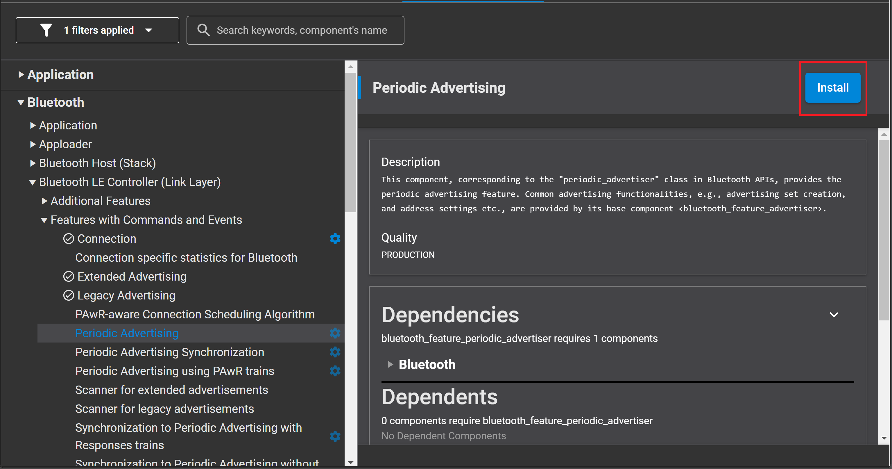

    - Install **IO Stream: USART** component with the default instance name: **vcom**  
    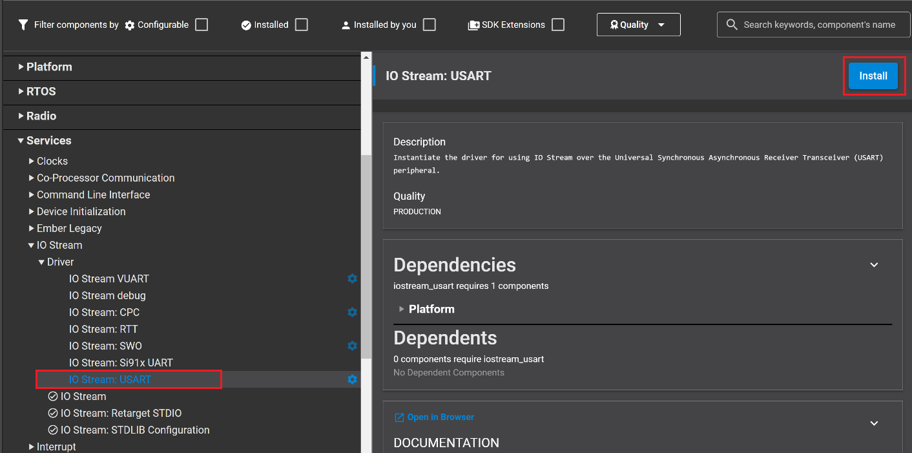
    

    - Enable **Virtual COM UART** in the **Board Control** component  
    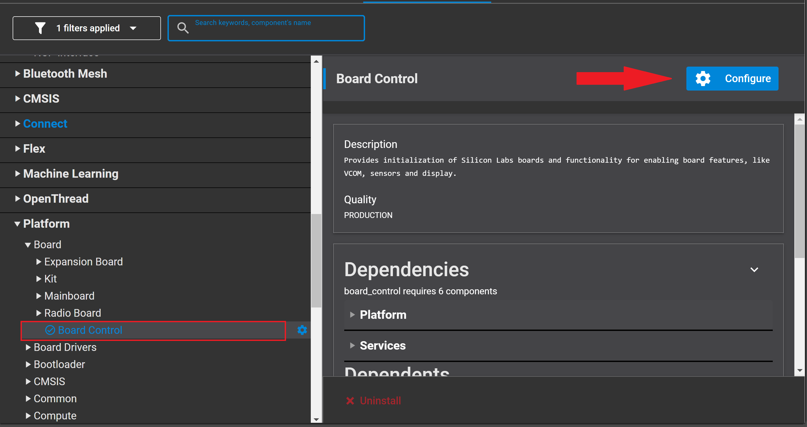  
    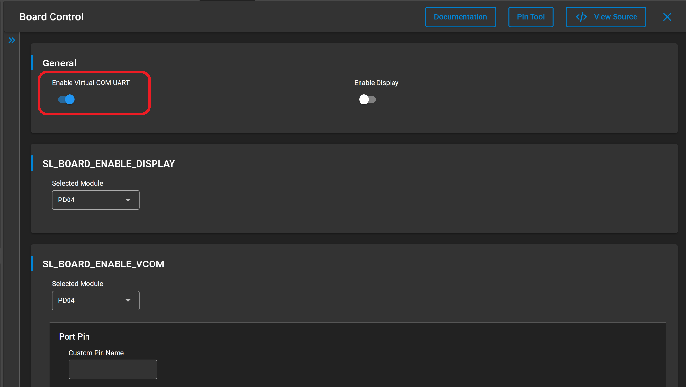

   - Install the **Extended Advertising** and **Periodic Advertising** components, if they are not yet installed

    - Install the **Log** component (found under Application > Utility group)
    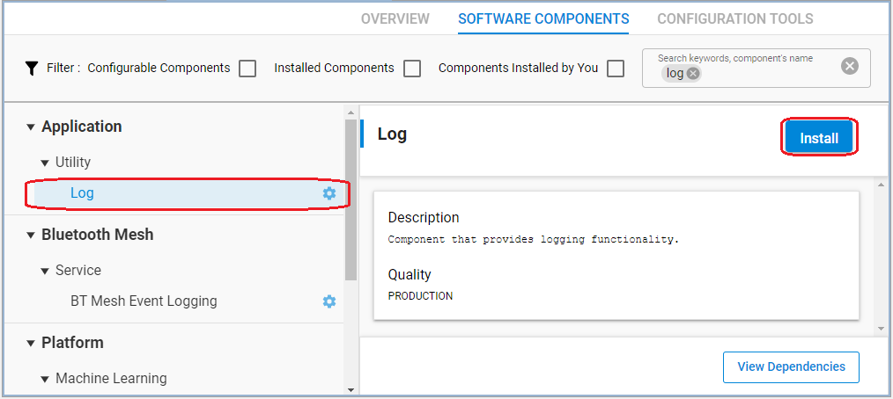  

4. Import the GATT configuration:
    - Open the **Bluetooth GATT Configurator** under the **CONFIGURATION TOOLS** tab.
    - Find the Import button and import the attached **gatt_configuration.btconf** file.
    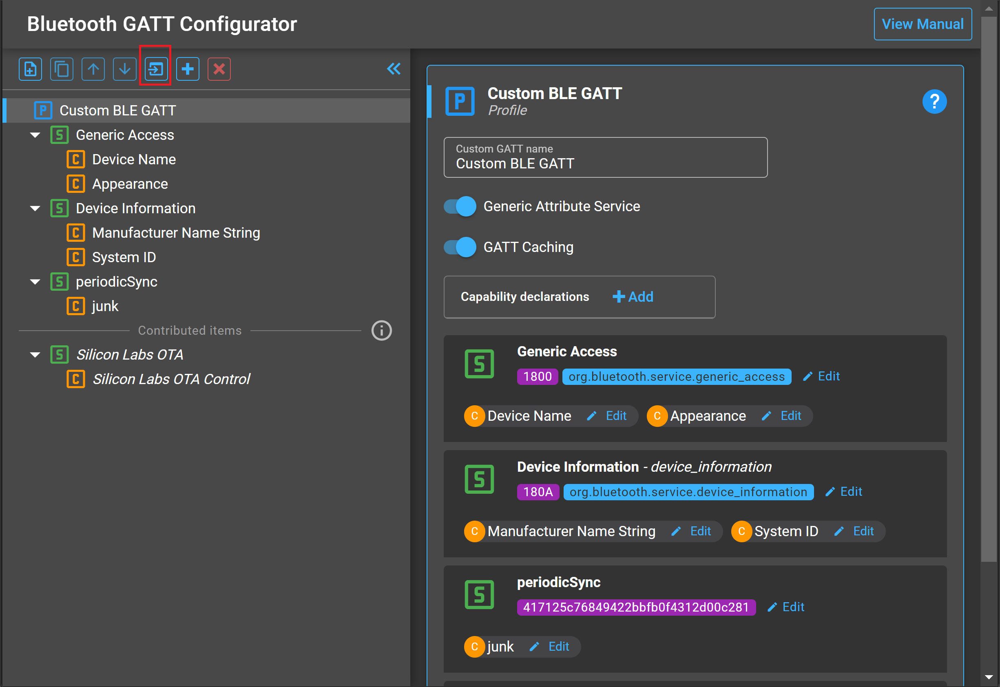
    - Save the GATT configuration (Ctrl+S).

5. **Save and close** then the tool will auto-generate to code.

6. Build and flash the project to the **Advertiser** device.

### Scanner

1. Create an **Bluetooth - SoC Empty** example for the radio boards in Simplicity Studio.

2. Copy the attached [src/scanner/app.c](src/scanner/app.c) replacing the existing `app.c`.

3. Config **Software components**.  

    * In **Bluetooth Core** configuration, set **Max number of periodic advertising synchronizations**. This example syncs to one advertiser only, but it is possible to sync to multiple advertisers at the same time.
      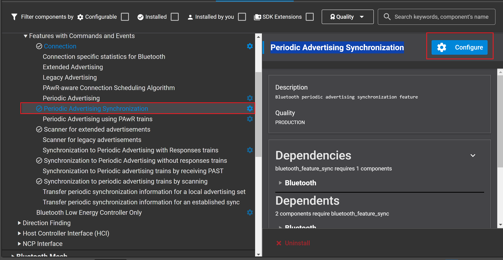
      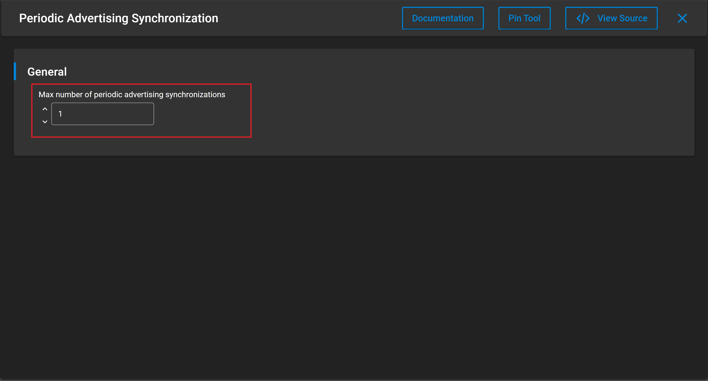

    * Install the **Periodic Advertising Synchronization** component.  
      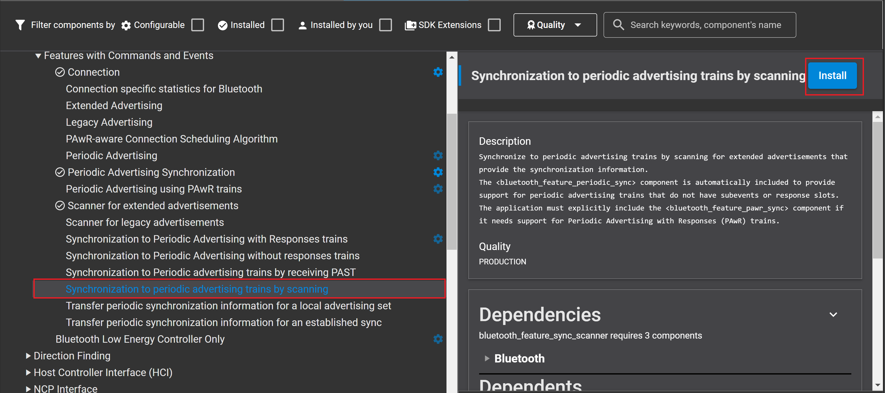

4. **Save and close** then the tool will auto-generate to code.

5. Build and flash the project to the **Scanner** device.

## Usage

After flashing the applications to the devices, launch console for both **Advertiser** and **Scanner**, and reset both devices. On the logs, you should be able to observe that those devices are sending and receiving periodic advertisements after the scanner synced on the advertiser.

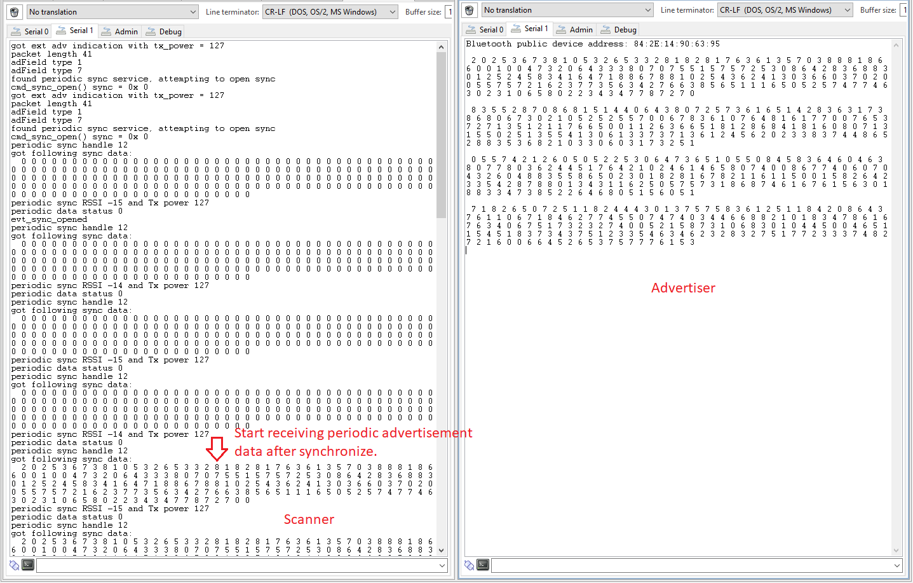

The advertiser changes the content of the advertisement every second, but the periodic advertising interval is set as 200ms so each data will be received 5 times. Which is shown in the console.

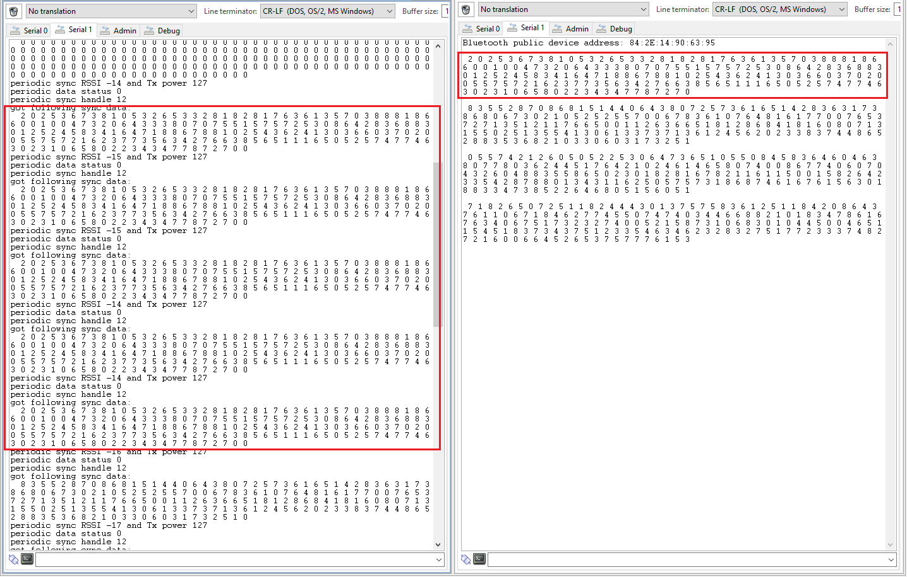

Use the energy profiler in Simplicity studio to evaluate the current consumption. The scanner goes into energy saving mode and wakes up every 200 ms to receive sync packets from the advertiser. The advertiser sleeps when not advertising, as shown in the figure below.

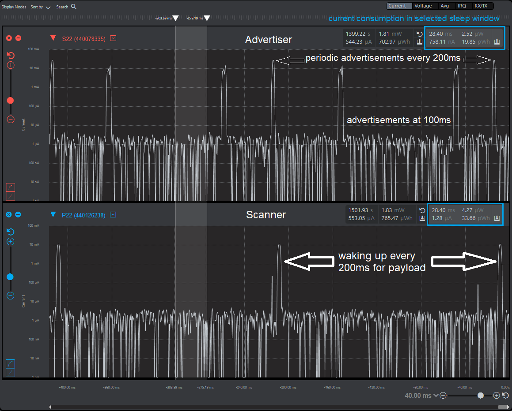
