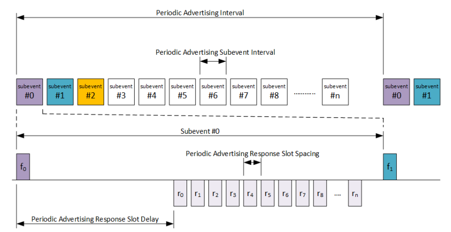
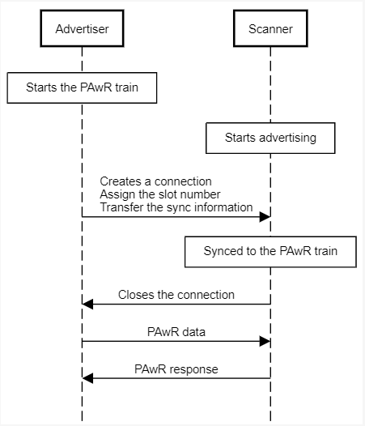
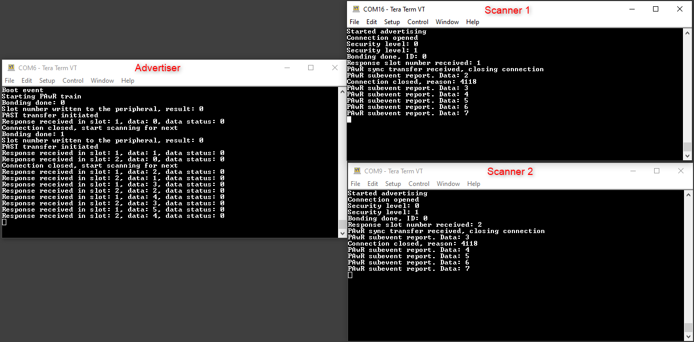

# PAwR with PAST sample 

## Simplicity SDK version ##

- SiSDK v2025.6

## Hardware Required ##

- 2 x WSTK board: BR4001A
- 2 x Bluetooth radio board, e.g: BRD4162A

## Periodic Advertising with responses basics

Periodic Advertising with Responses (PAwR) is kind of a Time Division Multiple Access (TDMA) system, where communication between nodes (single Central device and one or more Peripheral devices) happen in predefined time slots. The fundamental timing period is the "Periodic Advertising Interval" which is the interval of periodic advertisements sent by the Central device. Each Peripheral device receives the periodic advertisement once in the Periodic Advertising Interval to keep synchronization to the PAwR train. Each Periodic Advertising Interval is divided into 1-128 Subevents and each Subevent to 0-255 Response Slots. In theory 128 x 255 = 32,640 Peripheral devices may be mapped to one PAwR train. The Periodic Advertising Interval can be between 7.5ms to ~82
seconds.

In each Subevent, the Central device transmits one Periodic Advertisement to all Peripherals in that particular Subevent. Each Peripheral has its unique Response Slot where it may send data to the Central device. The allocation of the Response Slots is application-specific. PAwR itself doesn't specify in any means the content of the data or the protocol for how the data should be handled by any of the devices.



PAwR introduces several timing parameters to define the different intervals and delays. This allows endless possibilities to define the best parameters to meet the system/application bandwidth, latency, and energy consumption requirements.
The following timing parameters exist in PAwR:

• Periodic Advertising Interval (7.5ms - 81.91875sec)

    • Interval of the periodic advertisement train. PAI must be defined so that all the allocated Subevents fit into the PAI.

• Periodic Advertising Subevent Interval (7.5ms - 318.72ms)

    • Periodic Advertising Subevent Interval is the duration of one Subevent. All Subevents have the same duration. One Subevent includes one transmission from the Central device and possible Response Slots from the Peripherals. Periodic Advertising Subevent Interval must be defined so that all allocated Response Slots and the Periodic Advertising Response Slot Delay (see next bullet) fit into one Subevent.

• Periodic Advertising Response Slot Delay (1.25ms - 317.5ms)

    • Periodic Advertising Response Slot Delay is the duration between the Central device transmission to the first Response Slot. Periodic Advertising Response Slot Delay must be defined so that the Central device has enough time to transmit its message and be ready to receive the response in the first Response Slot.

• Response Slot Spacing (0.25ms – 31.875ms)

    • Response Slot Spacing is the duration of one Response Slot. All Response Slots have the same duration. One Response Slot includes one transmission from one Peripheral device to the Central device. Response Slot Spacing must be defined so that the whole Peripheral response fits into the Response Slot including the T_IFS (Inter Frame Space, min 150us).

Once the timing parameters of the PAwR are defined, the PAwR train is set up and Peripheral devices are synchronized after which the timing parameters cannot be (dynamically) changed.


## PAST: Periodic Advertising Sync Transfer

The PAST feature transfers the synchronization information of a local active periodic advertising set to a remote device. This means that the remote device does not need to scan for a given advertisement indication packet, it will receive all the required parameters to sync to a given advertising in a connection.
This feature is not exclusive for the PAwR feature, standard PA train information can also be transferred with the PAST feature. For PAwR cases it is particularly useful, as the remote device needs to be assigned to a response slot. Most cases that is done via opening a BLE connection and provisioning the device, so the PAST transfer can also happen on that connection. The PAST feature is not required for synchronizing to a PAwR train, it is also possible to scan for it, as for a traditional PA train.


## Sample application operation
This sample application uses one advertiser and any number of scanners. The PAwR train and the responses don't transmit any meaningful data, the main purpose of the application is to get familiar with the available APIs, and to learn how to start a PAwR train, how to transfer the parameters with PAST and how to send responses in the assigned response slots.

### Advertiser role
After booting, the advertiser will start a PAwR train. It also starts scanning and will initiate a connection to any devices advertising the "pawr_sync_service". This is an internally created service for demonstration purposes. After the connection is done, the advertiser will assign a response slot to the scanner by writing the slot number to the GATT characteristic. After that it will initiate a PAST transfer to transfer the parameters of the PAwR train. After the scanner is synchronized to the train, the scanner will close the connection. When the connection is closed, the device will start scanning again and repeat the above mentioned process indefinitely, "provisioning" any number of devices it can find.
The advertiser will periodically send out dummy data on the train, and will print out any data received from the scanners.

### Scanner role
The scanner will advertise the "pawr_sync_service". After a connection is made by the advertiser, it will receive the response slot number, and after synchronizing to the PAwR train, it will close the connection. The scanner will listen to the PAwR events, upon receiving a packet, it will print out he data and will send a dummy data back in the assigned response slot.

A simplified sequence chart of the operation:


The devices will log the received data on the console log:



## Project walkthrough
### Advertiser
For the full documentation of the PAwR advertiser APIs visit https://docs.silabs.com/bluetooth/latest/bluetooth-stack-api/sl-bt-pawr-advertiser#p-aw-r-advertiser

For the PAST transfer APIs use: https://docs.silabs.com/bluetooth/latest/bluetooth-stack-api/sl-bt-advertiser-past#advertiser-past


The advertisement can be started with the following API:
```C
sl_status_t sl_bt_pawr_advertiser_start(uint8_t advertising_set,
                                        uint16_t interval_min,
                                        uint16_t interval_max,
                                        uint32_t flags,
                                        uint8_t num_subevents,
                                        uint8_t subevent_interval,
                                        uint8_t response_slot_delay,
                                        uint8_t response_slot_spacing,
                                        uint8_t response_slots);
```
For the explanation of the parameters see the description of the PAwR timing at the beginning of the readme.
After the response slot is assigned, the PAST transfer is initiated with:

```C
sl_status_t sl_bt_advertiser_past_transfer(uint8_t connection,
                                           uint16_t service_data,
                                           uint8_t advertising_set);
```

New data for the advertisement can be set in the following event:
```C
sl_bt_evt_pawr_advertiser_subevent_data_request_id
```

Responses are delivered to the application via:
```C
sl_bt_evt_pawr_advertiser_response_report_id
```

### Scanner
On the PAST receiver side the following APIs are used:
https://docs.silabs.com/bluetooth/latest/bluetooth-stack-api/sl-bt-past-receiver#past-receiver

For the PAwR scanning side these are the available APIs:
https://docs.silabs.com/bluetooth/latest/bluetooth-stack-api/sl-bt-past-receiver#past-receiver

First the sync parameters are set in the project after boot:

```C
sl_status_t sl_bt_past_receiver_set_default_sync_receive_parameters(uint8_t mode,
                                                                    uint16_t skip,
                                                                    uint16_t timeout,
                                                                    uint8_t reporting_mode);


```

The application will be notified if a sync transfer is received with the event
```C
sl_bt_evt_pawr_sync_transfer_received_id
```
Any received PAwR advertisement will trigger the
```C
sl_bt_evt_pawr_sync_subevent_report_id
```

event. In this event the received data can be parsed, and also the response can be set.

Components

## Necessary Software components

The provided slcp files will include all the needed components, but there is a list for reference about the Bluetooth Components which are required for the PAwR and PAST feature to work:

Advertiser:

 - Periodic Advertising using PAwR trains (for starting a PAwR train)
 - Extended Advertising
 - Transfer periodic synchronization information for a local advertising set (only for PAST)

Scanner:

 - Synchronization to Periodic advertising trains by receiving PAST (only for PAST)
 - Synchronization to Periodic Advertising with Responses trains (to be able to sync to a PAwR train)

## Bootloader requirement
Both projects are requiring a bootloader-apploader to be flashed on the device.
