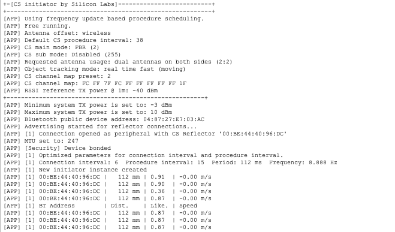
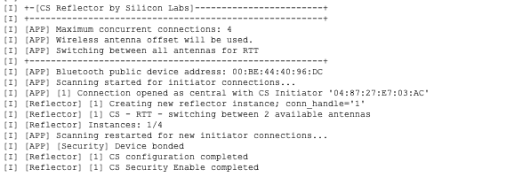

# Channel Sounding - Initiator as Peripheral, Reflector as Central

## Description

This example demonstrates the Bluetooth Channel Sounding (CS) feature with reversed GAP roles, where the SoC initiator acts as a **peripheral** and the SoC reflector acts as a **central** device. The example consists of two projects, one for the initiator and one for the reflector.

Upon startup, the initiator starts advertising for reflector connections as `Silabs Example` and the reflector starts scanning for `Silabs Example` initiator devices. Once a connection is established, the initiator starts CS procedures, computes the distance and prints the results to a serial console.

Alternatively, users may choose to use a Channel Sounding supported Android device (Pixel 10, Pixel Watch 4) as the reflector with an EFR32xG24 initiator device. When using this configuration, the CS procedure parameters should be configured as provided in the [Setup](#pixel-device-compatibility) section to ensure proper operation.

## Simplicity SDK version

SiSDK v2025.12.0

## Hardware Required

- 2 x BRD2606A

    OR

- 1 x BRD2606A
- Pixel 10 or Pixel Watch 4

## Setup

### CS Initiator as a Peripheral Device

1. Create a new Bluetooth - SoC CS Initiator example for BRD2606A in Simplicity Studio.

2. Select **Copy contents** to copy the SDK source files so that any SDK modifications remain local to the project and do not persist across projects.


3. Open the .slcp file of the project, select the Software Components tab and install the **BLE Peer Manager Peripheral** component under **Bluetooth → Application → Miscellaneous**. Uninstall **BLE Peer Manager Central** and **BLE Peer Manager Filter** components as they are not required.

4. Replace the existing `app.c` with `src/initiator/app.c`.

5. Since CS security must be initiated by the central device, this step prevents the peripheral initiator from attempting to enable CS security. In `simplicity_sdk_2025.12.0/bluetooth_le_middleware/common/cs_initiator/src/cs_initiator.c`, disable CS security enable step in `init_cs_configuration()`.

> **Note:** This step modifies SDK source code.

```c
  /*initiator_log_debug(INSTANCE_PREFIX "CS - enable security" LOG_NL,
                      initiator->conn_handle);

  sc = sl_bt_cs_security_enable(initiator->conn_handle);
  if (sc != SL_STATUS_OK) {
    initiator_log_error(INSTANCE_PREFIX "CS - security enable failed! [sc: 0x%lx]" LOG_NL,
                        initiator->conn_handle,
                        (unsigned long)sc);
    initiator_err = CS_ERROR_EVENT_INITIATOR_FAILED_TO_ENABLE_CS_SECURITY;
    on_error(initiator,
             initiator_err,
             sc);
    return;
  } else {
    initiator_log_debug(INSTANCE_PREFIX "CS - security enabled." LOG_NL,
                        initiator->conn_handle);
  }*/
```

#### Pixel device compatibility

To ensure compatibility with Pixel devices, the initiator configuration and MTU size should be modified. The changes are verified with Pixel 10 and Pixel Watch 4.

1. Replace the existing `config/cs_initiator_config.h` of your project with the configurations in `config/initiator/cs_initiator_config_pixel.h` of this example.

Note: The performance cannot be guaranteed if the parameters differ from the recommended values.

Alternatively, manually make the following initiator configuration changes in `config/cs_initiator_config.h`.

- Set the channel map to medium:
  - `#define CS_INITIATOR_DEFAULT_CHANNEL_MAP_PRESET CS_CHANNEL_MAP_PRESET_MEDIUM`
- Set preferred peer antenna elements to 3 (required only for Pixel 10):
  - `#define CS_INITIATOR_DEFAULT_PREFERRED_PEER_ANTENNA 3`
- Use custom procedure scheduling and 30 ms connection interval:
  - `#define CS_INITIATOR_DEFAULT_PROCEDURE_SCHEDULING CS_PROCEDURE_SCHEDULING_CUSTOM`
  - `#define CS_INITIATOR_DEFAULT_MIN_CONNECTION_INTERVAL 24`
  - `#define CS_INITIATOR_DEFAULT_MAX_CONNECTION_INTERVAL 24`
  - `#define CS_INITIATOR_DEFAULT_MIN_PROCEDURE_INTERVAL (7)`
  - `#define CS_INITIATOR_DEFAULT_MAX_PROCEDURE_INTERVAL (7)`
- Reduce maximum procedure duration:
  - `#define CS_INITIATOR_DEFAULT_MAX_PROCEDURE_DURATION 150`
- Set min/max subevent length to 9820 us:
  - `#define CS_INITIATOR_DEFAULT_MIN_SUBEVENT_LEN 9820`
  - `#define CS_INITIATOR_DEFAULT_MAX_SUBEVENT_LEN 9820`

2. In `app.c`, set the MTU size to 245 (Pixel device segments ranging data into 245-byte chunks).

```c
// MTU exchange event
case sl_bt_evt_gatt_mtu_exchanged_id:
{
  //initiator_config.mtu = evt->data.evt_gatt_mtu_exchanged.mtu;
  initiator_config.mtu = 245; // Using 245 MTU size to work with Pixel devices
  log_info(APP_PREFIX "MTU set to: %u" NL,
           initiator_config.mtu);
}
break;
```

### CS Reflector as a Central Device

1. Create a new Bluetooth - SoC CS Reflector example for BRD2606A in Simplicity Studio.

2. Select **Copy contents** to copy the SDK source files so that any SDK modifications remain local to the project and do not persist across projects.


3. Open the .slcp file of the project, select the Software Components tab and install the **BLE Peer Manager Central** and **BLE Peer Manager Filter** component under **Bluetooth → Application → Miscellaneous**. The **BLE Peer Manager Peripheral** component can be uninstalled as it is not needed.

4. As the reflector is the central device in this example, CS security must be enabled by the reflector. In `simplicity_sdk_2025.12.0/bluetooth_le_middleware/common/cs_reflector/cs_reflector.c`, call CS security enable API and add error handling in the `sl_bt_evt_cs_config_complete_id` event handler.

> **Note:** This step modifies SDK source code.

```c
    case sl_bt_evt_cs_config_complete_id:
    {
      uint8_t conn_handle = evt->data.evt_cs_config_complete.connection;
      if (!cs_reflector_identify(conn_handle)) {
        break;
      }
    
      reflector_log_info(INSTANCE_PREFIX "CS configuration completed" NL, conn_handle);
      reflector_log_debug(INSTANCE_PREFIX "CS - enable security" NL,
                    conn_handle);

      sc = sl_bt_cs_security_enable(conn_handle);
      if (sc != SL_STATUS_OK) {
        reflector_log_error(INSTANCE_PREFIX "CS - security enable failed! [sc: 0x%lx]" NL,
                            conn_handle,
                            (unsigned long)sc);
        break;
      } else {
        reflector_log_debug(INSTANCE_PREFIX "CS - security enabled." NL,
                            conn_handle);
      }
      // Set message handled
      handled = true;
    }
```

## Usage

1. Build and flash the modified SoC CS Initiator example to a BRD2606A initiator board.
2. Build and flash the modified SoC CS Reflector example to a BRD2606A reflector board.
3. Open two serial terminals and connect to the initiator and reflector boards via virtual COM port. Use the following UART settings: baud rate 115200, 8N1, no flow control.
4. On the initiator's terminal, you will see that once the application initialization is complete, advertising is started for reflector connections. On the reflector's terminal, scanning is started for initiator connections and when the Silabs Example initiator device is found, the connection is opened. This is followed by the setup of CS - instance creations, configuration, security, and start of ranging using CS. The measurement results are printed on the initiator's serial console.




