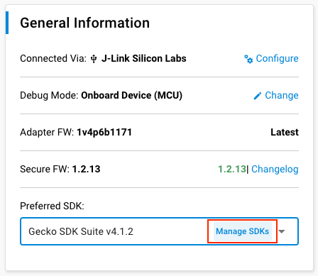
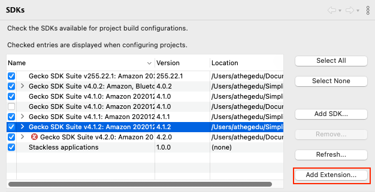
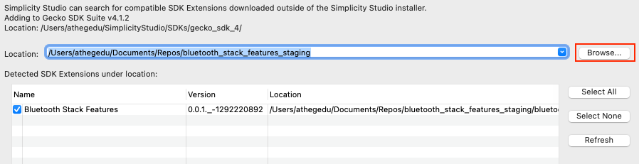
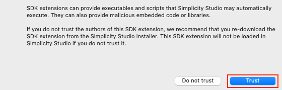
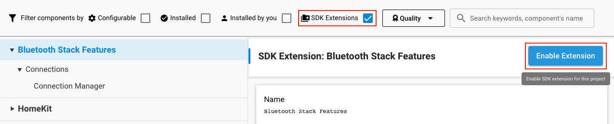
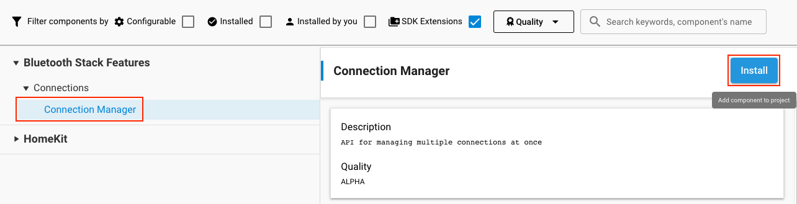
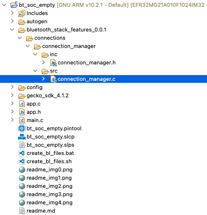

# Connection Manager SDK Extension #

## Description ##

This SDK Extension is aimed to simplify the managing of Bluetooth connections.

The API provides the possibility to retrieve the handles of all the active Bluetooth connections, get all the connection details either by these handles or by a Bluetooth address, and query the leftover space in the connection pool.

Please, see the connection_manager.h header file for the detail API explanation.

## Gecko SDK version ##

GSDK v4.1.2

---

## Important

This project README assumes that the reader is familiar with the usage of SiliconLabs Simplicity Studio 5 and the provided example projects within it.

---

## Requirements

  - Simplicity Studio 5 with the latest GSDK

## Known limitations:

  - The repo has to be cloned, direct git url cannot be used as external SDK Extension source.

## Instructions

  - Clone the repo first
  - Add the repo as an SDK Extension source to the latest GSDK
    - For this, click Manage SDKs
    
    - Select the SDK you wish to add the extension to, and click Add Extension...
    
    - Browse to the cloned repo, Simplicity will detect the SDK Extension in it
    
    - You may have to click Trust, as the Extension was fetched from an external source
    

  - Create a new project, for example a  ```Bluetooth - SoC Empty``` one
  - Add the Connection Manager Component to the project from the Software Components
    - For this, filter for SDK Extensions and enable the Bluetooth Stack Features SDK Extension (if not visible, you may have to alter the Quality filter)
    
    - After enabling the Extension, you have to install the Connection Manager Component, by selecting it and clicking Install
    

  - If all this has been successfully done, the files will be visible in the source tree and the functionalities can be utilized by adding the header to the ```app.c```
    ```c
    #include "connection_manager.h"
    ```
    

---