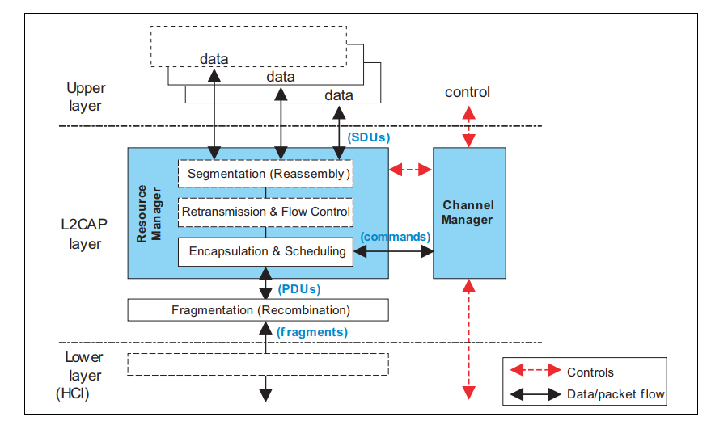

# Connection-oriented Channels

## Description
The Logical Link Control and Adaptation Layer Protocol (L2CAP) is layered over the Baseband Protocol and resides in the data link layer. L2CAP provides connection-oriented and connectionless data services to upper layer protocols with protocol multiplexing capability, segmentation and reassembly operation, and group abstractions.

The connection-oriented channels can be used to send and receive data in a connection without the need of GATT operations. The connection-oriented channels are using a credit-based flow control, where one channel endpoint can give credits to the other side, and receive as many messages as it has credits for. The received data packets are transferred directly to the application that uses them, without any additional Bluetooth layer-specific overhead. An application can also open multiple channels to the other endpoint.

This example uses a central and a peripheral device. The peripheral advertises itself and the central connects to it. After the connection is opened, it will open an L2CAP connection-oriented Channel.

A button press on the peripheral side will send credits to the central. If the button is pressed on the central side, it will send data packets to the peripheral until the credit limit is reached.

## Setting Up

To test the example, set up two radio boards, one as central, the other as peripheral.
Create a *Bluetooth - SoC Empty* project for both roles. In the Software Components install the following software components:

- IOSTREAM: USART
- Log
- Simple Button
- Simple LED (Peripheral only)
- L2CAP
- In the Board Control component: Enable VCOM

Copy the provided app.c file to the project. For the peripheral, also import the provided btconf file in the GATT configurator.

## Usage

Build and flash the two projects on the devices, and connect to them with a serial terminal to see the logs. After the connection is established, the central will open a connection-oriented data channel to the peripheral. The peripheral will send 5 initial credits after the channel is opened. Additional credits can be sent with pressing the BTN0 on the board. On the central side pressing the BTN0 will trigger the data transfer of as many packets as it has credits for.

