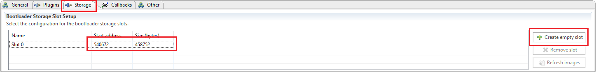
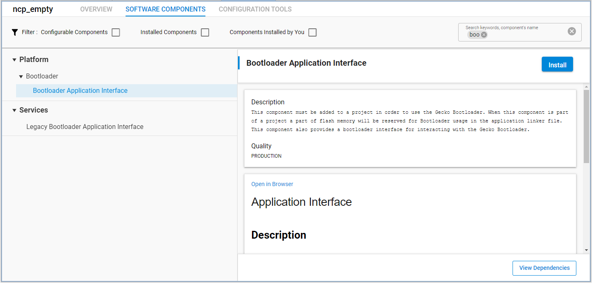
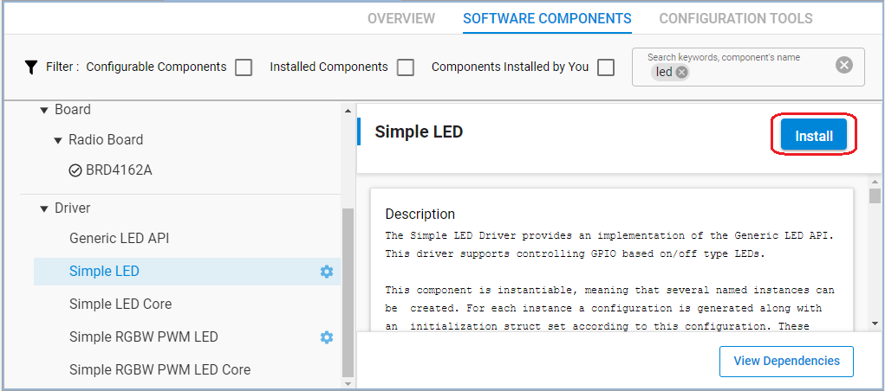

# OTA Options for NCP-Based Designs

## Description

This example lays out the different ways of doing device firmware updates (DFU), especially over-the-air updates (OTA), when using **NCP Mode** in your design. We will use the **NCP-target-empty** example project as the starting point. Normally the NCP empty example just acts as a bridge between the NCP host and the BLE stack running inside an EFR32 device, and it does not implement DFU functionality. Firmware upgrade capability must be added to your project.

There are three methods that the NCP-target device can use to update firmware:

- **UART DFU** (implemented in the bootloader)
- **OTA DFU** implemented in the **Apploader** (with the use of the bootloader)
- **OTA DFU** implemented in the **Application** (with the use of the bootloader)

When starting with software examples in Simplicity Studio, the project will not contain a DFU method by default. Choose one of the three methods above and add it to your project as it is described in the [Setting up](#setting-up) section.

### UART DFU

This is probably the most used firmware update method in NCP-mode. A Gecko Bootloader image (.GBL file) containing the new firmware is written to the target device using UART and BGAPI binary protocol. The target device needs to be programmed with the Gecko Bootloader as **BGAPI UART DFU Bootloader**.

The UART DFU process follows these basic steps:

1. Boot the target device into DFU mode (`dfu_reset(1)`).
2. Wait for the `DFU boot` event.
3. Send command `DFU Flash Set Address` to start the upgrade (set as zero, offsets are calculated automatically).
4. Send the whole Gecko Bootloader image (`.GBL`) using `DFU flash upload`.
5. After sending the image, the host sends the command `DFU upload finish`.
6. Finally, the host resets the target to normal mode `dfu_reset(0)`.

An NCP host example is provided with the SDK at `<StudioPath>\<version X>\developer\sdks\gecko_sdk_suite\<version>\app\bluetooth\example_host\uart_dfu`. For more information about compiling and developing host examples, see [AN1259](https://www.silabs.com/documents/public/application-notes/an1259-bt-ncp-mode-sdk-v3x.pdf) and [AN1086](https://www.silabs.com/documents/public/application-notes/an1086-gecko-bootloader-bluetooth.pdf). The host example compiles to an executable, which takes the COM port number, baud rate and **full.gbl** file as arguments. The default baud rate is 115200.

### Apploader

The Apploader is a simple application with a minimal Bluetooth stack, that handles the upload process. The Apploader uses the API of the Gecko Bootloader to decode the GBL files and to store the application image in the flash.

To use this approach, your device needs to be programmed with a suitable Gecko bootloader. When creating the bootloader project select **Bluetooth in-place OTA DFU Bootloader** or **Internal Storage Bootloader (single image on 512kB/1MB device)**, depending on the size of internal flash in your device. If you want to keep the possibility of **UART DFU** as well, then you should 

* Use a **BGAPI UART DFU Bootloader**.
* Install the **Common Storage**, and **Internal Storage** plugins in the `Plugins tab`.


* Define a bootloader storage slot in the bootloader project, based on your device flash size.

    - On 256k flash size devices Apploader needs a storage slot e.g. with start address `137216` and size `88064`
    - On 512k flash size devices Apploader needs a storage slot e.g. with start address `278528` and size `196608`
    - On 1M flash size devices Apploader needs a storage slot e.g. with start address `540672` and size `458752`

    In the `Storage tab`, Select `Create empty slot` then edit the start address and size as the description above.
    

For **Bluetooth SDK version 3**, the **OTA DFU** component should be added to your project to run the Apploader. After you add the **OTA DFU** component, the `Silicon Labs OTA` service will be added automatically to your GATT and the **Apploader** component will be added automatically too, which will take care of the `ota_control` characteristic.

The standard OTA DFU sequence implemented in the AppLoader goes as follows:

1. The app is running.
2. The device is reset into DFU mode. In this mode, the bootloader will start the Apploader instead of the Application.
3. The Apploader advertises and waits for a Bluetooth connection.
4. The AppLoader waits for the OTA start command (`ota_control` characteristic).
5. The Apploader starts receiving the GBL file (using `ota_data` characteristic).
6. The headers of the GBL file are parsed.

7. After parsing the headers, the rest of the GBL file is decoded on-the-fly, and the application is copied right to the application area, overwriting the old application.

8. The Apploader receives the OTA end command and restarts the device in normal mode.

 The procedure is also described in [AN1086 section 3.6](https://www.silabs.com/documents/login/application-notes/an1086-gecko-bootloader-bluetooth.pdf).

### Application-level OTA

In addition to the basic UART and OTA DFU solutions discussed above, it is possible to implement the firmware update functionality completely in the user application.

The main difference here compared to AppLoader based OTA above is that there is no separate DFU mode and step 2 in the above list is not needed at all. The GBL file is uploaded to the target device under the control of the user application. In this example, the file upload is done using the Silicon Labs proprietary OTA service (as specified in [AN1086](https://www.silabs.com/documents/login/application-notes/an1086-gecko-bootloader-bluetooth.pdf)), but it is possible to use a customer specific service and protocol to handle the file upload.

Some of the benefits of this approach are:

* The user application remains fully functional while the OTA image is being uploaded.
* It's possible to implement customer specific OTA service/protocol (with application-level security if needed).
* EM2 deep sleep is supported during OTA upload. *
* Normal BLE security features (link encryption, bonding...) can be used.

>\* Sleep and BLE encryption/bonding are not supported by AppLoader to reduce the flash footprint.

An obvious disadvantage of this solution is the requirement to have dedicated flash space available to be used as the download area.

Same with the [Apploader](#apploader), to use this approach, your device needs to be programmed with a suitable Gecko bootloader. When creating the bootloader project select **Internal Storage Bootloader (single image on 512kB/1MB device)**, depending on the size of internal flash in your device. If you want to keep the possibility of UART DFU as well, then you should 

* Use a **BGAPI UART DFU Bootloader**

* Install the **Common Storage**, and **Internal Storage** plugins
  

* Define a bootloader storage slot in the bootloader project, based on your device flash size.

  - On 256k flash size devices Application level OTA cannot be used
  - On 512k flash size devices Application level OTA needs a storage slot e.g. with start address `278528` and size `196608`
  - On 1M flash size devices Application level OTA needs a storage slot e.g. with start address `540672` and size `458752`

  In the `Storage tab`, Select `Create empty slot` then edit the start address and size as the description above.
  

Gecko bootloader has a key part in the OTA update. After the GBL file is uploaded, it is the Gecko bootloader that takes care of parsing the GBL file and installing the new firmware. The bootloader is also needed during the OTA file upload.

Gecko bootloader has an application interface exposed through a function table in the bootloader. This means that the user application can call functions implemented in the bootloader, even though the application is running in normal mode. In other words, the bootloader API functions are called from the user application context, but the implementation is in the Gecko bootloader project. As a practical example, the user application can call function `bootloader_writeStorage` to write data into the download area, without even knowing where the download area is physically located.

A list of the key bootloader API calls needed to implement OTA update is found in [AN1086](https://www.silabs.com/documents/login/application-notes/an1086-gecko-bootloader-bluetooth.pdf), Chapter 4. The commands are also shown below in short.

```C
// Bring in needed bootloader functions
#include "btl_interface.h"
#include "btl_interface_storage.h"

// Erase download slot before update started
bootloader_eraseStorageSlot(0);
// Write 0 to ota_control characteristic -> init
bootloader_init();'
// Write received bytes to download area
bootloader_writeStorage(...);
// When 3 is written to ota_control, the update ends and you verify the image
bootloader_verifyImage(0, NULL);
//  Specify slot of new image
bootloader_setImageToBootload(0);
// Reboot and perform update
bootloader_rebootAndInstall();
```

### Creating Firmware Upgrade Images of Your Project

To update your firmware you will need a .gbl file that contains the new firmware image. SDK examples provide scripts, which generate `.gbl`-files, `create_bl_files.bat/.sh` for Windows and Linux/Mac respectively. The images (`application.gbl`, `apploader.gbl`, `full.gbl` and possible secure variants) are created into output_gbl folder. Please follow the instructions in [AN1086: Using the Gecko Bootloader with the Silicon Labs Bluetooth® Applications,](https://www.silabs.com/documents/public/application-notes/an1086-gecko-bootloader-bluetooth.pdf) section 3.10.

### Uploading Firmware Upgrade Image to the Device

For the UART DFU method, SDK provide `uart-dfu` host example to upload new firmware at `<StudioPath>\<version X>\developer\sdks\gecko_sdk_suite\<version>\app\bluetooth\example_host\uart_dfu`.

For the OTA DFU, we will use the EFR Connect mobile app as the OTA client to perform the upgrade. A guide to using the app can be found here: [Using EFR Connect Mobile App for OTA DFU](https://docs.silabs.com/bluetooth/2.13/general/firmware-upgrade/using-efr-connect-mobile-app-for-ota-dfu).

See the [Usage](#usage) section of this readme file.

## Gecko SDK version

- GSDK v3.1.1

## Hardware Required

- 1 x WSTK board: BR4001A
- 1 x Bluetooth radio board, e.g: BRD4162A

## Setting up

### UART DFU

1. Create a new **BGAPI UART DFU Bootloader** project for your part.  


2. Build and flash the bootloader project to your part. 
    *Note: on series 1 devices (EFR32xG1x) you should flash the image that ends with **-combined.s37**!*

3. Create a new **NCP-empty-target** example project for your part.

4. Build and flash the default NCP-empty-target project to your part.  
At this point, you should be able to connect to your part with the Bluetooth NCP Commander tool to verify that it's running. You should not see any advertisements by default.

5. Next, we'll add functionality to the NCP-target project, (the purpose is to create new version of the application) by including the following function `local_handle_event` in **app.c**:

    ```C
    // The advertising set handle allocated from Bluetooth stack.
    static uint8_t advertising_set_handle = 0xff;
    
    bool sl_ncp_local_evt_process(sl_bt_msg_t *evt)
    {
      bool evt_handled = true;

      switch (SL_BT_MSG_ID(evt->header)) {
        case sl_bt_evt_system_boot_id:
          {
            // Start advertising automatically at boot (just to make testing easier)
            // Create an advertising set.
            sl_bt_advertiser_create_set(&advertising_set_handle);

            // Start advertising
            sl_bt_advertiser_start(advertising_set_handle,
                                  advertiser_general_discoverable,
                                  advertiser_connectable_scannable);
          }
          break;

        default:
          break;
      }
      return evt_handled;
    }
    ```

   This will make the device start advertising with the default name.

6. Build the project again and run the `create_bl_files` script. (See AN1086 for details.)


### Apploader

1. Create a new  **Bluetooth in-place OTA DFU Bootloader** / **Internal Storage Bootloader** project for your part. This example is for the EFR32MG12 device.  
  

2. Alternatively, create a **BGAPI UART DFU Bootloader** and modify it as described in the [Description](#description) section.

3. Build and flash the bootloader project to your part. 
    *Note: on series 1 devices (EFR32xG1x) you should flash the image that ends with **-combined.s37**!*
    
4. Create a new **NCP-empty-target** project.

5. Add the following function to **app.c**:

    ```c
    // The advertising set handle allocated from Bluetooth stack.
    static uint8_t advertising_set_handle = 0xff;
    
    bool sl_ncp_local_evt_process(sl_bt_msg_t *evt)
    {
      bool evt_handled = true;
    
      switch (SL_BT_MSG_ID(evt->header)) {
        case sl_bt_evt_system_boot_id:
          {
            // Start advertising automatically at boot (just to make testing easier)
            // Create an advertising set.
            sl_bt_advertiser_create_set(&advertising_set_handle);
    
            // Start advertising
            sl_bt_advertiser_start(advertising_set_handle,
                                  advertiser_general_discoverable,
                                  advertiser_connectable_scannable);
          }
          break;
    
        default:
          break;
      }
      return evt_handled;
    }
    ```

6. Config **Software components**, add **OTA DFU** component

    - Install **OTA DFU** component.  
    

7. **Save and close** then the tool will auto-generate to code.

8. Build and flash the project to the device.

See section [Usage](#usage) to see how to load new firmware from OTA Client.

### Application-level OTA

1. Create a new **Internal Storage Bootloader** project for your part. This example is for the EFR32MG12 device.  

2. Alternatively, create a **BGAPI UART DFU Bootloader** and modify it as described in the [Description](#description) section.
3. Build and flash the bootloader project to your part. 
    *Note: on series 1 devices (EFR32xG1x) you should flash the image that ends with **-combined.s37**!*
4. Create a new **NCP-empty-target** project.
5. Copy the attached [app.c](src/app.c) file replacing the existing `app.c`.
6. Config **Software components**, add **Bootloader Application Interface** component, **Simple LED** driver, and **Simple button** driver.

    - Install **Bootloader Application Interface** component.  
    

    - Install **Simple LED** driver with default instances `led0`  
      
      

    - Install **Simple button** driver with instance `btn1`  
      
      
7. Import the GATT configuration:
    - Open the **Bluetooth GATT Configurator** under the **CONFIGURATION TOOLS** tab.
    - Find the Import button and import the attached **gatt_configuration.btconf** file.  
    
    - Save the GATT configuration (Ctrl+S).
8. **Save and close** then the tool will auto-generate to code.
9. Build and flash the project to the device.

See section [Usage](#usage) to see how to load new firmware from OTA Client.


## Usage

### UART DFU

1. Navigate to the `uart-dfu` host example directory (`<StudioPath>\<version X>\developer\sdks\gecko_sdk_suite\<version>\app\bluetooth\example_host\uart_dfu`) and compile the host project with e.g. `mingw32-make`.

2. Copy the `full.gbl` image from the NCP-empty project to the `\exe` directory of the uart-dfu host example.

3. Run the program by using a command line:

   `uart-dfu.exe <your port> 115200 full.gbl`

4. The console will show as below:

```bash
Bytes to send:208064
Syncing..DFU OK
Bootloader version: 17563648 (0x10c0000)
DFU Packet size:208064
99%
finish
```

5. After the upgrade is finished, you should see the device start advertise from the EFR Connect app Bluetooth Browser. **-Success!**

### OTA DFU

From the external viewpoint, the OTA process is almost the same whether the target application uses Apploader or handles the update in the user application code. The main steps (simplified) are:

1. Connect to the target device.

2. Reboot the target device into DFU mode if Apploader is used.

3. Upload the new firmware, packaged into a GBL file.

4. When the upload is finished, Gecko bootloader installs new firmware on top of the old version.

See [Using EFR Connect Mobile App for OTA DFU](https://docs.silabs.com/bluetooth/2.13/general/firmware-upgrade/using-efr-connect-mobile-app-for-ota-dfu)

Preparations:

- Build and flash the bootloader built with default settings.

- Build and flash version 1 of the application image (*.hex).

- Change the `APP_VERSION` #define in `app.c` if you use application level OTA

    ```C
    #define APP_VERSION 2
    ```

    or change the Device Name in the GATT configurator if you use Apploader

- Rebuild to make version 2 of the application.

- Run script `create_bl_files`

- Copy the provided GBL files to your phone.

With the **Application-level OTA**, the preparations need one more step:

- To test OTA, you need to manually erase the download area. To do this, **keep PB1 pressed and reset** the kit. LED0 turns on and after a short delay, it starts blinking. The delay is because of the flash erase (~256kB area) which takes time to complete.  
The device should now advertise with the name _“NCP APP 1*”_.  
With the **Apploader** just skip this step.  

    > Note, that if you use **BGAPI UART DFU Bootloader** then the bootloader will use `PB0` to enter the UART DFU mode. So if you keep the PB0 press while reset, the device will enter UART DFU mode.

Now you connect to your device and you can run OTA using the EFR Connect app. OTA is performed using one single file (**application_1.gbl**) to change the application from version 1 to version 2.


After the OTA upload is complete, you press `END` button on the mobile app. At this point, the connection is closed and the NCP firmware completes the firmware update. Gecko bootloader is used to install the new image from the download slot.

Installation of the new image takes about few seconds and then the device reboots with the new firmware installed. At this point, you should see it advertising with a different name (_“NCP APP 2”_ in case you used Application level OTA, or your custom name if you used Apploader).

You can repeat the process and do another update to the original version by using file `application.gbl`.

> Remember that with **OTA DFU in Application** you need to erase the download area before each OTA update.

## References

* [AN1086: Using the Gecko Bootloader with the Silicon Labs Bluetooth® Applications](https://www.silabs.com/documents/login/application-notes/an1086-gecko-bootloader-bluetooth.pdf)
* [UG266: Silicon Labs Gecko Bootloader User’s Guide](https://www.silabs.com/documents/public/user-guides/ug266-gecko-bootloader-user-guide.pdf) - for more about bootloading in general.
* [AN1259: Using the v3.x Silicon Labs Bluetooth® Stack in Network CoProcessor Mode](https://www.silabs.com/documents/public/application-notes/an1259-bt-ncp-mode-sdk-v3x.pdf)
* [Using EFR Connect Mobile App for OTA DFU](https://docs.silabs.com/bluetooth/2.13/general/firmware-upgrade/using-efr-connect-mobile-app-for-ota-dfu) - mobile app OTA guide.
