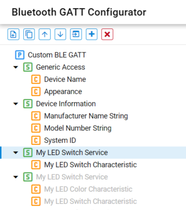
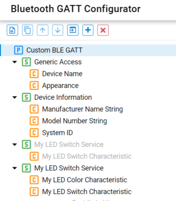
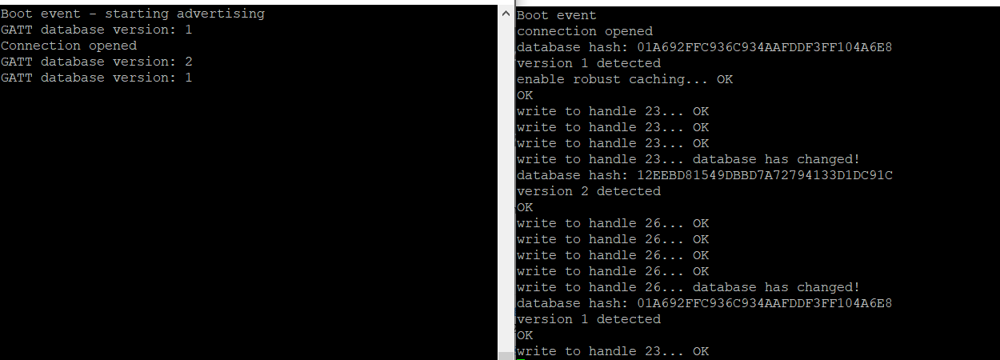

<!--Author: Arnold Kalvach -->

# Polymorphic GATT and GATT Caching

## Background

This code example has related User's Guides, here:

* [Polymorphic GATT](https://docs.silabs.com/bluetooth/8.2.0/bluetooth-gatt/polymorphic-gatt)
* [GATT Caching](https://docs.silabs.com/bluetooth/8.2.0/bluetooth-gatt/gatt-caching)

## Description

In this example, a server that can dynamically change its GATT database structure (polymorphic GATT) and a client that can recognize the database change (GATT caching) are implemented.

The server uses the polymorphic GATT feature i.e., it can enable and disable some of its services / characteristics at runtime. In this example, two versions of the same service (My LED Switch Service) are defined in the database, from which only one at a time is enabled to imitate two different versions of the database. In this example, version 1 has a LED Switch characteristic, while version 2 has both a LED Switch characteristic and a LED color characteristic.

|  Version 1                                   | Version 2                                    |
| -------------------------------------------- | -------------------------------------------- |
|  |  |

From the client side, always write to the LED Switch characteristic. Its UUID is always the same, but its characteristic handle depends on the database version. Hence, it is important to know which version the GATT server is using. To find the database version, read the Database Hash characteristic of the server, as follows:

* Every time the client connects to the server
* Every time the server sends an out_of_sync error code as a response to a GATT operation

The Database Hash can be read with the following command:

```c
uint8_t db_hash_uuid[2] = {0x2a,0x2b};
sl_bt_gatt_read_characteristic_value_by_uuid(conn_handle,0x0001FFFF,sizeof(db_hash_uuid),&db_hash_uuid[0]);
```

After the database version is known, you can also learn the corresponding characteristic handle.

In this example, hard coded values for the characteristic handles are used. In a real application, however, when the server changes to a new database structure (e.g., as a result of a firmware update), the client may encounter an unknown database hash and an unknown database structure. In this case, client needs to re-discover service and characteristic handles in the database, and to store the newly discovered characteristic handles (associated with the newly learned database hash). The database hash is stored in the NVM after discovery.

## Setting up

To try this example, you need two radio boards, one for the server side and one for the client side.

### Server

1. Create a new *SoC-Empty* project for your device.

2. Copy the attached *src/server/app.c* file into your project, replacing the original *app.c*.

3. Open the Software Components, and do the following changes:

   - Add the **IO Stream USART** component, with the instance name: **vcom**
   - Add the **Log** component
   - In the **Board control** set the **Enable Virtual COM Port** to enable
   - Install the **Legacy Advertising** component, if it is not yet installed
   - Add two instances of the **Simple button**, with the names: **btn0** and **btn1**

4. Open GATT Configurator and import the attached **config/gatt_configuration.btconf**

5. Build and flash the project to your device.

### Client

1. Create a new *SoC-Empty* project for your device.

2. Copy the attached *src/client/app.c* file into your project replacing the original *app.c*.

3. Open the Software Components, and do the following changes:

   - Add the **IO Stream USART** component, with the instance name: **vcom**
   - Add the **Log** component
   - In the **Board control** set the **Enable Virtual COM Port** to enable
   - Install the **Legacy Advertising** component, if it is not yet installed

4. Open the Software Components and install **NVM3 Default Instance** component.

5. Build and flash your project to your device.


## Usage

When running the two examples next to each other, the client will automatically find the server (based on the device name). Upon connection, the client reads the database hash of the server to learn its database version. Based on the version, the client sends a write request to the server using the corresponding characteristic handle every second, until it gets an out_of_sync error code. Then, it re-reads the database hash to learn the version again and starts writing to the corresponding characteristic handle. The database version can be changed at any time on the server using the push buttons of the WSTK. PB0 sets the database to version 1, and PB1 sets the database to version 2.

To test the example

1. Open two terminal programs (such as TeraTerm) on your PC and connect to the virtual COM ports (JLink CDC UART port).

2. Reset both WSTKs. You should now see the client connecting to the server, discovering the database version and writing to the corresponding characteristic handle. Make sure that the server starts with version 1 when connecting to the client for the first time.

3. On the server side, press PB1 to switch to database version 2. Now you can see the result of the out_of_sync error code on the client side. 

4. Press PB0 on the server to switch back to database version 1, and observe the change on the client side again.




## Source

* [src/client/app.c](src/client/app.c)
* [src/server/app.c](src/server/app.c)
* [config/gatt_configuration.btconf](config/gatt_configuration.btconf)
