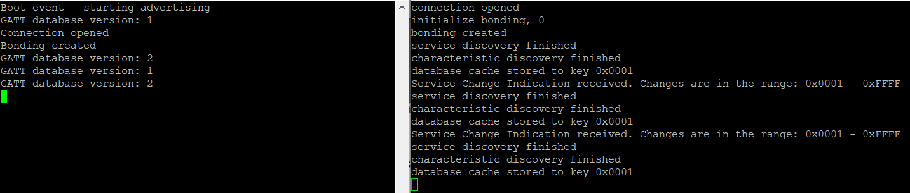

# Polymorphic GATT and Service Change Indications

## Background

This code example has related User's Guides, here:

* [Polymorphic GATT](https://docs.silabs.com/bluetooth/3.2/general/gatt-protocol/polymorphic-gatt)
* [Service Change Indications](https://docs.silabs.com/bluetooth/3.2/general/gatt-protocol/service-change-indication)

## Description

In this example, you find a server that can dynamically change its GATT database structure (polymorphic GATT) and a client that can subscribe to service change indications are implemented.

The server uses the polymorphic GATT feature i.e., it can enable and disable some of its services / characteristics at runtime. In this example, two versions of the same service (My LED Switch Service) are defined in the database, from which only one at a time is enabled to imitate two different versions of the database. The database versions can be changed by push button presses.

The client discovers the Service Changed characteristic in the server's GATT database and subscribes for service change indications to be notified about GATT database changes. After the GATT database of the server changes, the client gets a service change indication.

To be notified about changes that happened while the client was not connected, the client has to create a bonding with the server. If the devices are bonded, the server will notify the client upon reconnection about the changes.

## Setting up

To use this example, you need two radio boards, one for the server side and one for the client side.

### Server

1. Create a new *SoC-Empty* project for your device.

2. Copy the attached *src/server/app.c* file into your project, replacing the original *app.c*.

3. Open the Software Components and make the following changes:
              
    - Add the **IO Stream: USART** component, with the instance name: **vcom**
    - Add the **Log** component
    - Add the **Simple Button** with two instances: **btn0** and **btn1**
    - In the **Board Control** set the **Enable Virtual COM UART** to enabled
    - Install the **Legacy Advertising** component, if it is not yet installed

4. Open GATT Configurator and import the attached **config/gatt_configuration.btconf**

5. Build and flash the project to your device.

### Client

1. Create a new *SoC-Empty* project for your device.

2. Copy the attached *src/client/app.c* file into your project replacing the original *app.c*.

3. Open the Software Components and make the following changes:
              
    - Add the **IO Stream: USART** component, with the instance name: **vcom**
    - Add the **Log** component
    - In the **Board Control** set the **Enable Virtual COM UART** to enabled
    - Install the **Legacy Advertising** component, if it is not yet installed
4. Open the Software Components and install **NVM3 Default Instance** component.
   
5. Build and flash your project to your device.

## Usage

When running the two examples next to each other, the client will automatically find the server (based on the device name). Upon connection

* If the client is not bonded yet with the server
  * it initiates a bonding
  * discovers the GATT database
  * stores the discovered handles in persistent storage
  * subscribes for service change indications
* If the client is already bonded with the server
  * it loads the discovered handles from persistent storage

The database version can be changed at any time on the server using the push buttons of the WSTK. PB0 sets the database to version 1, and PB1 sets the database to version 2. After the version is changed, the server will automatically send out a service change indication to the client. The client receives the indication, confirms it, and restarts database discovery to update characteristic handles. Updated handles are stored again in persistent storage.

To test the example

1. Open two terminal programs (such as TeraTerm) on your PC and connect to the virtual COM ports (JLink CDC UART port).

2. Reset both WSTKs. You should now see the client connecting to the server, creating bonding, and discovering or loading the database structure.

3. On the server side, press PB1 to switch to database version 2. You can see the client receiving service change indication and rediscovering the database.

4. Press PB0 on the server to switch back to database version 1 and observe the change on the client side again.

5. Press and hold the reset button on the client while you press PB1 on the server. This will result in a database change while the client is not connected.

6. Release the reset button of the client and observe that the server will send a service change indication right after the client has reconnected.

## Source

* [src/client/app.c](src/client/app.c)
* [src/server/app.c](src/server/app.c)
* [config/gatt_configuration.btconf](config/gatt_configuration.btconf)

