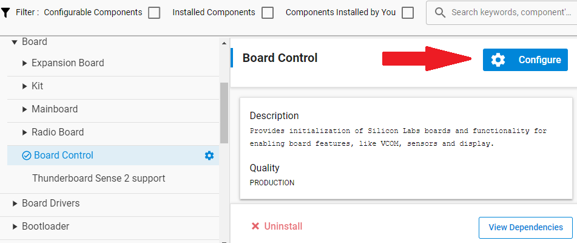
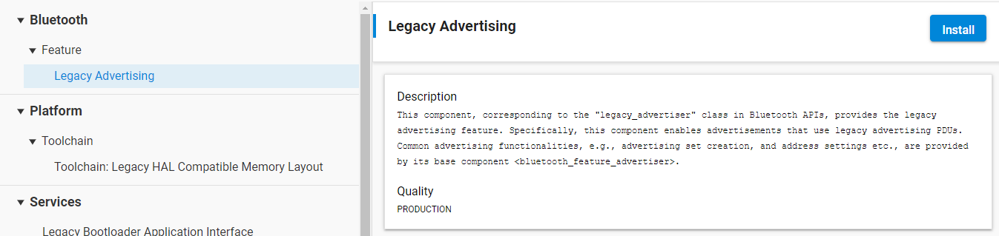
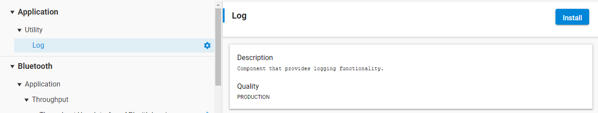
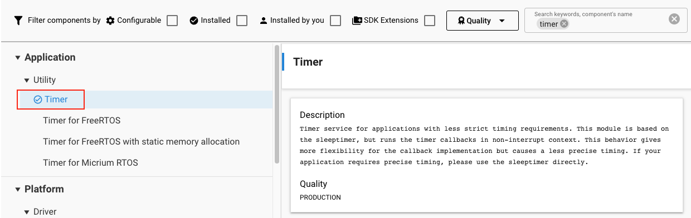
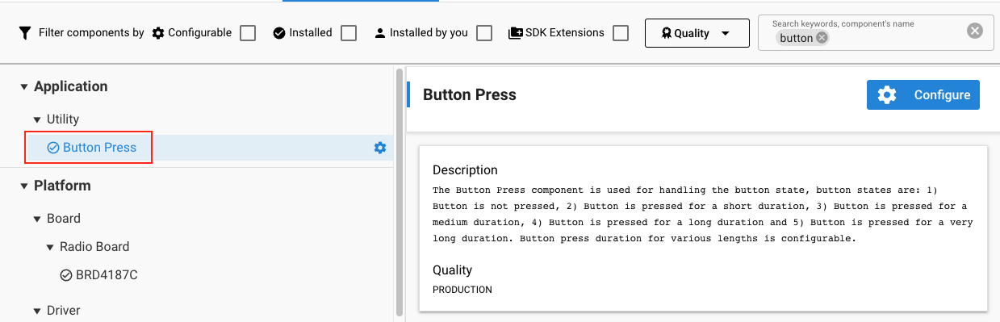
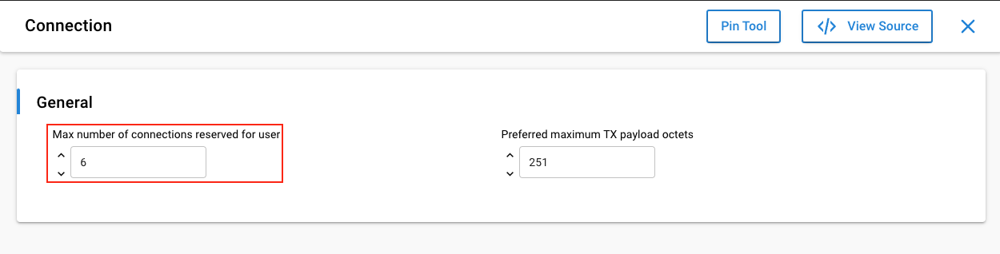

# GATT Read Request with Offset Example

## Description

The goal of this example is to demonstrate the collection of larger amount of information from multiple GATT Servers (up to 6), by one central device. For this, the example utilizes User defined GATT Characteristics and User Reading with Offset features.

## Simplicity SDK version

SiSDK v2025.6

## Hardware Required

- Two or more WSTK boards
- Two or more Bluetooth-capable radio boards, e.g: BRD4187C

## Setup

### GATT Server

To create a **Peripheral**:

1. Download the latest Bluetooth SDK via [Simplicity Studio](https://www.silabs.com/products/development-tools/software/simplicity-studio) if not already done.
2. Create a **Bluetooth - SoC Empty** project base on the board you are using as the starting point.
3. Open the .slcp file of the project, select the **Software Components** tab, and make the following changes:

   - Install **IO Stream: USART** component with the default instance name: **vcom**.
    

   - Find the **Board Control** component and click to the **Configure** button as shown.
      
    Then enable *Virtual COM UART* under its configuration.
    

   - Install the **Legacy Advertising** component, if it is not yet installed.
   

   - Install the **Log** component (found under Application > Utility group).
   

4. Drag and drop the *app.c* file located in the `peripheral/src` folder to your project to replace the existing one.
5. Open **GATT Configurator** and import the attached `peripheral/config/gatt_configuration.btconf`
6. Compile and run the program.
7. Flash as many times as many peripheral is needed (the currently supported max is **6**).

### GATT Client

To create a **Central**:

1. Download the latest Bluetooth SDK via [Simplicity Studio](https://www.silabs.com/products/development-tools/software/simplicity-studio) if not already done.
2. Create a **Bluetooth - SoC Empty** project based on the board you are using as the starting point.
3. Open the .slcp file of the project, select the **Software Components** tab, and make the following changes:

   - Install **IO Stream: USART** component with the default instance name: **vcom**.
    

   - Find the **Board Control** component and click to the **Configure** button as shown.
      
    Then enable *Virtual COM UART* under its configuration.
    

   - Install the **Log** component (found under Application > Utility group).
   

   - Install the **Timer** component (found under Application > Utility group).
   

   - Install the **Button Press** component (found under Application > Utility group).
   

   - Increase the number of supported connections by altering the *Max number of connections reserved for user* parameter within the **Connection** software component to 6.
   

4. Drag and drop the *app.c* file located in the `central/src` folder to your project to replace the existing one.
5. Compile and run the program.

## Usage

The central will connect to the first seen peripheral device. To scan for and connect to more peripherals, press the **BTN0** on the central device for approx. 3 seconds.
