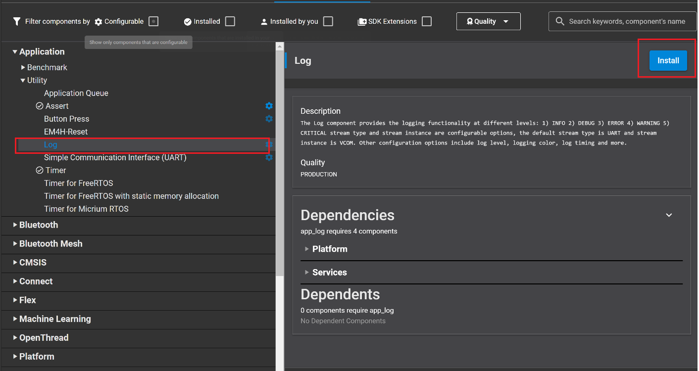
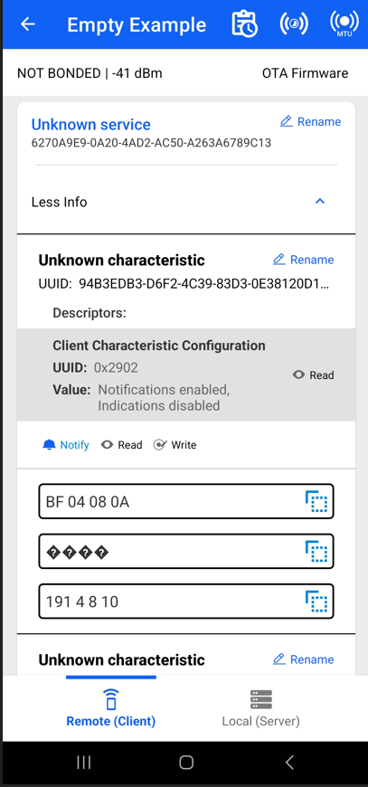

# Different Characteristic Value Type Example ##
 
## Description ##
 
This is the example code for the Different Value Types of Characteristics, which demonstrates below features:

1) Write and read a characteristic with value type "Hex".

2) Write and read a characteristic with value type "User".

3) If notification to the characteristic are enabled, it sends a notification for every 3 seconds and increments the first byte.

4) By searching the keyword "TAG", you will easily find the place for handling the operations above.

This code example has a related User's Guide, here: [Different Value Types of Characteristics.](https://docs.silabs.com/bluetooth/latest/general/gatt-protocol/using-characteristics-value-types)
 
## Gecko SDK version ##
 
GSDK v3.1.1
 
## Hardware Required ##
 
- A WSTK board.
- A Bluetooth capable radio board, e.g: BRD4161A.
 
## Setup
 
1. Create a **Bluetooth - SoC Empty** project.
2. Import the GATT configuration:
   1. Open the .slcp file in the project.
   2. Select the SOFTWARE COMPONENTS tab.
   3. Open the "Bluetooth GATT Configurator" under the Advanced Configurators.
   4. Find the Import button and import the attached *gatt_configuration.btconf* file.
   5. Save the GATT configuration (ctrl-s).

3. Open the "Software components" tab again and do the following changes:
- Install **IO Stream: USART** component with the default instance name: **vcom**.

- Find the **Board Control** component  and enable *Virtual COM UART* under its configuration.

- Install the **Log** component (found under Bluetooth > Utility group).

4. Replace the *app.c* file in the project with the provided *app.c*.
5. Build and flash to the target.
6. Do not forget to flash a bootloader to your board, if you have not done so already.
 
## How It Works ##
 
The example code shows where to handle the read and write requests to the characteristic with both user or hex type, as well as sending a notification every 3 seconds and incrementing the first byte. Follow the below steps to test the example:

1. Open the EFR Connect app on your smartphone.
2. Find your device in the Bluetooth Browser, advertising as Empty Example, and tap Connect.
3. Find the unknown service at the end of the GATT database.
4. Try to read, write, re-read the two characteristics, and check the value.
5. Enable notification on any of these two services, and see the value increasing every 3 seconds.

You can launch the Console that is integrated on Simplicity Studio or can use a third-party terminal tool like TeraTerm to receive the data from the virtual COM port. Use the following UART settings: baud rate 115200, 8N1, no flow control.

