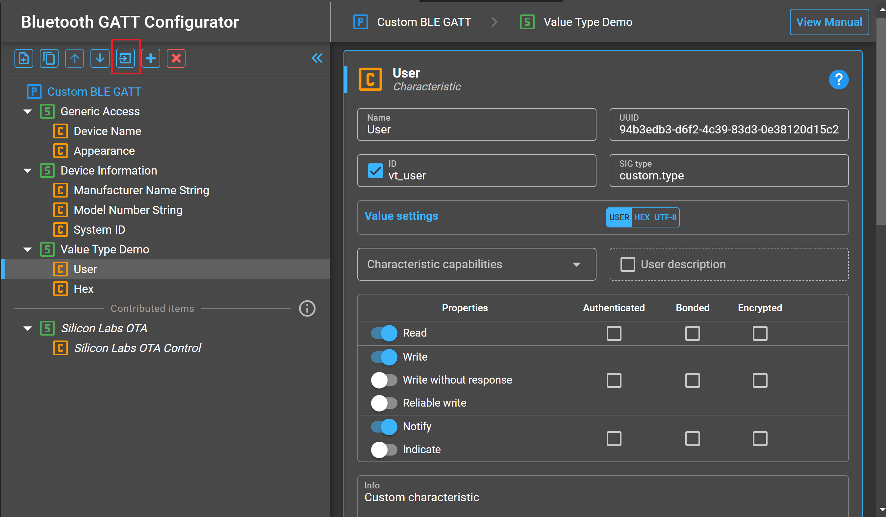
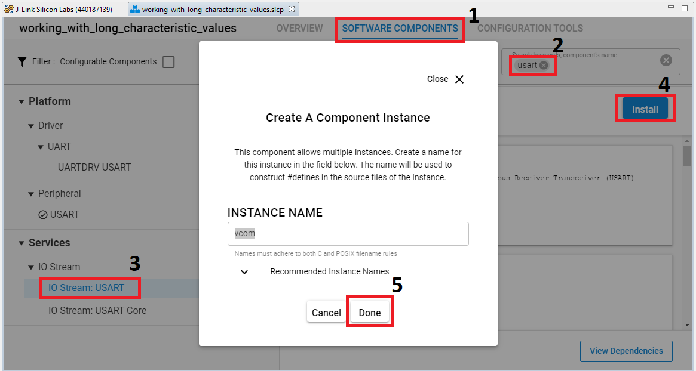
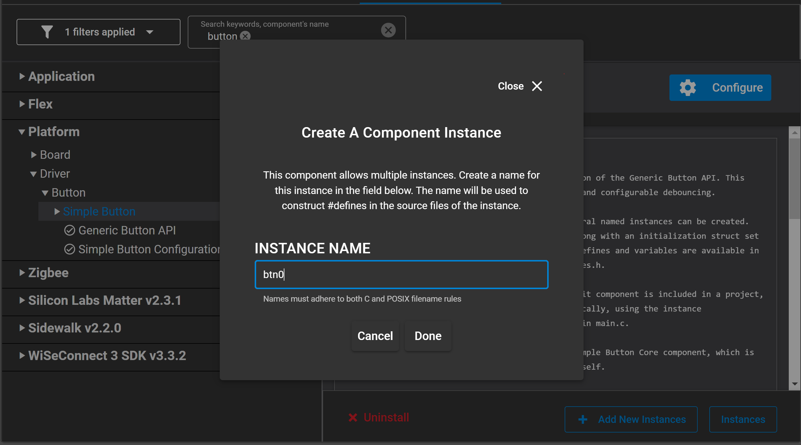
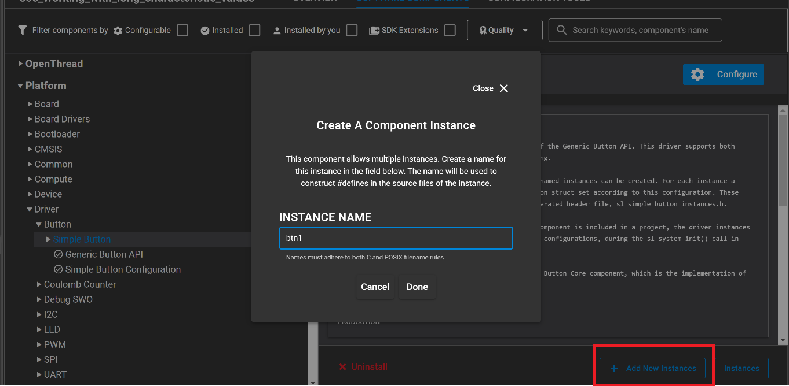
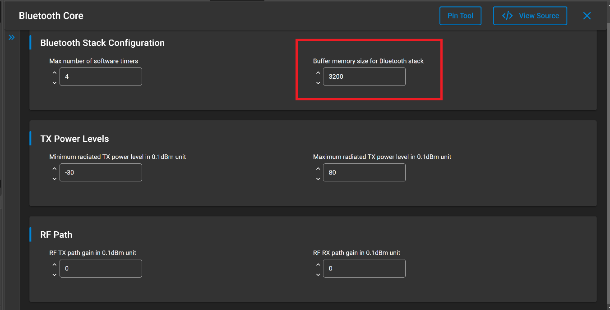

# Working with Long Characteristic Values #

## Description ##

According to the Bluetooth specification, the maximum size of any attribute is 512 bytes. However, the Maximum Transmission Unit (MTU), i.e., the largest amount of data that can be exchanged in a single GATT operation is usually less than this value. As a result, some characteristics may not be read/written with a single GATT operation. If the data to be read or written is larger than the MTU, a long read/write operation must be used. This example demonstrates how to implement this. The attached application handles reading and writing a characteristic of 512 bytes.

This code example has related User's Guide, which may be worth reading before. Find it here: [GATT Server and Client Roles](https://docs.silabs.com/bluetooth/latest/general/gatt-protocol/gatt-server-and-client-roles)

### Reading ###

When reading a user characteristic longer than MTU, multiple **sl_bt_evt_gatt_server_user_read_request** events will be generated on the server side, each containing the offset from the beginning of the characteristic. The application code must use the offset parameter to send the correct chunk of data.

### Writing ###

Characteristics can be written by calling **sl_bt_gatt_write_characteristic_value**. If the characteristic data fits within MTU – 3 bytes, a single operation used. Otherwise, the write long procedure is used. The *write long* procedure consists of a *prepare write request* operation and an *execute write request* operation. A maximum of MTU – 5 bytes can be sent in a single *prepare_value_write* operation. The application can also access these operations directly by calling **sl_bt_gatt_prepare_characteristic_value_write()** and **sl_bt_gatt_execute_characteristic_value_write()**. This is a useful approach if the size of the characteristic is greater than 255 bytes.

### Notifying/Indicating ###

Notifications and indications are limited to MTU – 3 bytes. Since all notifications and indications must fit within a single GATT operation, the application does not demonstrate them.

## Gecko SDK version ##

GSDK v3.1.1

## Hardware Required ##

- Two WSTK boards.
- Two Bluetooth capable radio boards, e.g: BRD4161A.

## Setup

1. Create a **Bluetooth - SoC Empty** project.

2. Import the GATT configuration:
   - Open the .slcp file in the project.
   - Select the SOFTWARE COMPONENTS tab.
   - Open the "Bluetooth GATT Configurator" under the Advanced Configurators.
   - Find the Import button and import the attached *gatt_configuration.btconf* file.
   - Save the GATT configuration (ctrl-s).

3. Open the "Software components" tab again and do the following changes:

- Install **IO Stream: USART** component with the default instance name: **vcom**.

- Find the **Board Control** component  and enable *Virtual COM UART* under its configuration.

- Install the **Legacy Advertising** component, if it is not yet installed (Bluetooth > Feature)

- Install the **Log** component (found under Application > Utility group).

- Install **Simple Button** component with the default instance name: **btn0**.

- Create the second button by clicking the **Add New Instances** button with the default instance name: **btn1**

- Find **Bluetooth->Stack->Bluetooth Core** component and increase the size of buffer memory from the default value to 3200. **This is a limitation of this SDK version**. So this code example only works properly when this step has already been done.

4. Replace the *app.c* file in the project with the provided *app.c*.

5. Build and flash to the target.

6. Do not forget to flash a bootloader to your board, if you have not done so already.

## How It Works ##

The attached application can operate in either peripheral or central mode. The application starts in peripheral mode. To switch to central mode, press PB0 on the WSTK.

### Central ###

As soon as the device is switched to central mode, it begins scanning for a device advertising a service with the following UUID: **cdb5433c-d716-4b02-87f5-c49263182377**. When a device advertising this service is found, a connection is formed. The **sl_bt_evt_gatt_mtu_exchanged** event saves the MTU size for the connection, which is needed for writing the long characteristic later.

The central device now discovers service and characteristic handles. After the *long_data* characteristic is found, the central device performs a read of this characteristic by calling **sl_bt_gatt_read_characteristic_value()**. The size of this characteristic is 512 bytes so the *read long* procedure is always used.

After this process is complete, you’ll see a message indicating that the read has finished and to press PB1 to write a block of test data to the peripheral device. Pressing PB1 on the WSTK triggers a write of an array of test data to this long characteristic. This action is handled by a helper function called **write_characteristic()**, which in turn uses a helper function called **queue_characteristic_chunk**. This function can handle any data size up to 512 bytes. Writing the characteristic data is handled by queuing data with as many calls to **sl_bt_gatt_prepare_characteristic_value_write()** as necessary. After all data is queued up, it is written with a call to **sl_bt_gatt_execute_characteristic_value_write()**. Because only one GATT operation can take place at a time for a given connection, the **sl_bt_evt_gatt_procedure_completed** event is used to drive the process of queuing writes. To get the process started, **queue_characteristic_chunk()** is called directly from **write_characteristic()**. After that **queue_characteristic_chunk()** is called from the **sl_bt_evt_gatt_procedure_completed** event. This ensures that the previous procedure is finished before attempting to start another. The central device displays messages indicating how many bytes are written to the peripheral device in each operation and the message “exec_result = 0x00” when complete.

### Peripheral ###

Upon startup, the peripheral device begins advertising the service mentioned above. This service contains a single *user*-type characteristic of 512 bytes. The **sl_bt_evt_gatt_server_user_read_request** event handler handles read requests from the central device. Because the characteristic is larger than an MTU, this event handler uses the connection *mtu size* and *offset* parameters passed to the event to send the correct portion of the array to the central device. This event will be generated as many times as necessary to allow reading the entire characteristic.

A **sl_bt_gatt_server_send_user_write_response** response must be sent by the application for each queued write, which is handled in the **sl_bt_evt_gatt_server_user_write_request** event handler. A **sl_bt_evt_gatt_server_execute_write_completed** event is generated when all of the queued writes have been completed. The result parameter indicates whether an error has occurred.

