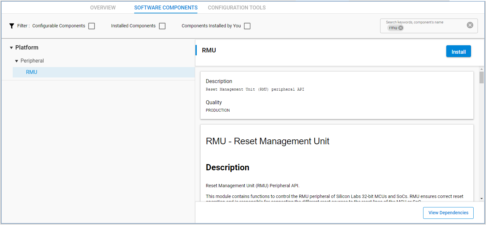
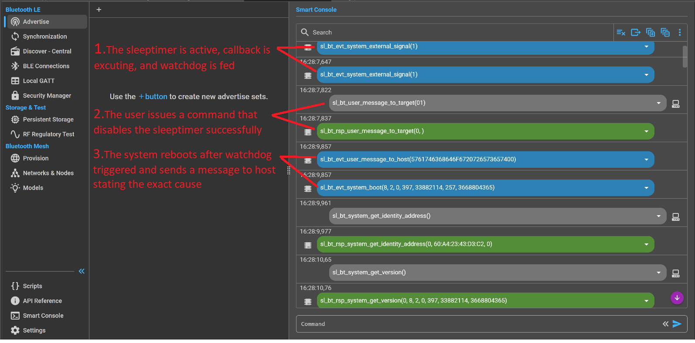

# Adding Watchdog in NCP Mode

## Description

This example describes how to implement the Watchdog on a Bluetooth NCP firmware. The Watchdog is an EFR32 peripheral which allows to detect and reset/reboot an EFR32/BGM device when it hangs and becomes unresponsive (e.g., software stalemate).

> For more information about NCP mode in SDK v3.x, see [AN1259: Using Silicon Labs v3.x Bluetooth Stack in Network Co-Processor (NCP) mode](https://www.silabs.com/documents/public/application-notes/an1259-bt-ncp-mode-sdk-v3x.pdf). For more details about the Watchdog, see the relevant EFR32 Reference Manual.

The sample code in this project was implemented from an **NCP - Empty** project, on **Silabs Bluetooth SDK version 8.2.x**. The basic idea is to **feed the Watchdog timer** each time the **periodic sleeptimer** timesout, if the sleeptimer is stopped then eventually the watchdog will be triggered and will reset the system.

The Watchdog has to be initialized once after reset with `WDOGn_Init()` and it has to be fed from time to time before the Watchdog timer expires using `WDOG_Feed()`.

The sleeptimer is set by calling the function:

```C

sl_status_t sl_sleeptimer_start_periodic_timer	(	sl_sleeptimer_timer_handle_t *	 handle,
           
                                                    uint32_t    timeout,
           
                                                    sl_sleeptimer_timer_callback_t   callback,
                                                            
                                                    void *   callback_data,
                                                            
                                                    uint8_t	 priority,
                                                            
                                                    uint16_t   option_flags)		

```

Each time the sleeptimer timesout, it will execute it's `sleeptimer_callback`, which in turn generates an `sl_bt_evt_system_external_signal` event. 

By default in NCP mode, all of the events are passed to the host, but they can also be handled by the NCP by writing the handling code in the function:

```C
bool sl_ncp_local_evt_process(sl_bt_msg_t *evt)
```

If you don't want to pass the events to the host after the NCP handles them, change the return value of the function `sl_ncp_local_evt_process()` to `false`. In this example, the return value is kept as `true`, it mean that after the events are handled by the NCP target, they are still passed to the host.

To determine whether you recovered from a crash with a Watchdog reset or whether the device was reset normally, use the function `RMU_ResetCauseGet()`.

To simulate a crash scenario you can issue the command [sl_bt_user_message_to_target()](https://docs.silabs.com/bluetooth/9.0.0/bluetooth-stack-api/sl-bt-user#sl-bt-user-message-to-target) from the NCP host. This command will be handled in the target by the function `sl_ncp_user_cmd_message_to_target_cb()` and if `USER_CMD_1_ID` is sent, the sleeptimer will be disabled and after some time the watchdog is triggered. 


## Simplicity SDK version ##

- SiSDK v2025.6

## Hardware Required ##

- One WSTK board: BR4001A
- One Bluetooth radio board, e.g: BRD4180B

## Setup

1. Create a new **NCP - Empty** project.
2. Copy the attached **app.c** file into the project folder (replacing the existing one).
3. Config **Software components**, add: **Watchdog** driver and **RMU** driver (RMU is used to get the cause of the last reset).

    - Install **WDOG** component  
      

    - Install **RMU** component  
      

4. **Save and close** then the tool will auto-generate to code.

5. Build and flash the project to your devices.

## Usage

You can use **Bluetooth NCP Commander** to test the example described in this article. In the Simplicity Studio Tools bar, select **Tools** then find the **Bluetooth NCP Commander**.  


Select your device and press `Connect`.  


You will observe sleeptimer callback occurring every 1 second. In the command prompt, you can stop the sleeptimer by sending the command `sl_bt_user_message_to_target(0x01)`, which will cause the Watchdog to reset the device after some time (depending on the watchdog setting).


