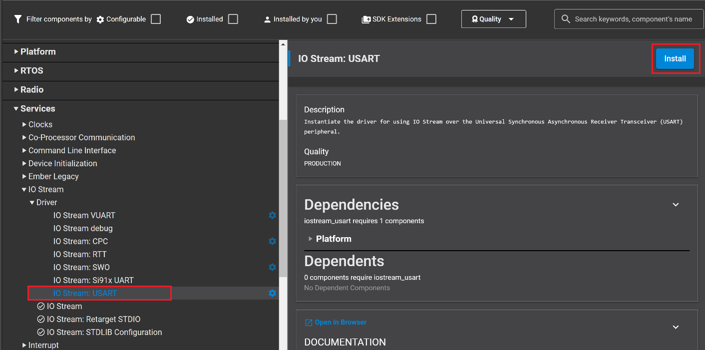
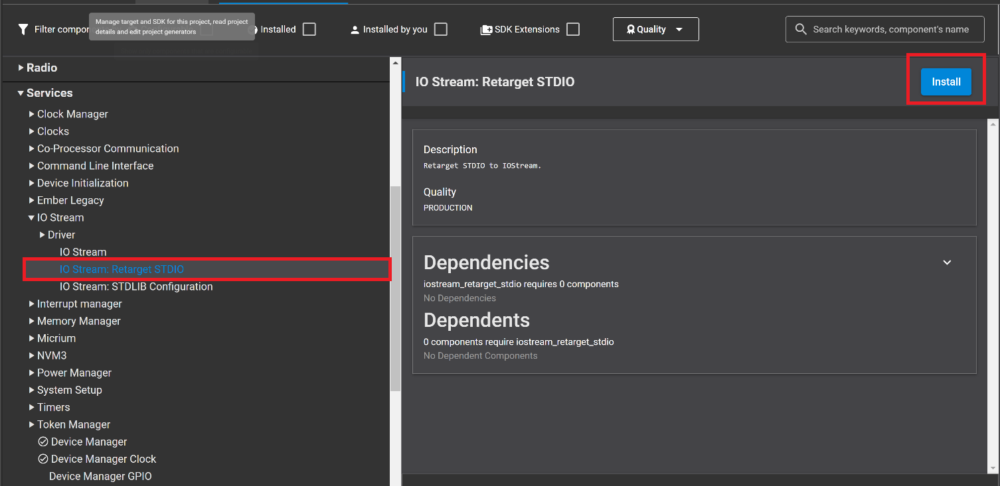
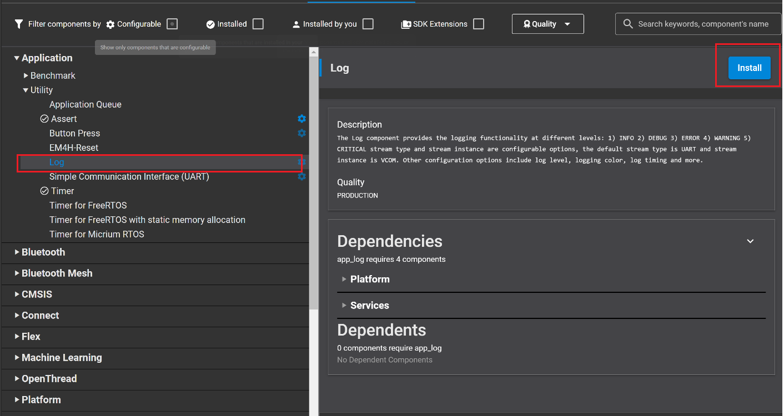
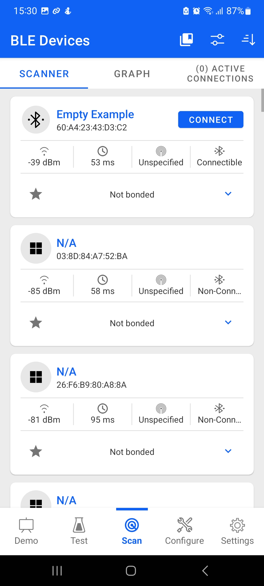
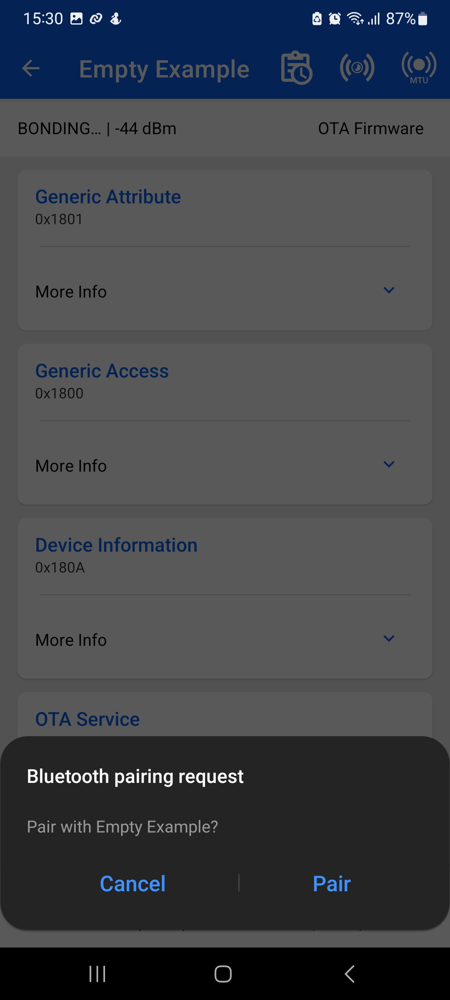
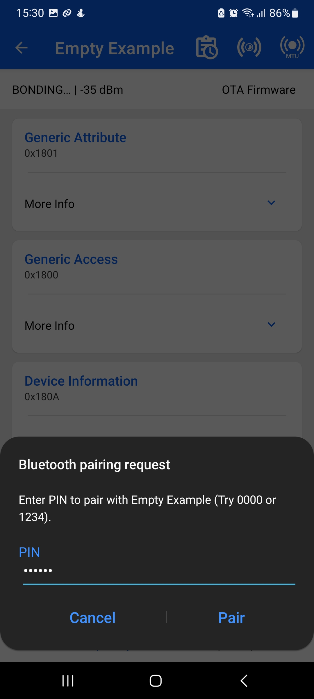
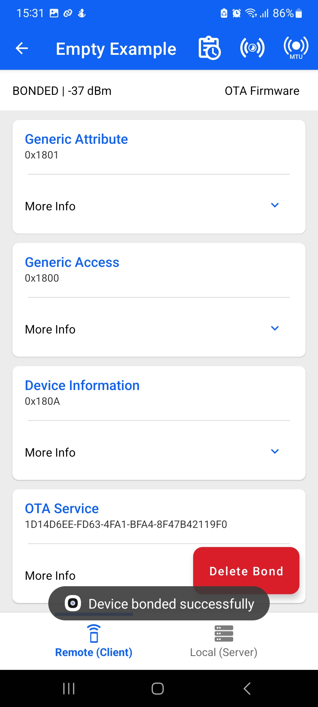
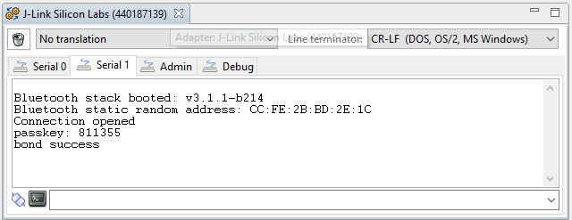

# Authenticating Devices with no User Interface #
 
## Description ##

A common problem with Bluetooth devices is that they often have no user interface, but still need to support authentication. This example demonstrates one method to accomplish this.
 
The Bluetooth specification determines the pairing mechanism based on the reported I/O capabilities of the two devices. When one of the devices has no I/O capabilities at all, the selected method is JustWorks pairing. This ensures an encrypted connection but does not allow for any authentication and allows any Bluetooth device in range request pairing or bonding. The simplest way around this problem involves only allowing bonding for a short period of time after power-up. This provides a little extra protection because the exposure is limited to the time that the device is bondable. However, this doesn’t prevent a rogue device from connecting. A better method is to use a a passkey association model, when this model is chosen along side the secure connection framework it is possible to provide a strong protection against Eavesdropping and Man-in-Middle-Attack.

The association model used for pairing is deterministic based on the IO capabilities of the two devices, in our case a phone will have the "Keyboard Display" I/O capablity while the device can be set to "Display Only", this will result in the passkey pairing method being chosen during the pairing feature exchange.
 

## Implementation ##

To ensure that the pairing method chosen is the passkey method.it is importatn to set security features to right values: 

*sl_bt_sm_configure(0x0F, sl_bt_sm_io_capability_displayonly);*

The flags chosen in the first parameter require MITM protection, bonding for encryption, and LE secure connections, Moreover the last bit is enabling the bonding requests confirmation, this is enabled so the user can accept future rebonding requests if the bonding information was deleted from the other device and the user identify the new bonding request legitimate. Disabling this option will result in the device refusing any rebonding request from the phone as it has lost its keys and can be a potential MITM attack.

Now, make the device bondable as shown:

*sl_bt_sm_set_bondable_mode(1);*

For simplicity, the attached example code requests any connection to be secured by calling sl_bt_sm_increase_security(). Normally, this is done by giving at least one of the characteristics a property that requires security, such as authenticated_read/authenticated_write.

 
## Simplicity SDK version ##
 
SiSDK v2024.6
 
## Hardware Required ##
 
- A WSTK board.
- A Bluetooth capable radio board, e.g: BRD4161A.
 
## Setup
 
To be able to test this example do as follows:

1. Create a **Bluetooth - SoC Empty** project.

2. Copy the attached app.c file into your project (overwriting existing app.c).

3. Install the software components:

- Open the .slcp file in the project.

- Select the SOFTWARE COMPONENTS tab.

- Config **Software components**, add **Log** driver.  

    - Install **IO Stream: USART** component with the default instance name: **vcom**  
    
    

    - Install **Retarget STDIO** component:
    

    - Install the **Log** component (found under Application > Utility group)
      

    - Install the **Legacy Advertising** component, if it is not yet installed (Bluetooth > Feature)

- Install the **Log** component (found under Application > Utility group).

4. Build and flash the project to your device.

5. Do not forget to flash a bootloader to your board, if you have not done so already.
 
## How It Works ##
 
Follow the below steps to test the example:

1. Open a terminal program on your PC, such as the Console that is integrated on Simplicity Studio or a third-party tool terminal like TeraTerm to receive the logs from the virtual COM port.

2. Open the Si Connect app on your smartphone. 

3. Find your device in the Bluetooth Browser, advertising as Empty Example, and tap Connect. Enter the passkey displayed on the terminal when asked.

|Find example|paring request|Enter passkey|Bond created|
|:-------:|:-------:|:-------:|:-------:|
|||||

5. After entering the passkey, you'll see a message in the terminal indicating that the devices are now bonded.

