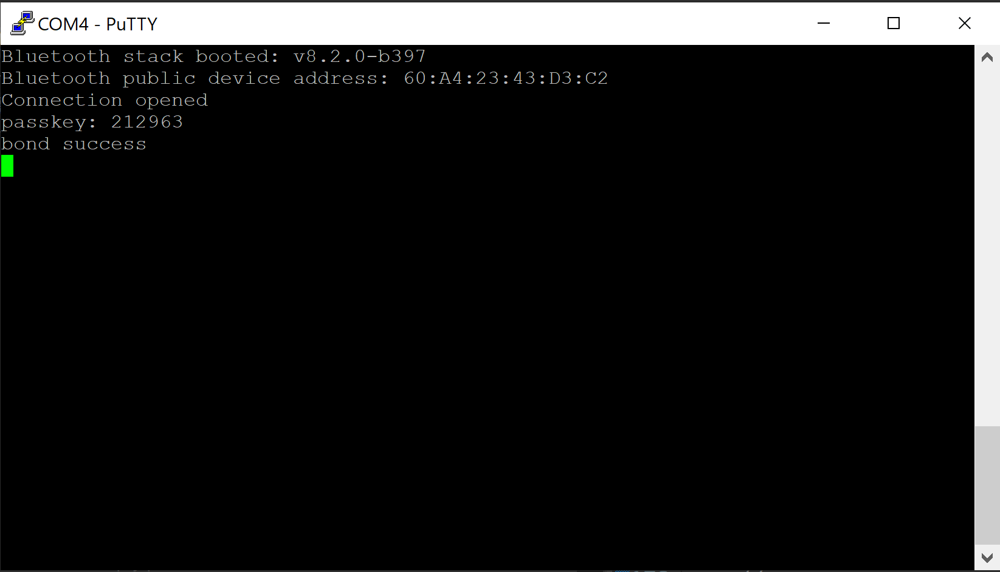

# Authenticating Devices with no User Interface #
 
## Description ##

A common problem with Bluetooth devices is that they often have no user interface, other than the Bluetooth connection, but still need to support authentication. This example demonstrates one method to accomplish this.
 
The Bluetooth specification determines the pairing mechanism based on the reported I/O capabilities of the two devices. When one of the devices has no I/O capabilities at all, the selected method is JustWorks pairing. This ensures an encrypted connection but does not allow for any authentication and allows any Bluetooth device in range request pairing or bonding. The simplest way around this problem involves only allowing bonding for a short period of time after power-up. This provides a little extra protection because the exposure is limited to the time that the device is bondable. However, this doesn’t prevent a rogue device from connecting. A better method is to use a fixed passkey that is made unique. Bluetooth allows for a 6 digit passkey. Because each device has a unique address, the Bluetooth address, it is possible to create a passcode based on this address. However, the number of device addresses is much larger than the number of passkey combinations so the passkey generated will not be truly unique.

The pairing method can be forced to passkey entry by configuring the peripheral as “display only”. The passkey will have to be shared with the user by some medium such as a printed hard copy.

## Implementation ##

First, get the device’s unique address with the following call.

*sl_bt_system_get_identity_address(&address, &address_type);*

Next, make a 32 bit integer from this 6 byte array by hashing the address. The example shown here uses SHA-2/256. The result of the hash is reduced by a modulus of 1 000 000 to produce a six digit passkey. This is done in the attached example with the following call:

*passkey = make_passkey_from_address(address);*

it can be set as the system passkey with the following call

*sl_bt_sm_set_passkey(passkey);*

To ensure that the pairing method chosen is the passkey method. This allows the master, such as a mobile phone or tablet, to enter a passkey, which is done with the following call:

*sl_bt_sm_configure(0x07, sl_bt_sm_io_capability_displayonly);*

The flags chosen in the first parameter require MITM protection, bonding for encryption, and LE secure connections.

Now, make the device bondable as shown:

*sl_bt_sm_set_bondable_mode(1);*

For simplicity, the attached example code requests any connection to be secured by calling sl_bt_sm_increase_security(). Normally, this is done by giving at least one of the characteristics a property that requires security, such as authenticated_read/authenticated_write.

The limitation of using the Bluetooth public address is that the passkey will always be the same. If it becomes necessary to change the pin, such as in the case of a factory default, it is possible to use a static random address. A static random address can be generated and set as follows :

```c
static void set_random_public_address(void)
{
  sl_status_t sc;
  bd_addr address;
  size_t data_len;
  uint8_t data[16];

  sc = sl_bt_system_get_random_data(6, sizeof(data), &data_len, data);
  sl_app_assert(sc == SL_STATUS_OK,
                "[E: 0x%04x] Failed to get random data\n",
                (int)sc);

  memcpy(address.addr, data, sizeof(bd_addr));
  /* set uppermost 2 bits to make this a random static address */
  address.addr[5] |= 0xC0;

  sc = sl_bt_system_set_identity_address(address, sl_bt_gap_static_address);
  sl_app_assert(sc == SL_STATUS_OK,
                "[E: 0x%04x] Failed to set identity address\n",
                (int)sc);
}
```
 
## Gecko SDK version ##
 
GSDK v3.1.1
 
## Hardware Required ##
 
- A WSTK board.
- A Bluetooth capable radio board, e.g: BRD4161A.
 
## Setup
 
To be able to test this example do as follows:

1. Create a **Bluetooth - SoC Empty** project.

2. Copy the attached app.c file into your project (overwriting existing app.c).

3. Install the software components:

- Open the .slcp file in the project.

- Select the SOFTWARE COMPONENTS tab.

- Install **Mbed TLS Support for Hashing and HMACs** component.


- Install **IO Stream: USART** component with the default instance name: **vcom**.


- Find the **Board Control** component  and enable *Virtual COM UART* under its configuration.

- Install the **Log** component (found under Bluetooth > Utility group).

4. Build and flash the project to your device.

5. Do not forget to flash a bootloader to your board, if you have not done so already.
 
## How It Works ##
 
Follow the below steps to test the example:

1. Open a terminal program on your PC, such as the Console that is integrated on Simplicity Studio or a third-party tool terminal like TeraTerm to receive the logs from the virtual COM port.

2. Open the EFR Connect app on your smartphone. 

3. Find your device in the Bluetooth Browser, advertising as Empty Example, and tap Connect. Enter the passkey displayed on the terminal when asked.


5. After entering the passkey, you'll see a message in the terminal indicating that the devices are now bonded.


