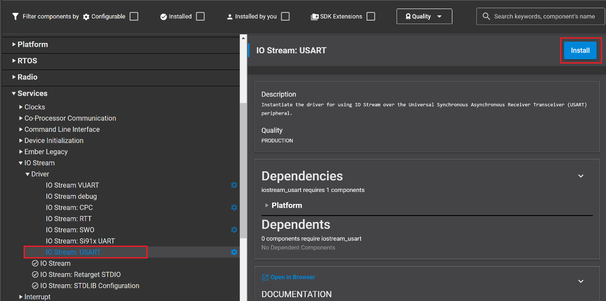
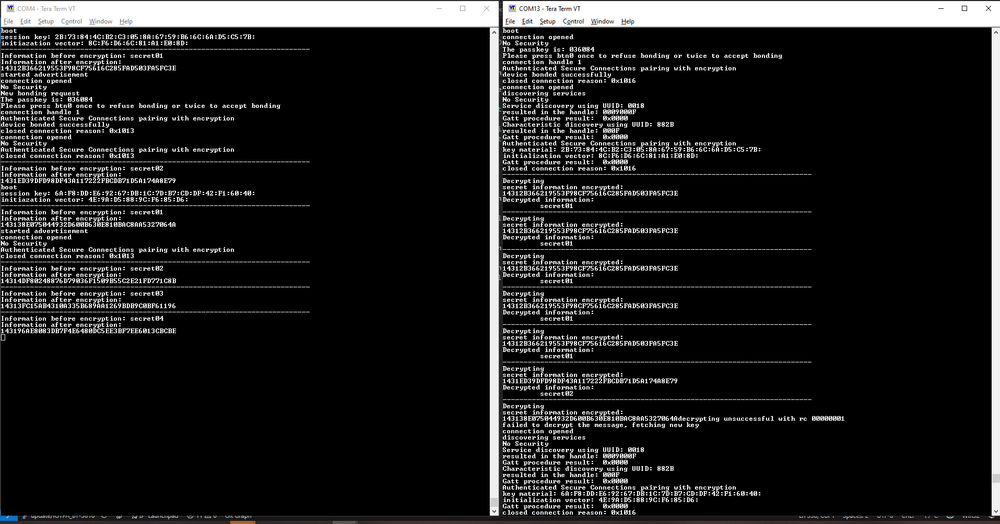

# Encrypted Advertisement #

## Description ##

Encrypted Advertisement is a feature added with Bluetooth version 5.4. This feature provides a standardized method to encrypt data, making communication secure even in connectionless mode. Before that, encryption was only available for connection-oriented communication.

Encrypted advertisement offers the advantage of making a device untraceable by relying on the advertisement data. This encryption, along with using a resolvable private address, can increase the security of the device as described in [the core specification](https://www.bluetooth.com/wp-content/uploads/Files/Specification/HTML/Core-60/out/en/architecture,-change-history,-and-conventions/architecture.html#UUID-2900da95-ac21-daac-a0f5-ce1051cacb2d)

In order for the advertiser and scanner to complete their encryption/decryption [procedure](https://www.bluetooth.com/wp-content/uploads/Files/Specification/HTML/Core-60/out/en/host/generic-access-profile.html#UUID-c461c568-7c55-3b24-fae2-6d0af46c36c7) successfully, they both need to obtain a key material. The key material is shared via a [dedicated GATT characteristic](https://www.bluetooth.com/wp-content/uploads/Files/Specification/HTML/Core-60/out/en/host/generic-access-profile.html#UUID-b341822d-a051-c4fb-9c87-7c31bf273916) which the scanner needs to read if it wishes to interpret the encrypted advertisement. 

The format of the encrypted data, the encryption algorithm (modified CCM algorithm) as well as the security properties of this feature that need to be respected are documented in the [core specification supplmenet](https://www.bluetooth.com/wp-content/uploads/Files/Specification/HTML/CSS_v12/out/en/supplement-to-the-bluetooth-core-specification/data-types-specification.html#UUID-f8b5ee3d-f9aa-1b29-268e-ae716ace10d2)

**Advertiser**

The advertiser is configured to change periodically the encrypted data in the advertisement as well as its own resolvable private address (RPA) every 20 seconds, This can be modified through:
```c
#define ADDRESS_CHANGE_PERIOD_MS 20000
```

The following function is responsible for generating a session key and well as the initialization vector; together they form the key material. The function also assigns the key material to its corresponding GATT characteristic. 

```c
sl_status_t initialize_and_store_key_material(sl_bt_ead_key_material_p key_material, psa_key_id_t key_id)
```

The following function is responsible for building the encrypted advertisement packet. Please note that in the example we also included an uncrypted part, but that is not mandatory.

```c
sl_status_t construct_advertisement_payload(sl_bt_ead_key_material_p key_material, sl_bt_ead_nonce_p nonce, uint8_t *index)

```

**Scanner**

The scanner is configured to scan for and decrypt the advertisement every 5 seconds, this can be modified through:

```c
#define ADVERTISEMENT_READ_PERIOD_MS 5000

```

At start, the scanner will attempt to find the advertiser using the function

```c
sl_status_t find_advertiser_by_local_name(sl_bt_evt_scanner_extended_advertisement_report_t *adv_report)

```
After that, it will try to decrypt the message. In case of failure, the `key_need_update` is raised, and the scanner connects to the advertiser to retrieve the new value of the key material. Finally, it disconnects and attempts to decrypt the message again**

**NOTE: The scanner is only able to read the key material characteristic if it has previously bonded with the device. Both the scanner and advertiser in this scenario have implemented sufficient code to implement the numerical comparison pairing method. 


## Simplicity SDK version ##

- SiSDK  v2025.6

## Hardware Required ##

- 2x WSTK board, e.g: BRD4002A
- 2x Bluetooth capable radio board, e.g: BRD4180B

## Setting up

To try this example, you need two radio boards, one for the advertiser side and one for the scanner side.

### Advertiser

1. Create a new **Bluetooth - SoC Empty** project.

2. Copy the attached [src/advertiser/app.c](src/advertiser/app.c) file replacing the existing `app.c`.

3. In **Software components**

    - Install **Encrypted Advertising Data core API** component  
    

    - Install **IO Stream: USART** component with the default instance name: **vcom**  
    
    

    - Install **Simple Button** component with two instances btn0 and btn1;
    
    
    

    - Enable **Virtual COM UART** in the **Board Control** component  
      
      

   - Install the **Extended Advertising**  component, if it is not yet installed

    - Install the **Log** component
      

4. Import the GATT configuration:
    - Open the **Bluetooth GATT Configurator** under the **CONFIGURATION TOOLS** tab.
    - Find the Import button and import the attached [gatt_configuration.btconf](config/advertiser/gatt_configuration.btconf) file.
    
    - Save the GATT configuration (Ctrl+S).

5. **Save and close** then the tool will auto-generate to code.

6. Build and flash the project to the **Advertiser** device.


### Scanner

1. Create an **SoC-Empty** example for the radio boards in Simplicity Studio.

2. Copy the attached [src/scanner/app.c](src/scanner/app.c) replacing the existing `app.c`.

3. Config **Software components** same as the advertiser with the exception of: 
    - install the **scanner for extended advertisement** component instead of **extended advertiser** if not already installed.

4. **Save and close** then the tool will auto-generate to code.

5. Build and flash the project to the **Scanner** device.

## Usage

Open a terminal program for both boards, such as the Simplicity Studio serial console, to view the output from the devices. The result should look similar to the following:

Shortly after starting up, the scanner discovers the advertiser using its full local name and initiates a pairing procedure. In this procedure, the user needs to press btn1 on both devices after verifying that both devices are showing the same number generated by the numerical comparison method. 

Later on, the Scanner carries on the Gatt procedures required to read the key material characteristic and disconnects. Henceforth, the scanner will use the key material to decrypt the message. If at any point the decryption fails (in this case, we trigger it by a simple advertiser reset), then the scanner will attempt to connect again and read the new key material characteristic and revert to decrypting only after disconnection. 