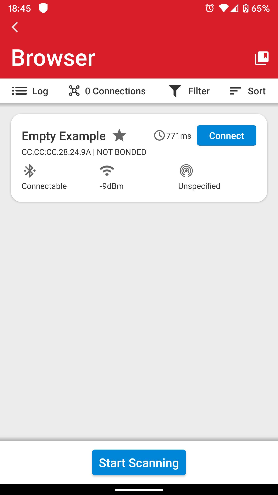

# Handling Missing Bonding Keys #

## Description ##

This example demonstrates two scenarios that can occur after a bond has been established between a smartphone and [a Bluetooth-Capable EFR32](https://www.silabs.com/products/development-tools/wireless/wireless-radio-boards#bluetooth).

**Case 1:** Bonding keys are deleted from the smartphone.
* Potential causes include manually deleting the keys, software/factory reset, app malfunction.

**Case 2:** Bonding keys are deleted from the EFR32.
* Potential causes include a full chip erase, running out of space for storing bonding keys (in which case the older keys can be deleted)

As an introduction to Bluetooth Security features, read [Using Bluetooth security features in Silicon Labs Bluetooth SDK](https://docs.silabs.com/bluetooth/2.13/general/security/using-bluetooth-security-features-in-silicon-labs-bluetooth-sdk).

The following are the most relevant Bluetooth API commands used in the sample code:

[sl_bt_sm_set_passkey(-1);](https://docs.silabs.com/bluetooth/3.1/group-sl-bt-sm#ga3ea16a5b602a40ba4d98030e823067e3)

* *Used to generate a random passkey required to support Level 4 security.*

[sl_bt_sm_configure(0x0B,sm_io_capability_displayonly);](https://docs.silabs.com/bluetooth/3.1/group-sl-bt-sm#ga2668706f7ffb70681ed974f1e0b46c86)

* *0x0B: Enables everything except the “secure connections only flag” bit.*
* *displayonly: Used to represent the EFR as a display only device.*

[sl_bt_sm_set_bondable_mode(1);](https://docs.silabs.com/bluetooth/3.1/group-sl-bt-sm#ga5b300b3007067d4671ecf598752d2f60)

* *Set the device in bondable mode.*

[sl_bt_sm_increase_security(connectionhandle);](https://docs.silabs.com/bluetooth/3.1/group-sl-bt-sm#gadde7d3d515ab2831e5cd40898530f874)

* Used to increase security level after connection is established.

More details of all these commands can be found in [Bluetooth API Reference](https://docs.silabs.com/bluetooth/3.1/group-sl-bt-sm) guide.

**Disclaimer:** This document and the sample application attached with it is to be used for information, reference about the topic and testing. It is not in any way production ready code. The use of the code will be at your own risk.

## Gecko SDK version ##

GSDK v3.1.1

## Hardware Required ##

- One WSTK board
- One Bluetooth capable radio board, e.g: BRD4162A

## Setting up ##

Central: A smartphone with the EFR Connect app

1. An Android smartphone (A Sony Xperia Z1 running Android 5.1.1 OS, **doesn’t support LE secure connections**)

2. Another Android smartphone (A Samsung Galaxy S6 Edge running Android 7.0 OS, **supports LE secure connections**)

3. An Apple smartphone (iPhone 6, running iOS 11.2.6 **supports LE secure connections**)

Peripheral: An EFR32 Radio board (a BGM module in this case, **it supports LE secure connections**) (Programmed with Bluetooth SDK 3.1.1)

1. Create a **Bluetooth - SoC Empty** project in Simplicity Studio.

2. The function code is in the *app.c* file. Copy and replace this file to the project folder.

3. Install the software components to use the **VCOM** port (UART) for logging:
   - Open the .slcp file in the project.

   - Select the SOFTWARE COMPONENTS tab.

   - Install **IO Stream: USART** component with the default instance name: **vcom**  
    

   - Find the **Board Control** component and click to the **Configure** button like below
      
    Then enable *Virtual COM UART* under its configuration
    

   - Install the **Legacy Advertising** component, if it is not yet installed (Bluetooth > Feature)
    

   - Install the **Log** component (found under Application > Utility group)
   

   - Create the first button by installing the **Simple Button** component with the default instance name: **btn0**
     
   Create the second button by click the **Add New Instances** button with the default instance name: **btn1**
   

4. Import the GATT configuration:        
    - Open the **Bluetooth GATT Configurator** under the **CONFIGURATION TOOLS** tab.
    - Find the Import button and import the attached **gatt_configuration.btconf** file.
    
    - Save the GATT configuration (Ctrl+S).

5. Compile and flash. The output will be shown on the Serial Port.

## Usage ##

### Android ##

According to our observation, Android OS treats pairing and connecting as two separate events. Pairing is optional if your GATT database does not contain any characteristic that requires encryption or bonding. You can connect, not pair and still be able to read and write other characteristics. A connection made between the EFR and Smartphone is security level 1. When paired, security  level increases to 3 or 4 depending on Legacy or Secure connections respectively.

*Figure 1: The Bluetooth Browser Showing the Empty Example Device*

*Figure 2: Connected but not Bonded to the EFR*

*Figure 3: Optional Pairing/Bonding Request Received*

### Apple ###

iOS actively asks for a pairing request if your GATT database contains any characteristic that require encryption or bonding because it reads all the characteristics as soon as you connect a device. As a result, you receive an active pairing request while setting up a connection. The request is initiated with security level 1 but is increased up to level 4 once a bond is created successfully.

*Figure 4: Bluetooth Browser in iOS*

*Figure 5: Active Pairing/Bonding Request Received while Connecting*

### Observations ###

These observations are for the flags set to values as mentioned above in the [Description](#description). These will vary based on the values and device capabilities as mentioned in [Using Bluetooth Security Features in Silicon Labs Bluetooth SDK](https://docs.silabs.com/bluetooth/2.13/general/security/using-bluetooth-security-features-in-silicon-labs-bluetooth-sdk).

**Scenario 1: Bonding keys are lost on the smartphone.**

iPhone: A new pairing request is initiated with a request to enter the passkey. Upon successful pairing, security Level_4 is achieved. The EFR overwrites the existing bonding keys.

Android (both test devices): Android phones receive two new pairing requests. The first one with a yes(pair)/no option to pair. The second one asks for a passkey entry. Upon successful pairing security Level_3 is achieved for phones which don’t support secure connections. Security Level_4 is achieved for phones which support secure pairing.

**Scenario 2: Bonding keys are lost on the EFR.**

1. Android EFR Connect App connecting to EFR

   a. On LE secure supported phones: Pairing fails for a reason

   ​	**0x1006**: pin_or_key_missing; Pairing failed because of missing PIN, or authentication failed because of missing key. The connection remains open with security Level_1. This error can be caught, and an increase security function (sm_increase_security; refer section ) can be triggered. As a result, a passkey entry request is received on the phone. Upon successful pairing, security Level_4 is achieved.

   b. On phones which don’t support LE secure: Again, pairing fails for a reason

   ​	**0x1006**: pin_or_key_missing; Pairing failed because of missing PIN, or authentication failed because of a missing key. The connection is terminated by the phone upon detecting a failed attempt and the bonding keys are deleted on the phone. An error code **0x1013:** remote user terminated is received. A repeated pairing attempt sets up new bonding keys on both sides as if they are connecting for the first time.

​    		* This behavior can change based on your phone/Android version and hardware configurations of your phone.

2. iOS App connecting to EFR

   Pairing fails with an error code **0x1006** (Pin or key missing). The connection remains open with security Level_1. This error can be caught in the *sl_bt_evt_sm_bonding_failed_id*, and an increase security function can be triggered. This command fails because of a timeout with error code **0x0007**after about 15-30 seconds. This error is caught and an increase security function *sl_bt_sm_increase_security(connectionhandle)* triggers a new passkey request. Upon successful pairing, security Level_4 is achieved.

### Testing the Example ###

The sample application attached with this document demonstrates these mechanisms for handling missing bonding keys on both sides. Create the project following the instructions in the attached readme file and flash it to a WSTK. This example prints to the WSTK VCOM so connect a terminal to the WSTK's COM Port on your PC to see the messages.

1. Connect to the EFR32 named "Empty Example" from the EFR Connect App Bluetooth Browser. Enter the passkey displayed on the console when asked.

2. Disconnect. Delete bonding data from your phone settings> Bluetooth. Reconnect from the app. Note the observations on the serial monitor.

3. Press reset on EFR32. **The sample application attached with this KBA is designed to delete the bonding keys when you reset**. **IT IS NOT RECOMMENDED IN REAL APPLICATIONS**. Follow step 1.

4. Disconnect, press reset on EFR32, and reconnect (do not delete bonding data on the phone this time). Note the observations on the serial monitor.

Contribution credit: The example code is based on the work of [Théo Meyer](https://www.silabs.com/community/profile.html/home/users/u/u-sOFE4O7OUAo_Lq7g7-/profile) from [www.strataggem.com](http://www.strataggem.com/)
