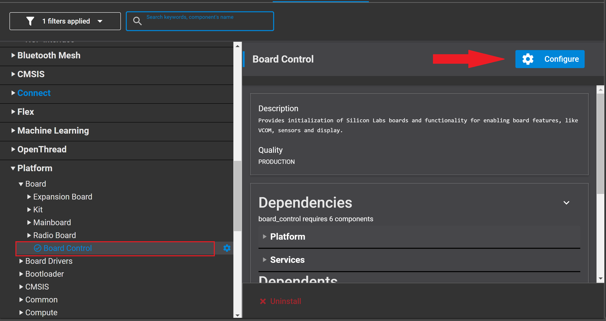
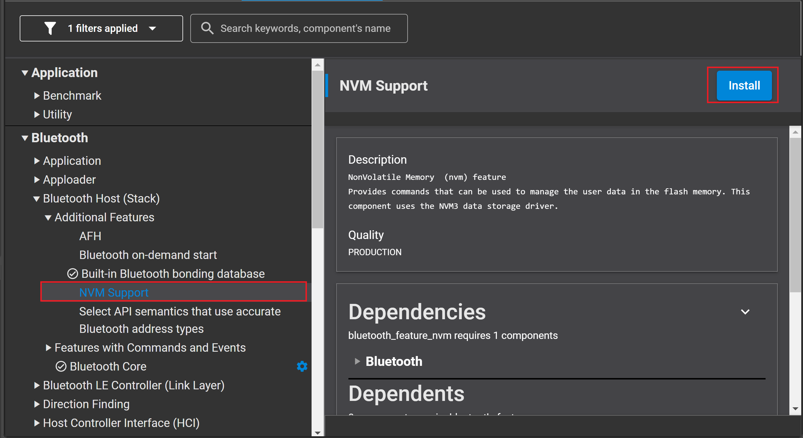

<!--Author: Arnold Kalvach -->

# OOB Example #

## Description ##

OOB (Out-Of-Band) pairing means, that the two devices to be paired exchange some secret on a medium other than Bluetooth, that is out-of-band. The secret information can be exchanged e.g. on NFC. In this example for the sake of simplicity the secret is exchanged manually by the user using terminal programs.

### Purpose of the Example ###

OOB with legacy pairing and OOB with secure connection pairing are the two OOB pairing modes. This example implements both modes for user’s reference.

Implementing the central and peripheral roles are the two projects in the example.

#### Central ####

* It has the central role of the connection.
* Implements the GATT client.
* It sends the write request to the server every 3 seconds and receives the notification from the server side.

#### Peripheral ####

* It has the peripheral role of the connection
* Implements the GATT server, with 1 service containing 2 characteristics:
   *  Notification characteristic – the property of this characteristic is “notify”, which doesn’t require authentication.
   *  Write characteristic – the property of this characteristic is “Authenticated write”, which requires authenticated connection to write a value to this characteristic.
* It sends notification to the client every 3 seconds and receives write request from the client.

Because of the different properties of these two characteristics, if the pairing and bonding procedure succeeds, the client will receive notifications and the server will receive write requests. Otherwise, if pairing and bonding procedure fails, the client should not be able to write the characteristic value due to an unauthenticated connection, but it should be able to receive notifications because it doesn’t require authentication.

### Key Points of the Example ###

#### Pairing Modes ####

In both projects, a symbol definition, PAIRING_MODE, can either be LEGACY_PAIRING or SECURE_CONNECTION_PAIRING. This symbol determines which pairing mode will be used in the connection.

```c
#define LEGACY_PAIRING                                       1
#define SECURE_CONNECTION_PAIRING                            2

#define PAIRING_MODE                                         SECURE_CONNECTION_PAIRING
```

#### Behaviors of Both Roles ####

* Central: It scans for the advertisement containing the service UUID “4880c12c-fdcb-4077-8920-a150d7f9b907” and establishes a connection if found. After a connection is made, it goes through the pairing and bonding procedure and discovers services and characteristics. It also sends a write request to the peer device every 3 seconds after the specified characteristic is found and enables the CCC of the specified characteristic the peer device to enable notifications.
* Peripheral: It won’t start advertising after boot until it receives the OOB data from the serial terminal. For OOB with legacy pairing, the OOB data is 16-bytes in length. For OOB with secure connection pairing, the length is 32-bytes, containing 16-byte OOB data and 16-byte confirm value. It will go through the pairing and bonding procedure after the connection is established with the central device and send notifications to central every 3 seconds after CCC is enabled by the central device.

## Gecko SDK version ##

GSDK v3.1.1

## Hardware Required ##

- Two WSTK boards
- Two Bluetooth capable radio boards, e.g: BRD4162A

## Setup ##

As shown above, the example requires two devices (e.g., BRD4104a Rev A00) and serial terminal, VCOM will be enabled in the example. Therefore, the serial print information will go out from the USB cable.

1. Create a **Bluetooth - SoC Empty** project

2. Install the software components to use the **VCOM** port (UART) for logging:
   - Open the .slcp file in the project.

   - Select the SOFTWARE COMPONENTS tab.

   - Install **IO Stream: USART** component with the default instance name: **vcom**.
   

   - Find the **Board Control** component and click to the **Configure** button like below
     
   Then enable *Virtual COM UART* under its configuration
   

   - Install the **Legacy Advertising** component, if it is not yet installed (Bluetooth > Feature)
   

   - Install the **Log** component (found under Application > Utility group).  
   

3. The device has the central role (#D1):
   - Install **NVM Support** component to manage the user data in the flash.
   

   - Replace the *app.c* file in the project with the provided app_central.c.
  
4. The device has the peripheral role (#D2):  
   - Import the GATT configuration:        
    - Open the **Bluetooth GATT Configurator** under the **CONFIGURATION TOOLS** tab.
    - Find the Import button and import the attached **gatt_configuration.btconf** file.
    
    - Save the GATT configuration (Ctrl+S).  

   -	Replace the *app.c* file in the project with the provided app_peripheral.c.  

5. Build and flash them to each device.

6. Connect to Serial terminal supported entering HEX data e.g Hercules
   - Serial terminal (#S1): connect to the central device. 
   - Serial terminal (#S2): connect to the peripheral device.

## Usage

1.  Power on both devices (#D1 and #D2) by the USB cable.

2.  Open the serial terminals connected to both devices; the port name should be “JLink CDC UART Port (COMxx)” and the baudrate is 115200. Set checkbox RTS checked because USART enables hardware control flow as default.

3.  Recognize which serial terminal connects to #D1 and which connects to #D2 by the print information after boot. Enter the right OOB data shown on #S1 to #S2. #D2 should start advertising if it receives enough length of data.

4.  #D1 will connect and start pairing and bonding to #D2 automatically.

* Below are 4 different test results:
  * Figure 1 shows what happened if the correct OOB data was input while using the legacy pairing mode. Both sides can receive the GATT data from the remote peer device.
  * Figure 2 shows what happened if incorrect OOB data was input while using the legacy pairing mode. Only the notification can be received. The write characteristic can’t be written because of unauthenticated connection.
  * Figure 3 shows what happened if the correct OOB data was input while using the secure connection pairing mode. Both sides can receive the GATT data from the remote peer.
  * Figure 4 shows what happened if incorrect OOB data was input while using the secure connection pairing mode. Only the notification can be received. The write characteristic can’t be written because of unauthenticated connection.

  
**Figure 1**. OOB with Legacy Pairing Succeeded

  
**Figure 2**. OOB with Legacy Pairing Failed

  
**Figure 3**. OOB with Secure Connection Pairing Succeeded

  
**Figure 4**. OOB with Secure Connection Pairing Failed

## Source

* [app_central.c](src/app_central.c)
* [app_peripheral.c](src/app_peripherial.c)
* [gatt_configuration.btconf](config/gatt_configuration.btconf)

