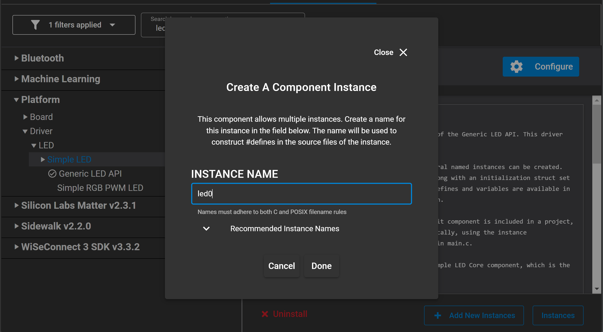
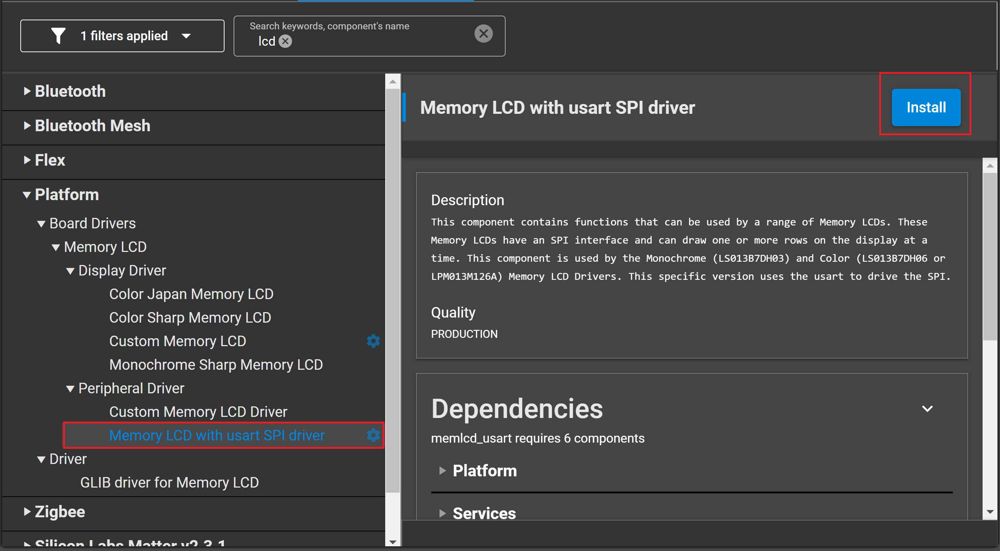

# Pairing Processes Example #

<!--Author: Harri Rahikainen -->

## Background ##

This code example has a related User's Guide, here: [Pairing Processes](https://docs.silabs.com/bluetooth/latest/general/security/pairing-processes)


## Description ##

This code example is created to demonstrate different Bluetooth pairing processes and help implement firmware, which is able to securely connect to other Bluetooth devices. Read the related User's Guide first to get a better understanding of the processes.


## Gecko SDK version ##

GSDK v3.1.1

## Hardware Required ##

- 2 x WSTK board
- 2 x Bluetooth capable radio board, e.g: BRD04104A

## Setup

1. Create a **Bluetooth - SoC Empty** project in Simplicity Studio.

2. The function code is in the *app.c* file. Copy and replace this file to the project folder.

3. Import the GATT configuration:        
  - Open the **Bluetooth GATT Configurator** under the **CONFIGURATION TOOLS** tab.
  - Find the Import button and import the attached **gatt_configuration.btconf** file.
    
  - Save the GATT configuration (Ctrl+S).

4. Install the software components to use the **VCOM** port (UART) for logging:
  - Open the .slcp file in the project.

  - Select the SOFTWARE COMPONENTS tab.

  - Install **IO Stream: USART** component with the default instance name: **vcom**  
    

  - Find the **Board Control** component and click to the **Configure** button like below
      
    Then enable *Virtual COM UART* under its configuration  
    

  - Install the **Legacy Advertising** component, if it is not yet installed (Bluetooth > Feature)
    

  - Install the **Log** component (found under Application > Utility group)
    

  - Create the first button by installing the **Simple Button** component with the default instance name: **btn0**
      
    Create the second button by click the **Add New Instances** button with the default instance name: **btn1**
    

  - Create the first led by installing the **Simple LED** component with the default instance name: **led0**
      
    Create the second led by click the **Add New Instances** button with the default instance name: **led1**

  - Install the following components for LCD.
    - Memory LCD with usart SPI driver
    -	Monochrome Sharp Memory LCD
    -	GLIB Graphics Library
    -	GLIB driver for SHARP Memory LCD

    
    
     

6. Configure macros *IO_CAPABILITY* and *MITM_PROTECTION* to DISPLAYONLY and 0x00 respectively.

7. Build and flash the project to two Wireless Starter Kits (WSTK).


## How It Works ##

The attached demo code enables testing all pairing combinations shown in the table of [Pairing Processes](https://docs.silabs.com/bluetooth/latest/general/security/pairing-processes). It implements both the initiator and responder roles in the same firmware. The roles are configured by pressing and holding down PB0 on the starter kit during reset and they are shown on the LCD screen. Pressing the button during reset puts the device into responder role. Leaving the button released during reset puts the device into initiator role.

A mobile phone with EFR Connect App can also be used as the responder, which covers the bottom row of the table.

I/O capabilities and Man In The Middle protection are configurable with two preprocessor macros *IO_CAPABILITY* and *MITM_PROTECTION* in **app.c**.

``` C
#define DISPLAYONLY 0
#define DISPLAYYESNO 1
#define KEYBOARDONLY 2
#define NOINPUTNOOUTPUT 3
#define KEYBOARDDISPLAY 4

#define IO_CAPABILITY (KEYBOARDONLY)  // Choose IO capabilities.
#define MITM_PROTECTION (0x01)        // 0=JustWorks, 1=PasskeyEntry or NumericComparison
```

At boot and after connection closed event, all bondings are deleted. Then the security manager (sm) is configured with the flags and capabilities chosen above.

``` C
sl_bt_sm_configure(MITM_PROTECTION, IO_CAPABILITY);
```

The passkey, for those methods that need one, is generated from the device address or is hard coded in the "KEYBOARDONLY" situation (both input), when, for example, it is shipped with the product.

Finally, bondings are enabled and the devices start scanning (responder) or advertising (initiator) for connection. Scanning device looks for advertisements of the "Secure Service" and connects. On connection, the initiator calls *sm_increase_security* to initiate the pairing process. The security related events are handled as follows:

``` C
      case sl_bt_evt_connection_opened_id:
        connection = evt->data.evt_connection_opened.connection;
        if (is_initiator)
        {
          sc = sl_bt_sm_increase_security(connection);
          app_assert(sc == SL_STATUS_OK,
                        "[E: 0x%04x] Failed to enhance the security of a connection\n",
                        (int)sc);
        }
        break;

      // -------------------------------
      // This event indicates that a connection was closed.
      case sl_bt_evt_connection_closed_id:
        app_log("Connection closed, reason: 0x%2.2x\r\n",
                  evt->data.evt_connection_closed.reason);
        sc = sl_bt_sm_delete_bondings();
        app_assert(sc == SL_STATUS_OK,
                      "[E: 0x%04x] Failed to delete all bonding information\n",
                      (int)sc);
        app_log("All bonding deleted\r\n");
        connection = 0xFF;
        state = IDLE;
        // Restart advertising after client has disconnected.
        setup_advertising_or_scanning();
        break;

      case sl_bt_evt_connection_parameters_id:

        switch (evt->data.evt_connection_parameters.security_mode)
        {
        case connection_mode1_level1:
          app_log("No Security\r\n");
          break;
        case connection_mode1_level2:
          app_log("Unauthenticated pairing with encryption (Just Works)\r\n");
          break;
        case connection_mode1_level3:
          app_log("Authenticated pairing with encryption (Legacy Pairing)\r\n");
          break;
        case connection_mode1_level4:
          app_log("Authenticated Secure Connections pairing with encryption (BT 4.2 LE Secure Pairing)\r\n");
          break;
        default:
          break;
        }
        break;

      case sl_bt_evt_sm_passkey_display_id:
        // Display passkey
        app_log("Passkey: %4lu\r\n", evt->data.evt_sm_passkey_display.passkey);
        passkey = evt->data.evt_sm_passkey_display.passkey;
        state = DISPLAY_PASSKEY;
        break;

      case sl_bt_evt_sm_passkey_request_id:
        app_log("Passkey request\r\n");
        state = PROMPT_INPUTTING_PASSKEY;
        break;

      case sl_bt_evt_sm_confirm_passkey_id:
        app_log("Passkey confirm\r\n");
        passkey = evt->data.evt_sm_confirm_passkey.passkey;
        state = PROMPT_YESNO;
        break;

      case sl_bt_evt_sm_confirm_bonding_id:
        app_log("Bonding confirm\r\n");
        sc = sl_bt_sm_bonding_confirm(evt->data.evt_sm_confirm_bonding.connection, 1);
        app_assert(sc == SL_STATUS_OK,
                      "[E: 0x%04x] Failed to accept or reject the bonding request\n",
                      (int)sc);
        break;

      case sl_bt_evt_sm_bonded_id:
        app_log("Bond success\r\n");
        state = BOND_SUCCESS;
        break;

      case sl_bt_evt_sm_bonding_failed_id:
        app_log("Bonding failed, reason 0x%2X\r\n",
                  evt->data.evt_sm_bonding_failed.reason);
        sc = sl_bt_connection_close(evt->data.evt_sm_bonding_failed.connection);
        app_assert(sc == SL_STATUS_OK,
                      "[E: 0x%04x] Failed to close a Bluetooth connection\n",
                      (int)sc);
        state = BOND_FAILURE;
        break;
```

The *state* is used to track which external signals (REJECT_COMPARISON, ACCEPT_COMPARISON, REENTER_PASSKEY, SUBMIT_PASSKEY) each pushbutton emits and what is shown on the LCD screen at each step of the interactive processes. See *sl_button_on_change* and *refresh_display* functions for more details.

Processes that require interaction show either

* YES/NO prompt and the passkey to confirm or
* An editable passkey field with a cursor underneath

Prompts for YES/NO are accepted with PB0 and rejected with PB1.

For an editable passkey, the current digit is incremented with PB1 and PB0 is used to step the cursor to the next digit on the right. For passkey entries, the prompt for submitting the whole key is shown after the cursor loops to the beginning of the passkey field again.

If you enable printing to UART, you can also follow the processes with a terminal program, such as Tera Term. Figures below show connecting a BG13 device with the firmware built, as described earlier and mobile phone with EFR Connect App. The BG13 is the initiator with DISPLAYONLY capabilities and the phone acts as the responder with KEYBOARDDISPLAY capabilities. This leads to using passkey entry (initiator displays, responder inputs) as indicated by the table. The mobile phone will prompt to pair with the device on connection and asks to input the passkey formed from the public address of the BG13 which is shown on the WSTK screen. After the authentication is complete, the LCD screen will go back to showing the role and security level is printed to the terminal.


Initiator displays passkey


To change the pairing process and try out other combinations, modify the macros as described earlier.
