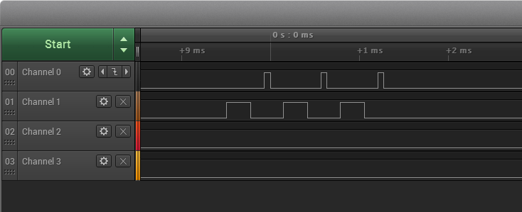

# TX and RX Activity Indicator Pins

## Description

This code example shows how to configure the TX and RX activity indicators when using Bluetooth SDK to follow/debug the timing of radio tasks.

The TX and RX activity signals can be used to monitor the radio activity. The following screen capture from logic analyzer shows an example where Channel 0 is showing the RX activity and Channel 1 is showing TX activity.





The image above shows one advertising event. The advertisement is transmitted on all three channels (three pulses in the TX indicator). After sending packet on one channel, the receiver is active for a short period of time so that possible connection or scan requests can be detected.


## Setting up

1. Create a new SoC-Empty project for your device.
   
2. Using the project configurator install the PRS Software Component.

3. Copy the attached app.c into your project.

4. The application calls a single function to enable the RX/TX activity pins. 

5. In  `app_init()`, configure the TX and RX indicators to the desired pins. The example below outputs RX activity on PORTB0 and TX activity on PORTB1.

   ```  c
   enableDebugGpios(gpioPortB,0,gpioPortB,1);
   ```

6. Build your project and flash it to your device.


## Usage

SoC-empty example starts advertising by default. Therefore, if you connect a logic analyzer to the selected pins, you should observe the same activity as on the figure in the [Description](#description) section. If you connect to your device via Bluetooth (e.g., with a smartphone), you will be also be able to observe the TX/RX activity going on during the connection.


## Source

* [app.c](src/app.c)

  
