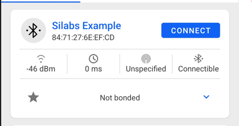
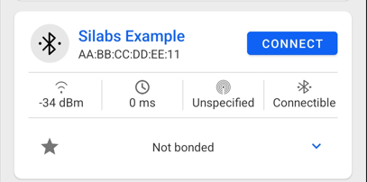

# Setting Custom BT Address #

## Description ##

The BLE stack usually derives the BT address (sometimes referred to as *MAC address*) of a device from its Unique Identifier, a 64-bit value located in the Device Information Page; this value is factory programmed and not modifiable. Since the BT address is only 48-bit long, part of the Unique Identifier is *removed* while deriving the address. See your device's reference manual for more details on the Device Information page.

To extract the Unique Identifier from a radio board (e.g., BRD4182A - EFR32MG22), you can issue the following command using Simplicity Commander in a windows command prompt.

* `$ commander device info`

You should get an output similar to this, notice the *Unique ID* value:

```
Part Number    : EFR32MG22C224F512IM40
Die Revision   : A2
Production Ver : 2
Flash Size     : 512 kB
SRAM Size      : 32 kB
Unique ID      : 680ae2fffe2886c5
DONE
```

After flashing the *Bluetooth - SoC Empty* example to the same device and scanning nearby devices using the **Si connect** application, you can see the derived BT address. Figure 1 below shows the expected output:



Notice that the address is the same as the Unique ID except for the middle 16 bits (0xFFFE), hence why the BT address is a derived value. As mentioned before, this is the usual way for the BLE stack to acquire the BT address. **Nonetheless, if there's a valid BT address entry in the non-volatile region of the device (NVM3 for series 2 devices and PS Store or NVM3 for series 1), this value is used instead**.

The API **sl_bt_system_set_identity_address** can be used to specify a new BT address in the non-volatile memory. This example reads the manufacturing token `MFG_CUSTOM_EUI_64`, which can be programmed to the device with Commander and uses it to set a new BT address. This method allows for scalability and could be useful for a production environment.


## Simplicity SDK Version ##

SiSDK v2025.6


## Required Hardware ##

* A WSTK board.
* A Bluetooth capable radio board, e.g: BRD4161A.
  * This example was tested with BRD4182A (EFR32xG22) and BRD4181B (EFR32xG21)


## Setup ##

Because the BT address is ultimately derived from the `MFG_CUSTOM_EUI_64` token in the User Data page, it needs to be programmed prior to executing the application, this can be done through Simplicity Commander:

* `$ commander flash --tokengroup znet --token "<token name>:<value>"`
  * e.g: `$ commander flash --tokengroup znet --token "TOKEN_MFG_CUSTOM_EUI_64:0000AABBCCDDEE11"`

Note that the two initial bytes are 0x0000 because the token is 8 bytes long but, we only need 6 of them. You should get an output similar to this:

```
Writing 1024 bytes starting at address 0x0fe00000
Comparing range 0x0FE00000 - 0x0FE003FF (1024 Bytes)
DONE
```

You can verify that the token was properly flashed using the following command:

* `$ commander tokendump --tokengroup znet --token TOKEN_MFG_CUSTOM_EUI_64`

You should get an output similar to this:

```
#
# The token data can be in one of three main forms: byte-array, integer, or string.
# Byte-arrays are a series of hexadecimal numbers of the required length.
# Integers are BIF endian hexadecimal numbers.
# String data is a quoted set of ASCII characters.
#
MFG_CUSTOM_EUI_64: 0000AABBCCDDEE11
```

Once you have written the custom address into the manufacturing token, do the following:

1. Create a new **SoC-Empty** project.
2. Install the **Legacy Advertising** component, if it is not yet installed (Bluetooth > Feature)
3. Copy the attached app.c file replacing the existing `app.c`.
4. Build and flash your project to your board.


## How It Works ##

The example uses a custom function called inside the system boot event `sl_bt_evt_system_boot_id` that leverages the `sl_bt_system_set_identity_address` and, `sl_bt_system_get_identity_address` APIs.  The following is a brief explanation of the function's operation:

* Retrieve the `MFG_CUSTOM_EUI_64` token from the user data page.
* Adjust the byte endianness of the token to form the *new BT address*.
* Retrieve the *current BT address*.
* Update the *BT address if the new BT address* is different from the current one.
* Reset the system.
  * This step is needed because during the BLE stack initialization, the BT address is determined.

The following image shows the output of **Si connect** showing the new BT address after flashing the token and letting the custom function modify the BT address:


