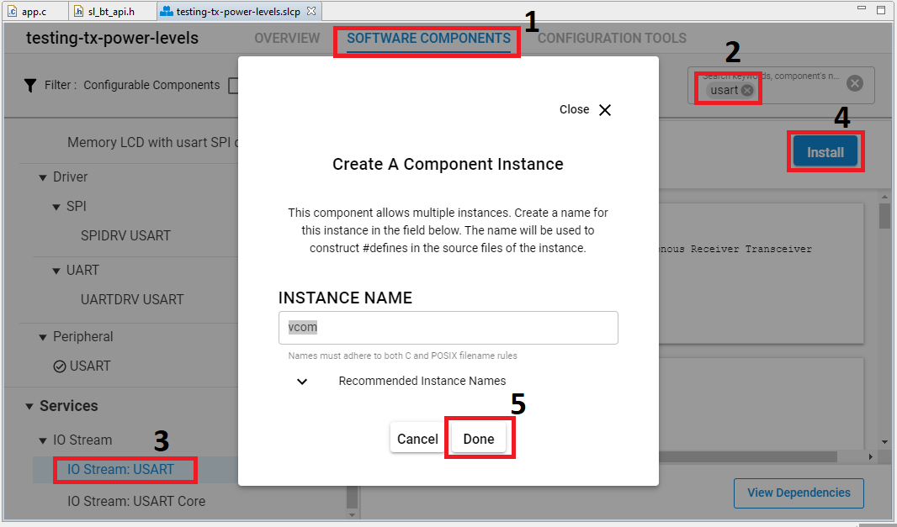
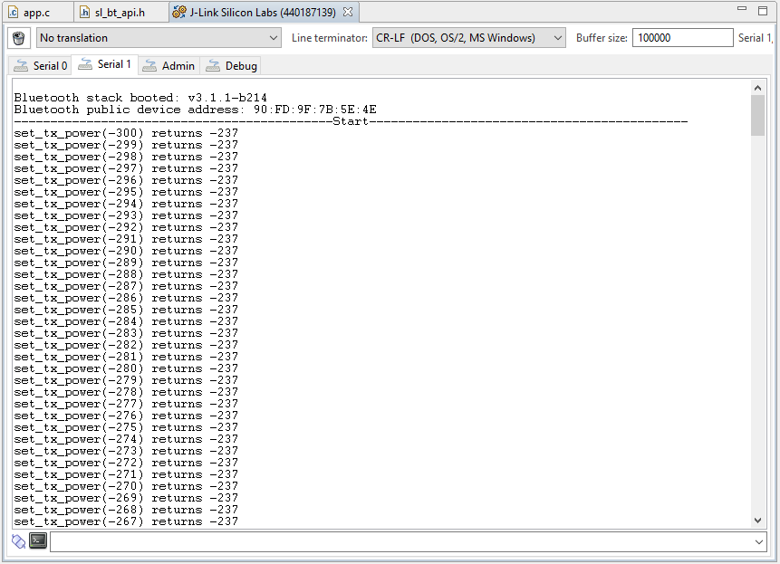

# Testing TX Power Levels #
 
## Description ##
 
The command **sl_bt_system_set_tx_power** can be used to set the global minimum and maximum radiated TX power levels for Bluetooth, but the value which is actually set by the Bluetooth stack may not be the same as the input to the command. The actual set value can be read from the command response.

This example iterates through a power level range between a minimum and a maximum value given to **sl_bt_system_set_tx_power** command and prints out both the input parameter and the response.

> **NOTE:** TX power can be set with 0.1 dBm granularity. For example, the value of 50 equals +5 dBm. For more information, see the description of the [sl_bt_system_set_tx_power](https://docs.silabs.com/bluetooth/8.2.0/bluetooth-stack-api/sl-bt-system#sl-bt-system-set-tx-power) API command.

This code example has related User's Guides, which may be worth reading before. Find them here:

[Current consumption variation with TX Power](https://docs.silabs.com/bluetooth/8.2.0/bluetooth-fundamentals-system-performance/compliance-power-limitations)

[TX Power Limitations for Regulatory Compliance (ETSI, FCC)](https://docs.silabs.com/bluetooth/8.2.0/bluetooth-fundamentals-system-performance/compliance-power-limitations)

## Simplicity SDK version ##
 
SiSDK v2025.6
 
## Hardware Required ##
 
- A WSTK board.

- A Bluetooth capable radio board, e.g: BRD4161A.
 
## Setup ##

To be able to test this example do as follows:

1. Create a **Bluetooth - SoC Empty** project.

2. Copy the attached app.c file into your project (overwriting existing app.c).

3. Install the software components to use the **VCOM** port (UART) for logging:

- Open the .slcp file in the project.

- Select the SOFTWARE COMPONENTS tab.

- Install **IO Stream: USART** component with the default instance name: **vcom**.

- Find the **Board Control** component  and enable *Virtual COM UART* under its configuration.

- Install the **Log** component (found under Application > Utility group).

4. Build and flash the project to your device.

5. Do not forget to flash a bootloader to your board, if you have not done so already.
 
## How It Works ##
 
1. On your PC launch the Console that is integrated on Simplicity Studio or can use a third-party terminal tool like TeraTerm to receive the data from the virtual COM port.

2. Reset your device and observe the log messages. As shown, the TX power values of EFR32xG chip set are not continuous, the lower the value, the coarser the adjustment.

