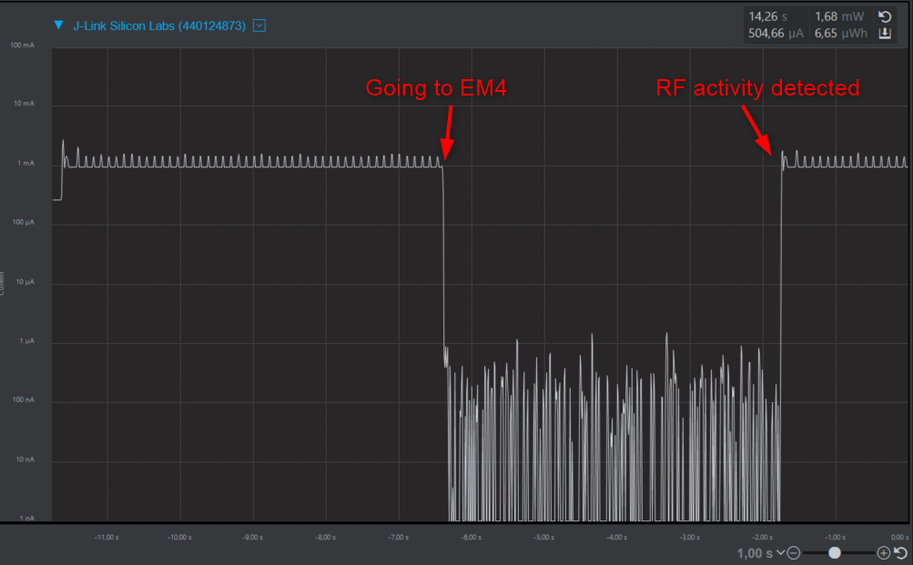

# Waking from deep sleep using RfSense

## Overview ##

RFSense is a low power feature of the EFR32 Wireless MCU family. It can "wake up" an MCU from its EM2 or even EM4 power modes. Practically, it is an ultra low power interrupt source, running on ULFRCO clock.

The RFSense is a wide band circuit, it can detect energy in the 100MHz - 5 GHz frequency range, filtered only by the matching network of the RF front end. This is an advantage, as no need for separate PCB components. But it’s also a drawback: it is sensitive to any kind of interferer signal as well.

### Legacy mode ###

In legacy mode, the RFSense module generates an interrupt if it detects energy for a configured time. This time can be configured with the function parameter **senseTime**. It is the interval (in microseconds) in whihch the RF energy must be continually detected to be considered "sensed". The possible values of this parameter depend on the device type. The API will return the actual value which was set. This is the only mode supported by Series 1 devices.

### Selective Mode ###

Selective mode mitigates the unfiltered nature of RFSense. Instead of simply detecting energy for a given time period, it detects "a pattern of energy", which is essentially an OOK packet. The packet is Manchester coded, uses fixed 1kbps bitrate, 1B preamble and 1-4B sync word (no payload added). This packet can be transmitted by any OOK capable device, including all EFR32 wireless MCUs (Series 1 and Series 2).

More info about RFSense:
[https://www.silabs.com/community/wireless/proprietary/knowledge-base.entry.html/2020/02/14/rfsense_on_efr32xg22-haG2]()

## Setup ##
1. Create a **Bluetooth - SoC Empty** project
2. Open the "Software components" and do the following changes:
- Install **IO Stream: USART** component with the defaul instance name: **vcom**

  - Find the **Board Control** component  and enable *Virtual COM UART* under its configuration

  - Install the **Log** component (found under Bluetooth > Utility group)

3. Replace the *app.c* file in the project with the provided *app.c*
4. Select the RfSense mode with the **#define RFSENSE_SELECTED_MODE**
5. Compile and flash to the target
6. Do not forget to flash a bootloader to your board, if you have not done so already.

## Usage ##
You have the following options to select in the example code:
  - **RfSense Mode**: 
    - Legacy
    - Selective
  - **RfSense Wait**: this sets the time how long the device will advertise before activating RfSense
  - **goToDeepSleep**: When set to *true*, the device will go the EM4

After startup the device will start advetising for the time set with the parameter **RFSENSE_WAIT**. After that it will activate the RfSense, and will go to EM4 if allowed. When a signal is detected by the RfSense, a reset will be triggered. 

If you set the varaible *goToDeepSleep* to *false*, it will not go into EM4. In this case the function *rfsense_callback* will be called. 

### Using in legacy mode

The RfSense callback or reset from EM4 can be triggered with any 2.4 GHz signal which is at least as long as the set **senseTime**. Some examples:
- using BLE advertising with long enough packets
- using BLE data packets
- toggling WiFi on a mobile near to the device

### Using in selective mode

With selective mode the device can only be woken up by transmitting the correct syncword. As an example the attached **app_process.c** file can be used. Create a new **Flex (RAIL) - Simple TRX** project in Studio, and replace the app_process with the provided file. Build and flash it to the device. The syncword can be sent with pressing BTN0 on the WSTK.

