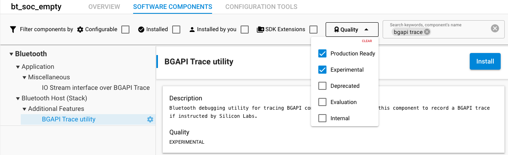
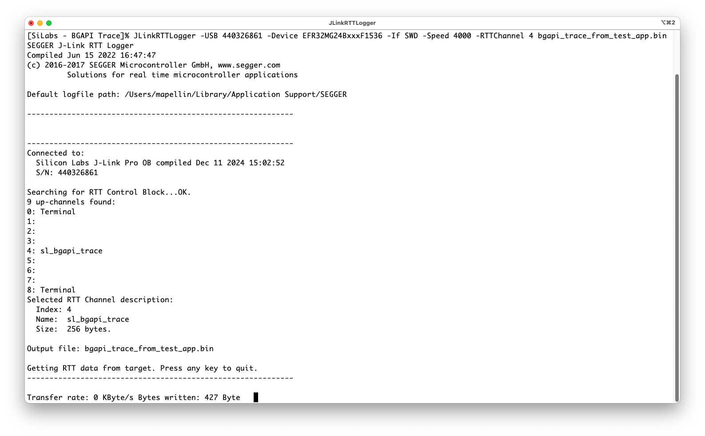
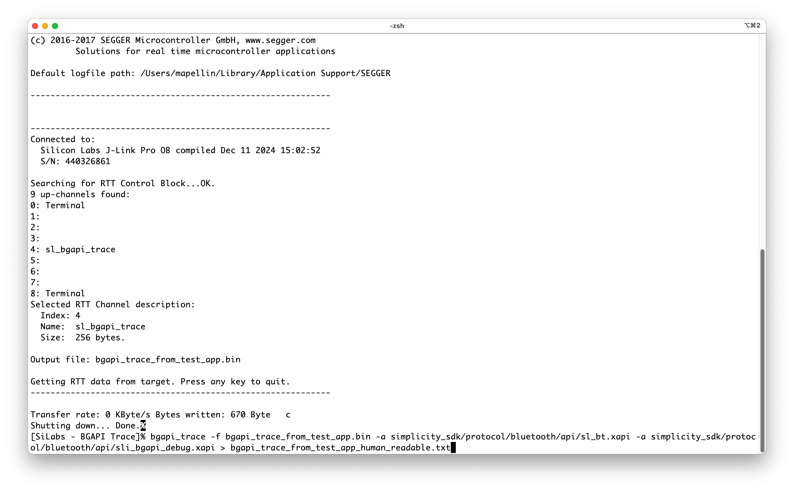
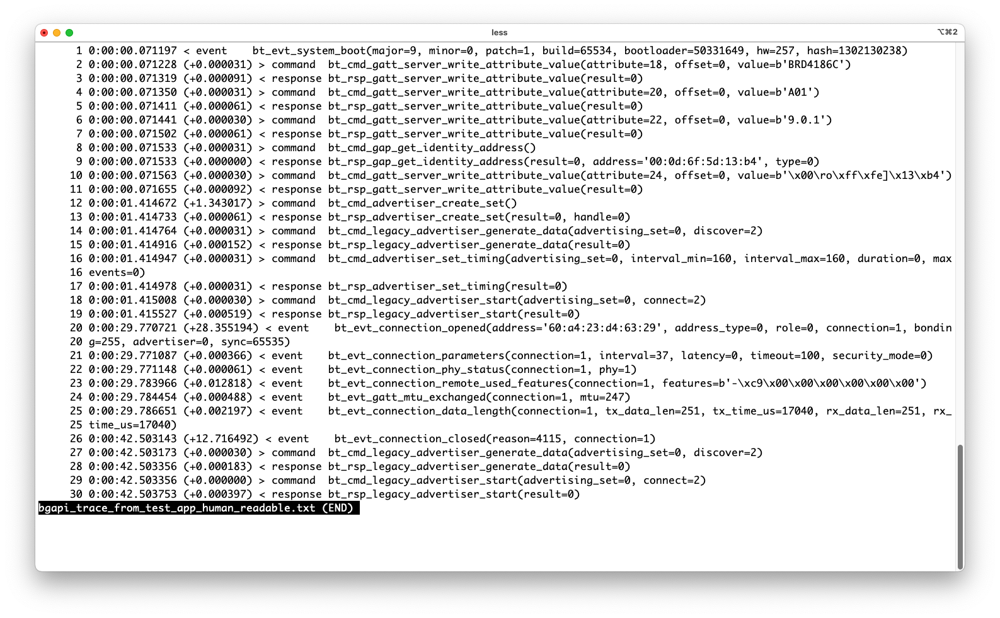
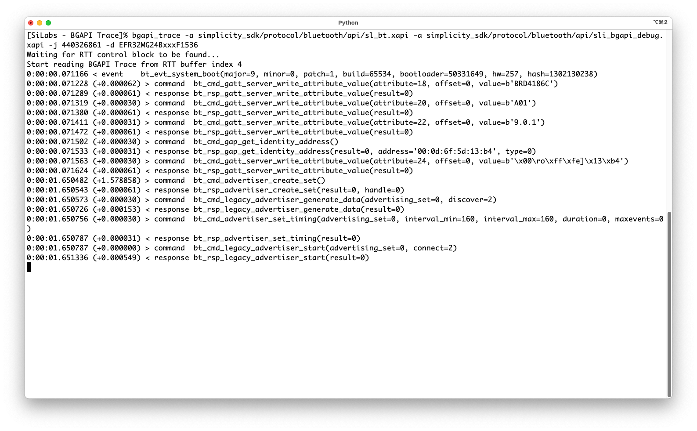
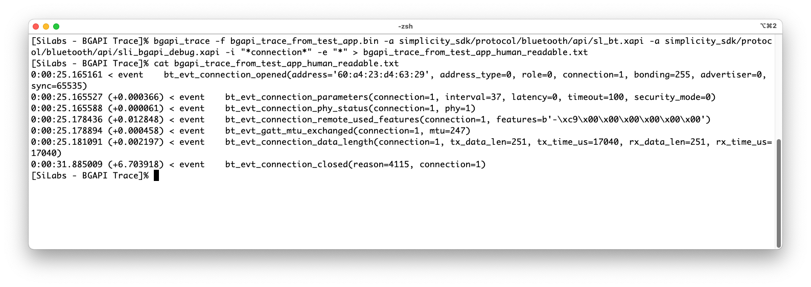

# BGAPI Trace

## Introduction

Silicon Labs' devices running the [Bluetooth stack](https://docs.silabs.com/bluetooth/latest/bluetooth-start/) (either as SoC or NCP mode) can be configured to write out the BGAPI API calls (with their responses) and events via *Segger's Real Time Transfer* (RTT). The API calls and events are output in binary format, but the binary stream can be decoded to human-readable format by using a ***BGAPI Trace*** tool. The *BGAPI Trace* is capable decoding the BGAPI protocol in real-time directly from the RTT, or from a file in which the data has been earlier stored.


---

## Abstract / short summary
1. Install Segger's [*J-Link Software and Documentation Pack*](https://www.segger.com/downloads/jlink#J-LinkSoftwareAndDocumentationPack)
2. Install the **BGAPI Trace utility** (`bluetooth_utility_bgapi_trace`) software component to the BLE project
3. Build and flash the application as usual
4. Start recording the RTT trace, e.g.
   `JLinkRTTLogger -USB 440189857 -Device EFR32MG24BxxxF1536 -If SWD -Speed 4000 -RTTChannel 4 bgapi_trace_from_test_app.bin
`
6. Run the test
7. Stop *JLinkRTTLogger* by pressing any key
8. Decode the recorded *BGAPI Trace* to human readable format:
	`bgapi_trace -f bgapi_trace_from_test_app.bin -a sl_bt.xapi -a sli_bgapi_debug.xapi`


---

## Prerequisites - Installing the tools

### JLinkRTTLogger

The *BGAPI traces* are collected with *Segger's* *JLinkRTTLogger*, which is part of the [J-Link Software and Documentation Pack](https://www.segger.com/downloads/jlink#J-LinkSoftwareAndDocumentationPack). Download and install the latest *J-Link Software and Documentation Pack*.


### The `bgapi_trace` decoder

The `bgapi_tool` can be installed with [pipx](https://pipx.pypa.io/stable/): 

```pipx install /path/to/the/bgapi_trace-0.6.2.tar.gz```

Optionally, the `bgapi_trace` tool can be installed with ```pip``` (Note: might require a Python virtualenv): 

```pip install /path/to/the/bgapi_trace-0.6.2.tar.gz```.


---

## Firmware preparation

The *BGAPI Trace* can be enabled on Bluetooth projects by installing the *BGAPI Trace utility* software component. Please note: the *BGAPI Trace utility* software component is currently labelled as experimental, therefore the *Experimental* quality selector needs to be enabled in order to install the component to a project.

**NOTE: if the *BGAPI Trace utility* software package is installed to the project, but no *JLinkRTTLogger* running, the code execution will halt.**



[Gecko SDK 4.4.x](https://github.com/SiliconLabs/gecko_sdk) include the configuration for the RTT buffer index with the config item SL_BGAPI_TRACE_RTT_BUFFER_INDEX. Make sure the RTT buffer index is unique if your application includes other components that also use RTT. The newer [Simplicity SDK](https://github.com/SiliconLabs/simplicity_sdk) automatically has unique RTT buffer indexes, so no configuration is needed.

Once the component has been added to the project, compile and flash the application to the target device as would normally be done.


---

## Recording BGAPI Traces to a file and converting the log to text format

The *BGAPI Traces* can be recorded to a file (in binary format) with the *JLinkRTTLogger*.  The *JLinkRTTLogger* requires the J-Link ID as command line option (`-USB <J-Link ID>`), or optionally the IP address of the device (`-IP <IP address>`), and  the device type under test (`-Device <EFR device type>`). The device type can be identified with Silicon Labs' *Simplicity Commander*, either from the GUI or from command line: `commander device info` (Part Number field). In addition to the J-Link ID and device type, the *JLinkRTTLogger* requires the target interface (`-If SWD`) and it's speed (`-Speed <speed in kHz>`), and the RTT Channel (`-RTTChannel 4`) as command line parameters. Channel number 4 is reserved for *BGAPI Trace* in SiSDK, while channel number 2 is the default one used with GSDK 4.4.0 and above.  The correct channel number can be identified by name `sl_bgapi_trace`. The last parameter is the output file to which the *BGAPI Trace* will be written:

```
JLinkRTTLogger -USB 440326861 -Device EFR32MG24BxxxF1536 -If SWD -Speed 4000 -RTTChannel 4 bgapi_trace_from_test_app.bin
```



All *JLinkRTTLogger* command line options can be listed with command `JLinkRTTLogger -?`.

Press any key on the terminal that runs *JLinkRTTLogger* to stop the recording.

The recorded *BGAPI Trace* log can be decoded to human readable format with the *bgapi_trace* tool. The tool requires the recorded *BGAPI Trace* log file (command line option `-f` or `--rtt-file`) and the `.xapi` files (command line option `-a` or `--api`) from the same SDK version the application under test was compiled as input. By default, the *bgapi_trace* prints the decoded API calls, responses and events to the command line, but this can be forwarded to a text file with `>`:
```
bgapi_trace -f bgapi_trace_from_test_app.bin -a simplicity_sdk/protocol/bluetooth/api/sl_bt.xapi -a simplicity_sdk/protocol/bluetooth/api/sli_bgapi_debug.xapi > bgapi_trace_from_test_app_human_readable.txt
```



Once the binary log has been converter, and optionally redirected to a file, the output should contain all the BGAPI commands, responses and events in text format with their corresponding timestamps, and time since the previous BGAPI command, response or event. The full API documentation can be found from [docs.silabs.com/bluetooth/](https://docs.silabs.com/bluetooth/latest/bluetooth-start/).





---

## Decoding BGAPI Trace directly from the RTT stream

The *bgapi_trace* tool can also decode the BGAPI commands, responses and events in real time from the RTT stream. There is no need to run the *JLinkRTTLogger* separately, the *bgapi_trace* will read the stream directly from the devilce. In this case, the command line parameters must include the `.xapi` files (as with decoding from a file use case), but also the J-Link ID or the IP address (command line option `-j`, or `-jlink`), and the target device type in use (command line option `-d` or `--device`):

```
bgapi_trace -a simplicity_sdk/protocol/bluetooth/api/sl_bt.xapi -a simplicity_sdk/protocol/bluetooth/api/sli_bgapi_debug.xapi -j 440326861 -d EFR32MG24BxxxF1536
```



---

## Filtering the decoded trace

The binary trace file will always include the full BGAPI message stream emitted by the device, but the trace can be filtered during decoding to make it easier to focus on the messages that matter in the investigation at hand.

The filter rules are described as a sequence of [glob](https://en.wikipedia.org/wiki/Glob_%28programming%29) patterns that typically use the * wildcard with some keyword to match interesting messages. Each rule specifies whether a message that matches the pattern is included to the output or excluded from the output. The rule patterns are compared to the message in the order in which the rules are supplied. The first rule that matches decides if the message is included or excluded. If the message does not match any filtering rule, it is included in the output by default.

Simple filtering rules can often be conveniently specified on the command line using the option `-i` or `--include` to include messages, or the option `-e` or `--exclude` to exclude messages. For example, the following arguments specify a filter that matches everything that mentions connection but excludes anything else:
```
bgapi_trace ... -i "*connection*" -e "*"
```

Note that quotation marks " are typically needed around the patterns on the command line to avoid the command shell from expanding * to the names of files in the working directory.



More complex rules are typically easier to specify in a file. Use the option `--filter` to specify a file that contains the filtering rules. For example:
```
bgapi_trace ... --filter filter_rules.txt
```

The specified file is read as text file where each line represents one rule. For each line, any string that follows the `#` character is considered a comment. Empty lines are ignored. Lines that specify a rule must contain the rule type and the rule pattern separated by space. Three types of rules are supported:
* `+ pattern` includes messages that match the pattern
* `- pattern` excludes messages that match the pattern
* `merge file` reads further filtering rules from `file`

### Filter examples

To include messages that contain a particular keyword and ignore all others, use two rules. For example, to include everything that mentions `connection` anywhere in the message, use this filter:
```
+ *connection*
- *
```

The filtering applies to the full message string, so you can inspect parameter values as well. For example, to see all responses that have an error (result is other than 0), use the following rules. This also illustrates the use of inline comments with the `#` character:

```
- bt_rsp*result=0* # Exclude success responses
+ bt_rsp*          # Include all other responses
- *                # Exclude everything else
```


---

## HELP
* *JLinkRTTLogger* command line options: 
`JLinkRTTLogger -?`
* *BGAPI Trace* command line options:
`bgapi_trace --help`

---
