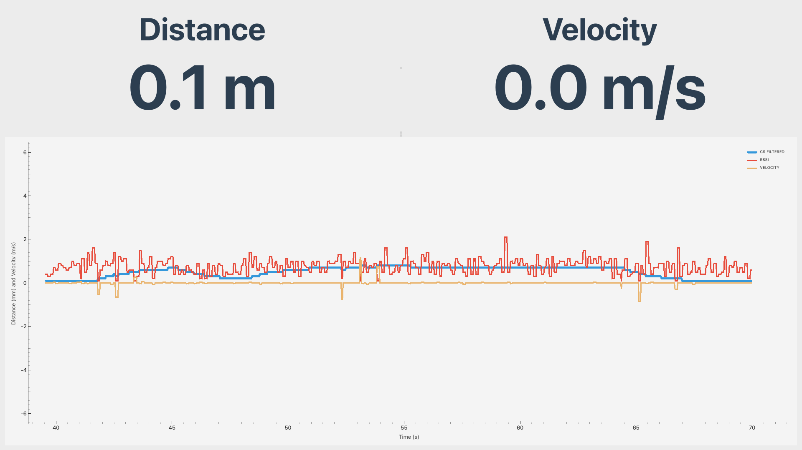

# CS Plotter

**CS Plotter** is a customizable Python-based graphical tool for real-time plotting of channel sounding measurements.
It's designed to read and visualize serial data from Silabs SoC initiator.

> [!NOTE]  
> This application has been developed and tested using SiSDK-2025.6.1.

## Features

* Reads channel sounding measurements from a serial port using multiprocessing.
* Plots incoming data in real-time.

  
  * Filtered CS distance
  * RSSI distance
  * Radial velocity
    * Only supported when using [`SL_RTL_CS_ALGO_MODE_REAL_TIME_FAST`](https://docs.silabs.com/rtl-lib/latest/rtl-lib-channel-sounding-dev-guide/04-sample-applications#rtl-algorithm-mode). When using
    [`SL_RTL_CS_ALGO_MODE_REAL_TIME_BASIC`](https://docs.silabs.com/rtl-lib/latest/rtl-lib-channel-sounding-dev-guide/04-sample-applications#rtl-algorithm-mode)
    the velocity will be displayed as constant 0 m/s.

* Configurable serial port and baud rate.

---

## Requirements

* 1x BRD2606A or BRD4198A flashed with `bt_cs_soc_initiator`.
  * It is recommended to set `SL_IOSTREAM_EUSART_VCOM_BAUDRATE` in `sl_iostream_eusart_vcom_config.`to 921600. This way
  the plotting latency is minimized.
* 1x BRD2606A or BRD4198A flashed with `bt_cs_soc_reflector`.
* Python 3.12 or higher with the [required packages](./requirements.txt) installed.


    ```bash
    pip install -r requirements.txt
    ```

> [!NOTE]  
> For more information about the Silabs CS sample applications and different parameters, please refer to our [developer guide](https://docs.silabs.com/rtl-lib/latest/rtl-lib-channel-sounding-dev-guide/04-sample-applications).

---

## Project Structure

```bash
your_project/
│
├── cs_plotter.py             # Entry point for the app
├── SerialReadProcess.py      # Reads serial data and pushes it to a queue shared with DataPlotter
├── DataPlotter.py            # Plots the data in real-time
├── utils.py                  # Utilities and constants like WINDOW_SIZE, BUFFER_SIZE, etc.
├── README.md                 # This file
├── requirements.txt          # Python dependencies
```

---

## Usage

Run the `cs_plotter.py` script with the required arguments:

```bash
python cs_plotter.py [-h] -s SERIAL_PORT [-b BAUD_RATE]
```

For example:

```bash
python cs_plotter.py -s /dev/ttyUSB0 -b 921600
```


### How it Works

1. `SerialReadProcess` starts in a separate process and reads data from the serial port.
2. The data is pushed to a shared queue.
3. `DataPlotter` reads data from the queue and plots it in real-time using `PyQt`.

### Adjusting the UI

The UI can be adjusted using the following parameters in [utils.py](./utils.py):

```python
Y_LIM_M = None # If None, the scale will be dynamic
X_SCALE_S = 30 
X_PADDING_S = 1 # Seconds of padding added to the x-axis
PLOT_REFRESH_PERIOD_MS = 30
BUFFER_SIZE = int(X_SCALE_S / (PLOT_REFRESH_PERIOD_MS / 1000))  # Number of samples displayed
LABEL_TEXT_SIZE_PX = 150
WINDOW_SIZE = (1440, 1080)
```

---

## FAQ

1. **The plots are unresponsive/flat?**</br>
  The plotter reads the output from the CS SoC Initiator application. The plots are therefore
  a direct representation of the initiator's output. In the case of unresponsive/flat plots,
  please confirm the initiator's output is valid by viewing it in a terminal emulator such as
  Tera Term or Minicom, using the same port and baud rate as when launching the plotter.</br></br>
  Valid output from the initiator should look like this:

    

---

## Known Issues

1. **'utf-8' codec can't decode byte**</br>
Occurs when the data read from the initiator's output can't be decoded using the utf-8 codec.
To resolve this, please make sure the output format from the SoC application is correct,
and restart the application.

---

## License

This project is licensed under the **GNU General Public License v3.0**.  
See the [LICENSE](./LICENSE) file for details.
